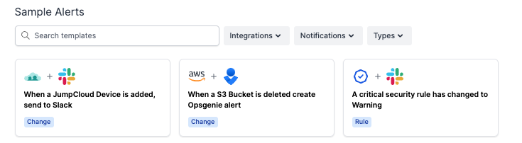
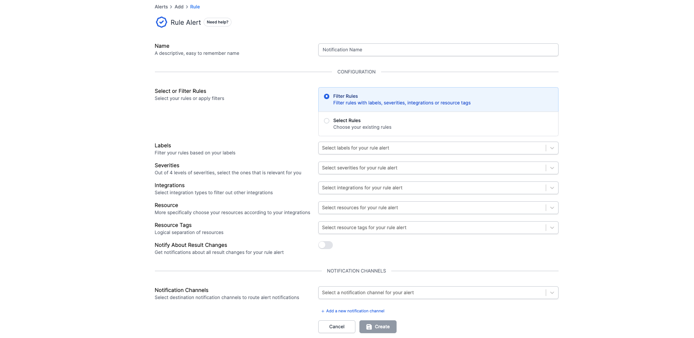
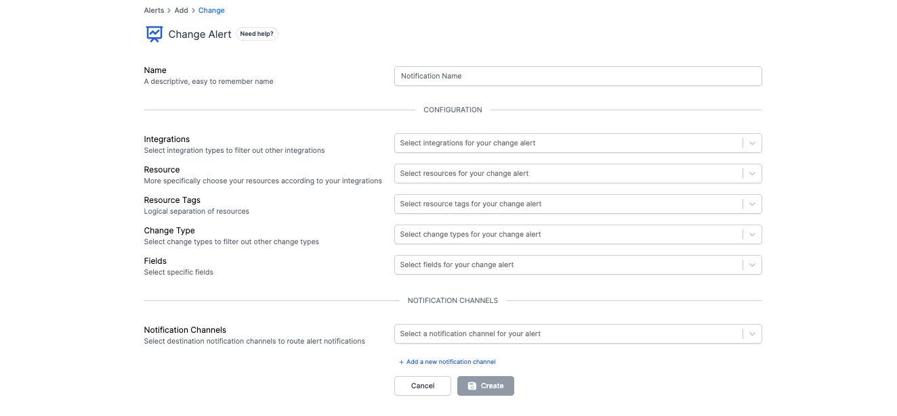
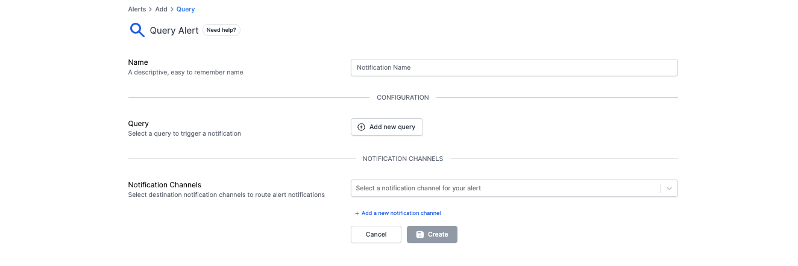
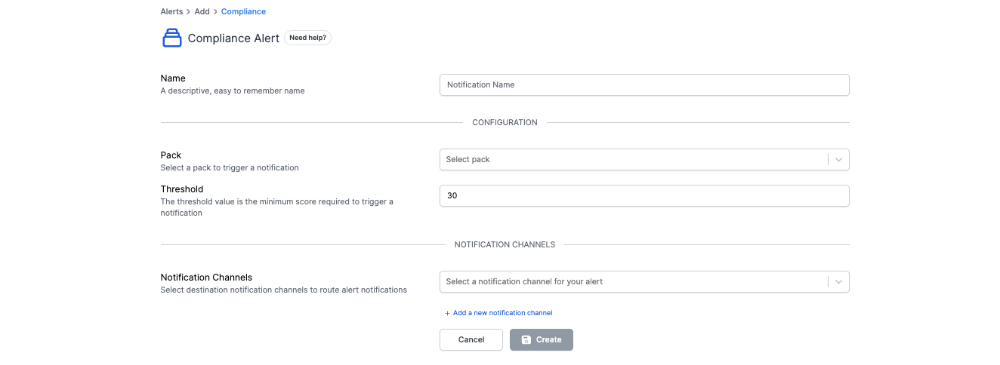

# Alerts

The Alerts feature allows Resmo users to receive real-time notifications for critical events related to their cloud and SaaS assets through a variety of notification channels. Users can customize alerts for security rule status and result changes, data changes, query modifications, and compliance score changes.

Alerting comes with flexible notification channels, including popular ones like Slack, email, Amazon SNS, Parny, Linear, Jira, or Opsgenie, to make sure that you receive only what matters through the most convenient channel.

### Types of Alerts

Resmo's Alerting feature offers four types of customizable alerts:

* **Rule:** Get alerts on the status and the result of a rule change.
* **Change:** Receive alerts when new data is added or deleted, or fields change.
* **Query:** Get alerts on any update on the query result.
* **Compliance:** Receive alerts when a score of pack crosses a threshold

### What do Alerts offer to Resmo users?

* Users can view the created alerts on the alert list.&#x20;
* Alerts can be edited, disabled, cloned, and deleted from the Actions option for each alert on the alert list.&#x20;
* Select a rule type or filter rules when creating a Rule alert.&#x20;
* Create Query type alerts by adding a query.
* Create a Compliance type alert by selecting a pack to trigger notifications and defining a threshold value to set the minimum score required to trigger a notification.
* Create alerts by selecting the integration, resource tag, change type, and fields for the Change alert type.&#x20;
* View alert details on Alert Detail pages where you can edit, clone, delete, and disable a given alert or see detailed information about each alert.
* Visualized and detailed data:
  * The bar chart on the Alert Detail pages demonstrates how many times and when an alert has been triggered over a given time period.&#x20;
  * The table below the bar chart displays data over the defined time period. These data are group data. Therefore, users need to expand each data row for more information.


Users can select 5 notification channels and specific subtypes for each alert type.


### Sample Alerts

<figure><figcaption></figcaption></figure>

Currently, there are three sample alerts you can use directly or configure. Available sample alerts are as the following:

* Get alerts via Slack when a JumpCloud device is added.
* Create an Opsgenie alert when an S3 bucket is deleted.&#x20;
* Receive notifications on Slack when a critical security rule has changed.

### How to create a new alert

<figure><figcaption></figcaption></figure>

#### Creating a Rule Alert

<figure><figcaption></figcaption></figure>

1. Once you navigate to the Alerts page, click the Add Alert button.
2. Select the Rule alert type.
3. Name your Rule alert.
4. Select rules or filter rules.&#x20;

* You can filter rules based on labels, severities, integrations, resources, and resource tags.&#x20;
* To select from existing rules, click the Add new rule button.

5. Switch on the Notify About Results Changes toggle to get notifications about all result changes for your rule alert.
6. Next, select the notification channels you wish to receive your \
   Rule alerts on. You can add multiple notification channels.
7. Once you complete the configurations, hit the Create button. You have now created your Rule Alerts.

#### Creating a Change Alert

<figure><figcaption></figcaption></figure>

1. Click the Add Alert button on the Alerting page and select Change as your alert type.
2. Give a name to your Change alert.
3. Select integration/s, resources, resource tags, change types, and fields for your alert.
4. Then, select your notification channel/s for this specific alert.
5. Hit the Create button, and your Change Alert will be ready.

#### Creating a Query Alert

<figure><figcaption></figcaption></figure>

1. Click the Add Alert button and select Query as your alert type.
2. Give a descriptive name to your query alert.
3. Select a query to trigger a notification.
4. Select notification channels for your Query alert.
5. Click Create, and that's it!

#### Creating a Compliance Alert

<figure><figcaption></figcaption></figure>

1. Click the Add Alert button and select Compliance as your alert type.
2. Name your Compliance alert.
3. Select a pack to trigger a notification.
4. Define a threshold value. The threshold value is the minimum score required to trigger a notification.
5. Select notification channels and hit the Create button.

### How to edit, clone, disable, or delete alerts

<figure><figcaption></figcaption></figure>

To edit, clone, disable, or delete an alert, you can either:

* Open the Alerts page. Click the ellipsis icon on the row of the specific alert you want to clone, disable, or delete. Then, select the option you want to execute.
* Go to the detail page of a specific alert, click the ellipsis icon, and select the option you want to execute.

### Support

Contact us via live chat or email us at contact@resmo.com for further queries or troubleshooting.
