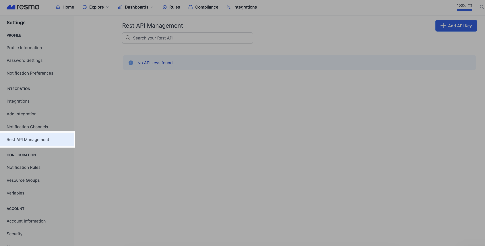
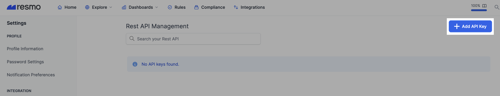

# Query API

The API Key will work with several scopes in the future, but currently, it supports the “Query” scope only.

**Query scope** represents that your API key can work with the query endpoint.

### Supported Endpoints

**Query Endpoint**&#x20;

You can query your data with the help of this endpoint, as you did in Resmo Search UI. You just need to add your SQL to the request body.

### Request fields

**Method:** POST

**Url:** `<your customer domain>/api/query`

**Headers:**

| Header Name       | Header Value            |
| ----------------- | ----------------------- |
| **Authorization** | `Bearer <your-api-key>` |
| **Content-Type**  | application/json        |

### Payload fields

| Field   | Value                                                                             |
| ------- | --------------------------------------------------------------------------------- |
| **sql** | sql string that you want to execute.   **Example:** `SELECT * FROM resmo_account` |

### Sample cURL request

```
curl --location --request POST '/api/query'
--header 'Content-Type: application/json'
--header 'Authorization: Bearer <your-api-key>' 
--data-raw '{"sql":"SELECT * FROM resmo_account"}' 
```

### How to create a Query API Key on Resmo

1. Go to your Settings page on Resmo.
2. Click on Rest API Management from the left side panel.

<figure><figcaption></figcaption></figure>

3\. Click the Add API Key button from the top right.

<figure><figcaption></figcaption></figure>

4\. Name your API key and choose the query scope. Then, define an expiration date for your API key.

<figure><figcaption></figcaption></figure>

5\. Hit the Add API Key button.

### Troubleshooting

For support requests and troubleshooting, contact our team via live chat or email us at contact@resmo.com.
