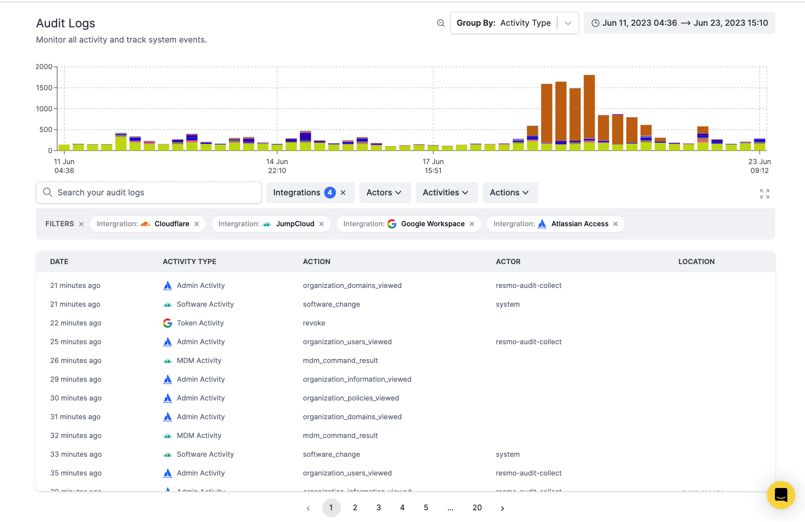

# Audit Logs

### What is audit logging?

Audit logging, also referred to as an audit trail, is a security-relevant chronological record or set of records that provide documentary evidence of the sequence of activities that have affected at any time a specific operation, procedure, or event. Audit logs typically serve to document what activities were performed, when they were performed, and by whom.

These logs are crucial in various fields, especially in IT, where they are used to:

* Track changes to the system
* Detect anomalies or security incidents
* Troubleshoot issues
* Support forensic investigations.&#x20;

Audit logging is critical to cybersecurity, enabling organizations to detect, prevent, mitigate, and trace back security threats.

**Audit logs capture the following types of activity information:**

* Activity dates
* Activity types
* Actions
* Actors
* Locations

### Basic features of Resmo Audit Logs

* **Detailed log entries**: Every log entry includes thorough details such as timestamps, event descriptions, event types, and the identities of the users or systems involved.&#x20;
* **Centralized logging:** Collect all logs in one place for easy access and analysis.&#x20;
* **Real-time monitoring:** Real-time tracking of events to promptly detect and respond to potential security incidents.&#x20;
* **Activity Graph:** Visually monitor all activities and track system events in a specific time period with an activity graph. Group activities based on activity type, integration, action type, and actor.
* **Log integrity**: Once logs are recorded, they can't be modified or deleted.&#x20;
* **Search and filter:** Search logs and filter them based on various attributes, such as activity type, action, actor, and integration.

### How do Audit Logs work?

Initially, Resmo polls the added integration's audit logs to maintain retention for each supported integration in your account. Once the initial polling is completed, we implement smart polling to retrieve real-time updates. If the integration supports webhook events for audit logs, Resmo also listens for them.

<figure><figcaption></figcaption></figure>

* **Set a time range:** You can set a specific time range from the top right to see all activities and events that happened during that period.
* **Group by:** The Group by button allows you to group activities based on Activity Type, Integration, Action Type, and Actor to better visualize your activity data on the graph.&#x20;
* **Search bar:** Search your audit logs to quickly find what you're looking for.
* **Filters:** Filter all activities and system events based on Integrations, Actors, Activities, and Actions. You can click the "X" on each set filter to turn it off.
* **Each activity row is clickable**. If you click on an activity row, it will show you detailed information such as an IP address, and the result of an action, i.e., success, category, and metadata.

### Current list of integrations that support Audit Logs

| Integrations supporting Resmo Audit Logs                                        |
| ------------------------------------------------------------------------------- |
| [Atlassian Access](../integrations/atlassian-access-integration.md)             |
| [Cloudflare](../integrations/cloudflare-integration.md)                         |
| [Okta](../integrations/okta-integration.md)                                     |
| [Opsgenie](../integrations/opsgenie-integration.md)                             |
| [Google Workspace](../integrations/google-workspace-integration.md)             |
| [JumpCloud](../integrations/jumpcloud-integration.md)                           |
| [Azure Active Directory](../integrations/azure-active-directory-integration.md) |
| Office 365                                                                      |

