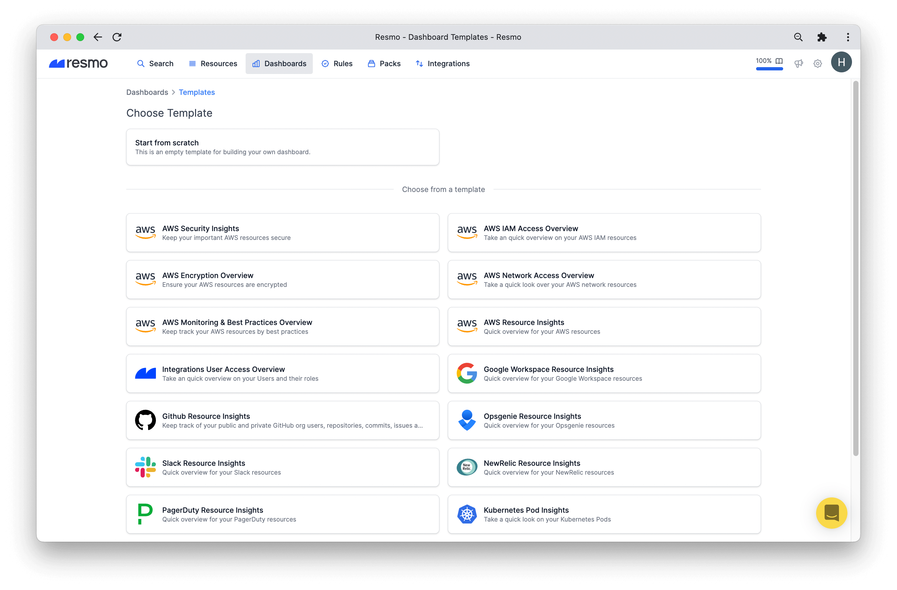
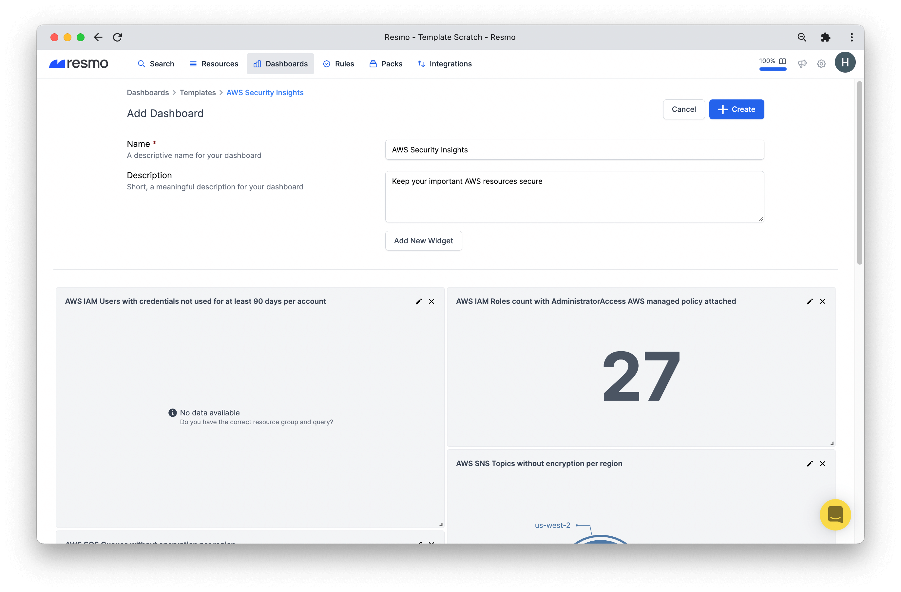
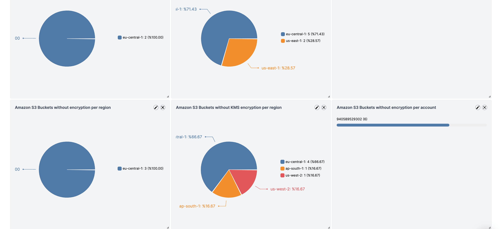
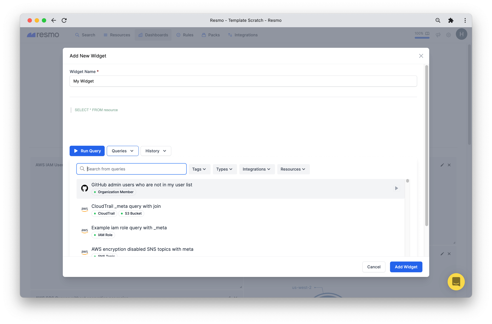
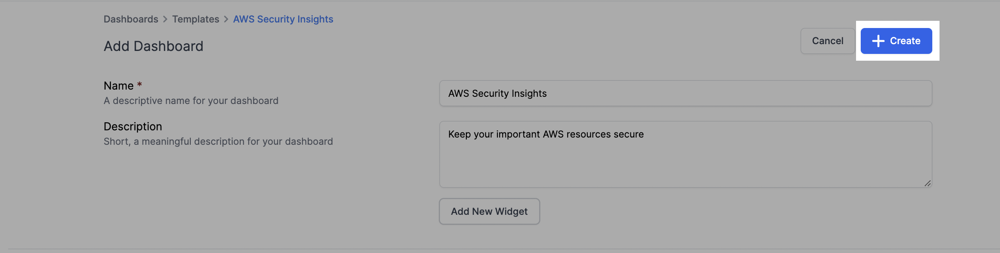
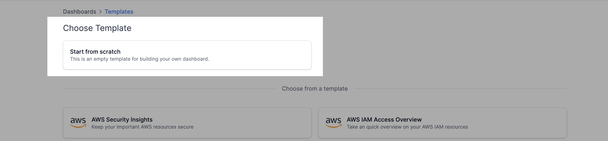
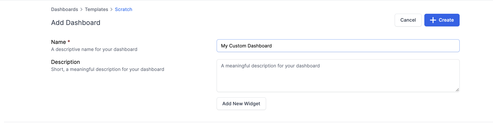
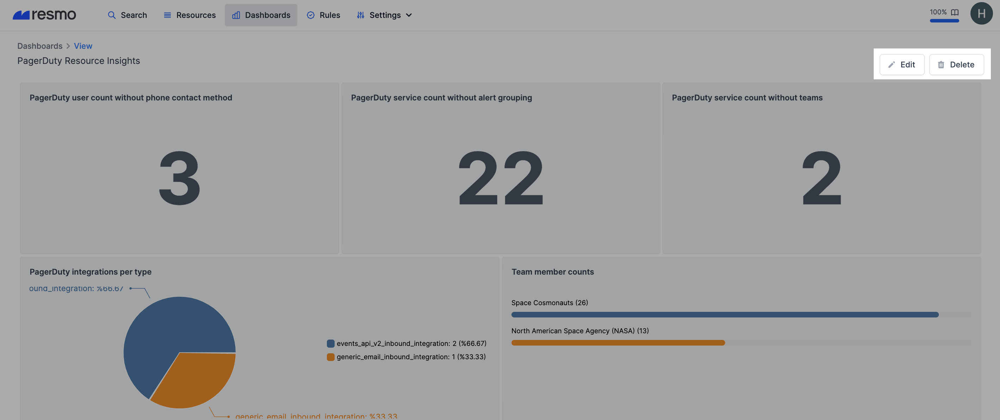

# Dashboards

### How do Resmo dashboards work?

Resmo dashboards pull existing data from the queries you defined for your widgets. The charts, tables, bars, and all widgets update near real-time.

The number of widgets must be a minimum of 1 and a maximum of 20.

* **Supported widget types:** area, bar, billboard, line, markdown, pie, table, and JSON.

### What do dashboards offer for Resmo users?

* Use templates to add a dashboard right away
* Create a custom dashboard from scratch&#x20;
* Visually monitor your resource changes
* Turn managed or saved queries into widgets for your dashboards
* Pick a query from your query history to add as a widget
* Monitor all users matched with your integrated clouds and applications

### Users dashboard

<figure><figcaption></figcaption></figure>

The Users dashboard on your Dashboards page allows you to easily monitor unique users by applications with some cool additional info like:

* Each unique user matched with applications
* Rules that apply to the user with status information so that you can take faster action
* Risk level on each unique user row
* Ability to see if a user is active or passive
* MFA and admin information of each user
* A table displaying users count per application
* Filterable results


To see the active/passive, type, MFA, admin, and last sign-in info, expand each user row.


### Ready-to-use dashboard templates

Resmo has many dashboard template options you can choose from and start using. Each includes widgets that you can also edit or remove. You can add new widgets as well to quickly shape the template around your needs.

### How to create a dashboard with templates

1. Log in to your Resmo account and then click Dashboards from the navigation bar.
2. Hit the Add Dashboard button.

<figure><figcaption></figcaption></figure>

3\. Select one of the ready-to-use dashboard templates.

<figure><figcaption></figcaption></figure>

4\. Then, type a descriptive name for your dashboard.

<figure><figcaption></figcaption></figure>

5\. You will see the widgets that are predefined for your selected template. You may keep them as is, edit, or remove.

6\. To add a new widget, click the Add New Widget button. This will open a modal window.

7\. First, name your widget. Then, you may select one of your saved/managed queries or one from your query history.&#x20;

<figure><figcaption></figcaption></figure>

8\. Choose the widget type.

9\. Click the Add Widget button, and your widget will be added to your dashboard template.

10\. If you are happy with the widgets on your dashboard, just hit the Create button from the top right and enjoy your dashboard!

<figure><figcaption></figcaption></figure>

### Building a dashboard from scratch

The build from scratch option gives you the freedom to shape your custom dashboard by adding new widgets of your choice.

#### How to build a dashboard from scratch

1. Log in to your Resmo account.
2. Navigate to the Dashboards tab.
3. Click the Add Dashboard button.
4. Select the Start from scratch card.

<figure><figcaption></figcaption></figure>

5\. Give a name and description to your custom dashboard.

<figure><figcaption></figcaption></figure>

6\. Hit the Add New Widget button.

7\. Name your new widget and select a query to visualize for your dashboard.&#x20;

8\. Click the Add Widget button.

9\. Repeat the widget-adding process until you are satisfied with your dashboard's look.

### How to delete a dashboard

1. Go to Dashboards from the navigation bar.&#x20;
2. Select the dashboard you wish to delete.&#x20;
3. To permanently remove your dashboard, click the Delete button from the top right. Or you may edit it as you like with the Edit button instead.

### Support

If you have further questions about dashboards or Resmo, you can contact us via live chat on our website or email us at contact@resmo.com.
