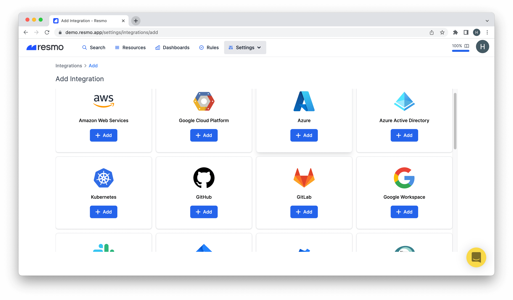
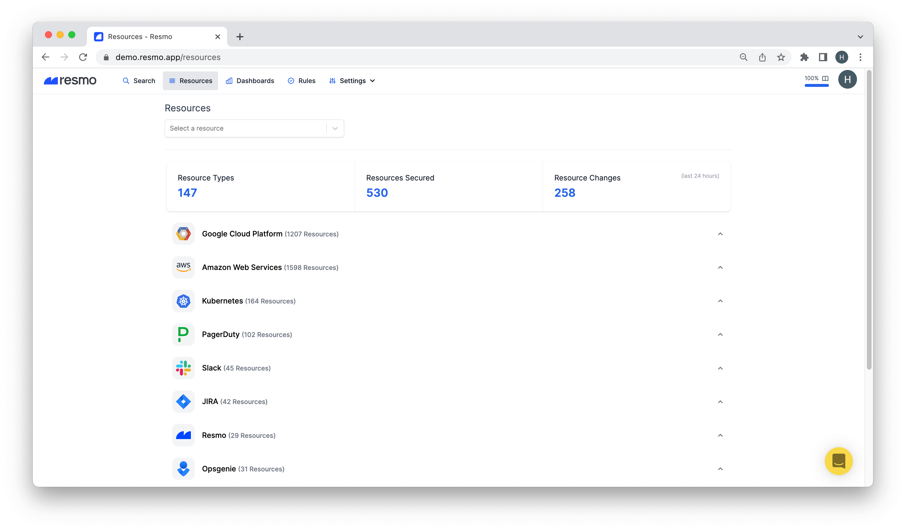
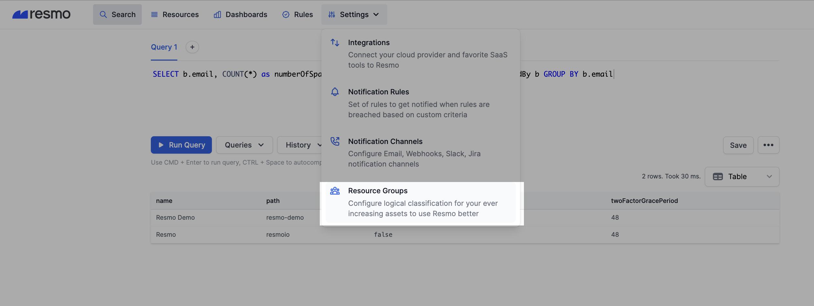
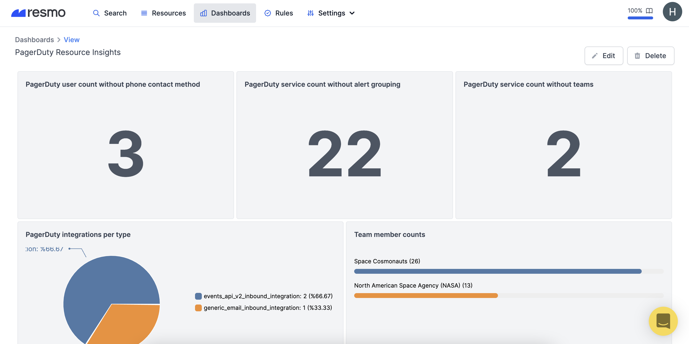

# Quick Start Guide

This quick guide will walk you through the essential steps of using Resmo.

1. Everything starts with integration. **Integrating Resmo** with your SaaS and cloud services is pretty easy. If you need help integrating, please check our [Broken link](broken-reference "mention").


For example, you can headstart by integrating with AWS if you use the AWS cloud. Or, you can start with any other cloud and SaaS integration such as GitHub, MongoDB, or Azure AD.


2\.  Once we index your resources (which takes a minute or so), head over to your **Resources**. This is where you will have all your cyber assets visible in one place. See [Broken link](broken-reference "mention") for details.

3\. Next stop is your Search page. You can start querying your assets using SQL right away on this page. It's standard SQL, so you probably know how to write SQL. If you need guidance, start at[standard-sql-queries.md](../queries/standard-sql-queries.md "mention").

4\. Then go to Rules from the navigation bar and see the security and compliance violations, or bad practices we automatically catch! You can add your own custom rules in addition to the managed ones. [Broken link](broken-reference "mention")

5\. **Rules** are automated checks that you can monitor; they don't send alerts though. To receive notifications on rule violations, navigate to Settings>Notification Rules. Notification rules will alert you based on your preferred configurations. (See [Broken link](broken-reference "mention") for details.)

6\. Next, you have Resource Groups to define a logical classification for your ever-increasing assets.  Just head on to Settings>Resource Groups and hit the Add button. These groups are there to make your job easier so that you can check resources and queries faster. (Need guidance? See [Broken link](broken-reference "mention").)

7\. You have all asset data in your palms. Now it's time to visualize those. Go to Dashboards from the navigation bar and create a new dashboard. You can use a template or build one from scratch! Check [Broken link](broken-reference "mention") for details.&#x20;

That's it! Now, you know your way through Resmo. If you still need further instructions, see the related documentation for each step. You can always ask for support via live chat on our website or email us at contact@resmo.com.
