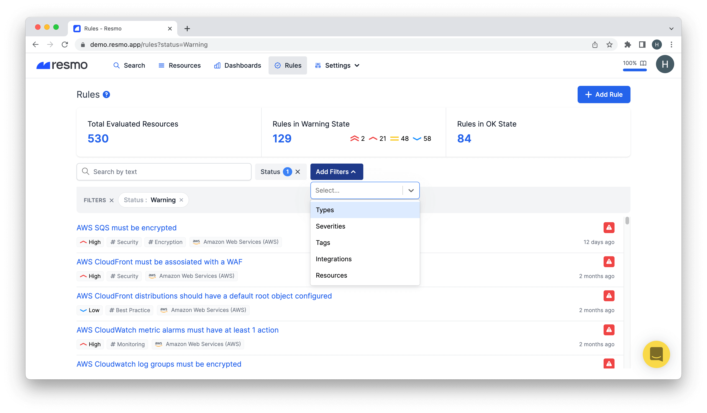
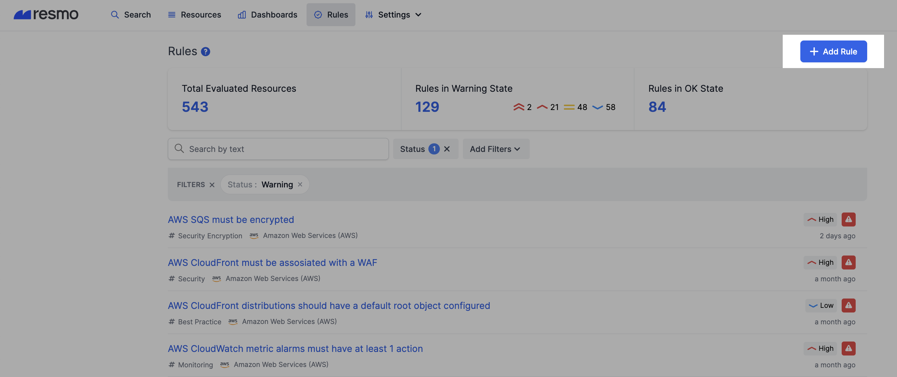
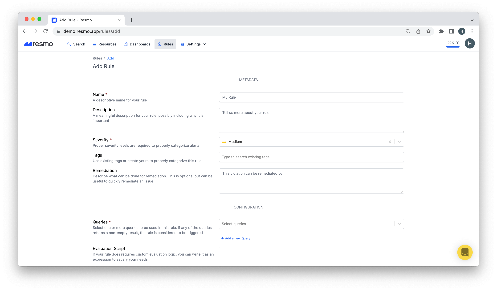
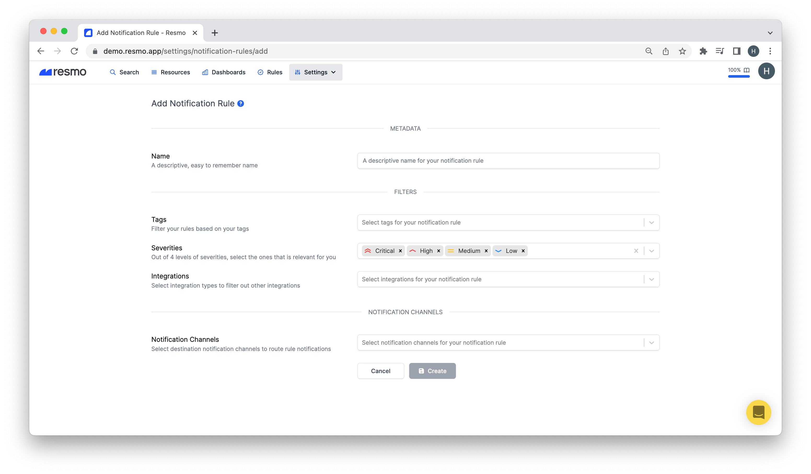

# Create Your First Rule

Rules are how Resmo audits your integrated resources for security and compliance checks. There are three types of rules, to begin with: managed rules, custom rules, and notification rules.

This guide will show you how to create your first rule step-by-step.

### How to add a custom rule

1. Open your Rules page on Resmo. You'll see a list of managed rules on this page.&#x20;


* Managed rules comprise common best practices and are maintained by our team.
* Each rule has a Detail page where you can see the overview, result, activity, and suppression of a rule. See [Broken link](broken-reference "mention") for details.


2\. Click Add Rule to create a custom rule.


Custom rules can be triggered by saved or managed queries. You can define their severities, remediations, and evaluation scripts.


3\. Fill in the required metadata fields. Then select queries for your rule. Additionally, if your rule does require custom evaluation logic, you can write it as an expression.&#x20;

4\. Hit the Create button when all configurations are done.

### How to add a notification rule

1. Navigate to Settings>Notification Rules.


Notification rules alert you about rule breaches through the channels of your choice**,** such as Slack or email. See [notification-rules.md](../notification-rules/notification-rules.md "mention") for details.


2\. Click Add Notification Rule.

3\. Fill in the metadata field for your rule. Then, select severities, integrations, and notification channels. Hit the Create button once you're done.


Tags are there to help you filter your rules. On the other hand, Severities help you get notified only on violations with specific severities so that you avoid alert fatigue.


### Support

Contact us via live chat or email us at contact@resmo.com for questions and troubleshooting.
