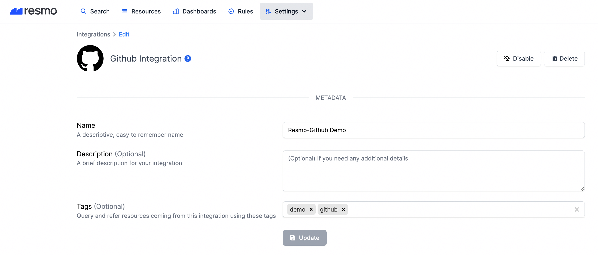
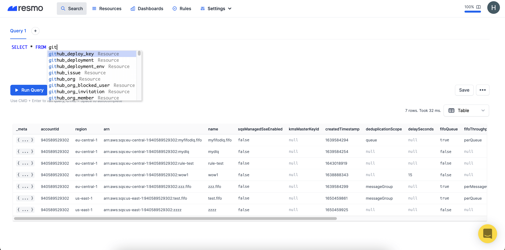
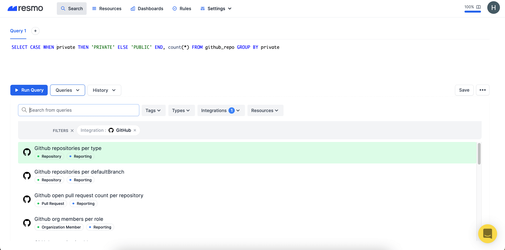
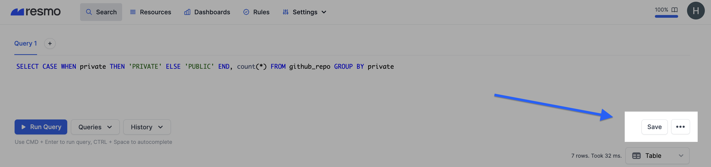

# Query Your First Resources

Resmo uses standard SQL statements with some really cool improvements. If you want to start querying your resources/assets, you need to start with the integrations and connect your Cloud providers or other tools (mostly SaaS) with Resmo.&#x20;

In this guide, we'll show how to query your first resources step by step.

1. **Integrate Resmo with your tools**

Resmo offers integrations with your favorite tools. Let's assume you use GitHub. The integration process is similar and easy for all integrations and if you want to start with another integration, like AWS, just follow its integration document under the [Broken link](broken-reference "mention")section.

* Let's integrate Resmo with GitHub, for example.&#x20;



* First things first, go to **Settings>Integrations** and click the **Add Integration** button.&#x20;
* Then, select GitHub. Once you fill in the required fields and click **Create**, you will be redirected to GitHub to accept permissions. Accept them, and your integration is ready to roll!

**2. Write your first query with autocomplete support**



```
Select * from resource_key
```

**3. Use Resmo's managed queries**




Managed queries make it quicker to ask security, compliance, and best practices questions. Don't forget to utilize the filtering options. You can filter your managed queries list based on Tags, Types, Integrations, and Resources.


**4. Save your own query**

You can save custom queries to find and use them later on. Plus, if it's a query needed across your team, you can share saved queries with team members in your Resmo account.

* Once you type your SQL query, hit the Save button, and your query will be saved.




* Every user can view saved queries unless the saved query is private.
* Private queries cannot be viewed by other users and referenced in the rules.


.png>)

### Support

If you still have questions regarding the resource query process, feel free to contact us via live chat or email us at contact@resmo.com.
