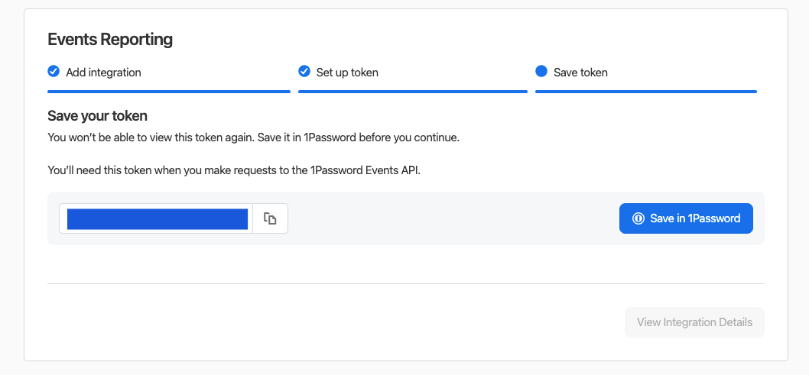

# 1Password Integration

<figure><figcaption></figcaption></figure>

Resmo's integration with 1Password ensures comprehensive monitoring and advanced analysis of item usage and critical audit events.

### What does Resmo offer to 1Password users?

* Monitor access to sensitive information with detailed log entries that provide timestamps, event types, and user identities for every access or modification.
* Consolidate all item usage logs in a centralized system, merging 1Password logs with other integrations for a comprehensive overview.
* Visualize item usage patterns and trends through an Activity Graph, helping organizations understand how shared vault items are utilized.
* Ensure log integrity, ensuring that once an item access event is recorded, it remains unchangeable, preserving the authenticity of audit logs.
* Search and refine audit logs effortlessly using a range of filters, search bars, and grouping options, making it easier to detect anomalies or specific events for in-depth analysis.

### How does the integration work?

Currently, Resmo's integration with 1Password supports only the [Audit Logs](broken-reference) feature; upon successful integration, users can seamlessly access and review system activities linked to their 1Password account via the dedicated Audit Logs page.

#### Available resources



### Integration walkthrough

#### How to install

1. From your Integrations page on Resmo, find and select 1Password.
2. Click the Add Integration button from the right bottom corner of the opening modal window.
3. Go to your 1Password account on a new tab and navigate to Events Reporting.

<figure><figcaption></figcaption></figure>

4. Once you name your token, continue with the fields under "Set up token".&#x20;

Specify the following:

* Token name
* Token expiration
* Events to report

<figure><figcaption></figcaption></figure>

5. Next, save your token and copy it.

<figure><figcaption></figcaption></figure>

6. Return to your 1Password integration screen on Resmo and paste the API Token into the related field.
7. Select your 1Password server. (e.g. 1Password Business, 1Password Enterprise, etc.)
8. Hit the Create button and your integration is all set!

<figure><figcaption></figcaption></figure>

#### How to uninstall

1. Select 1Password on your Integrations page on Resmo.
2. From the Connected Integrations tab on the modal, click the account you want to remove.
3. To temporarily pause the integration click the Disable button. For permanent deletion, click the Delete button.

<figure><figcaption></figcaption></figure>
