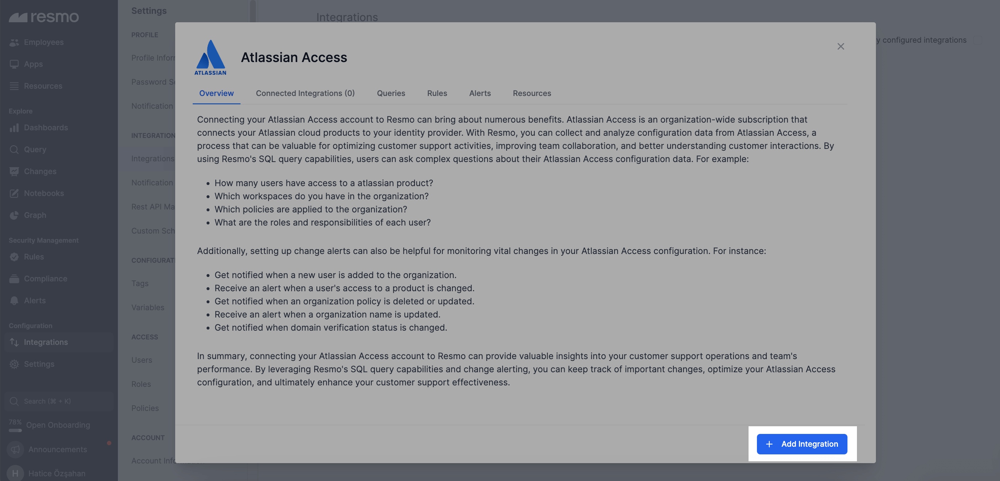
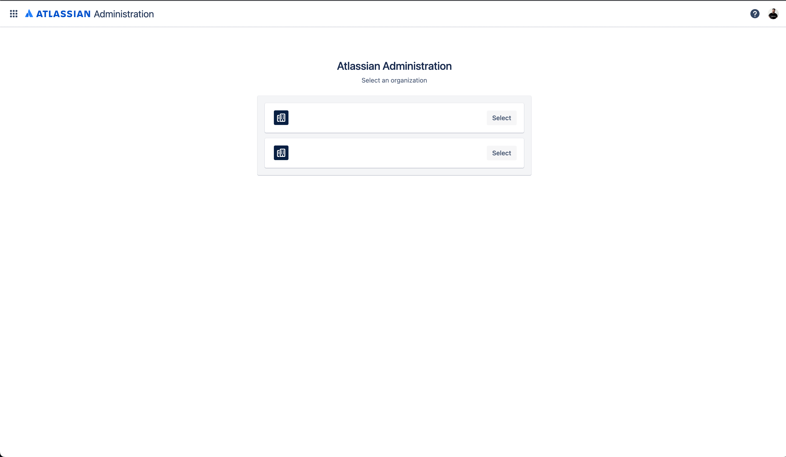
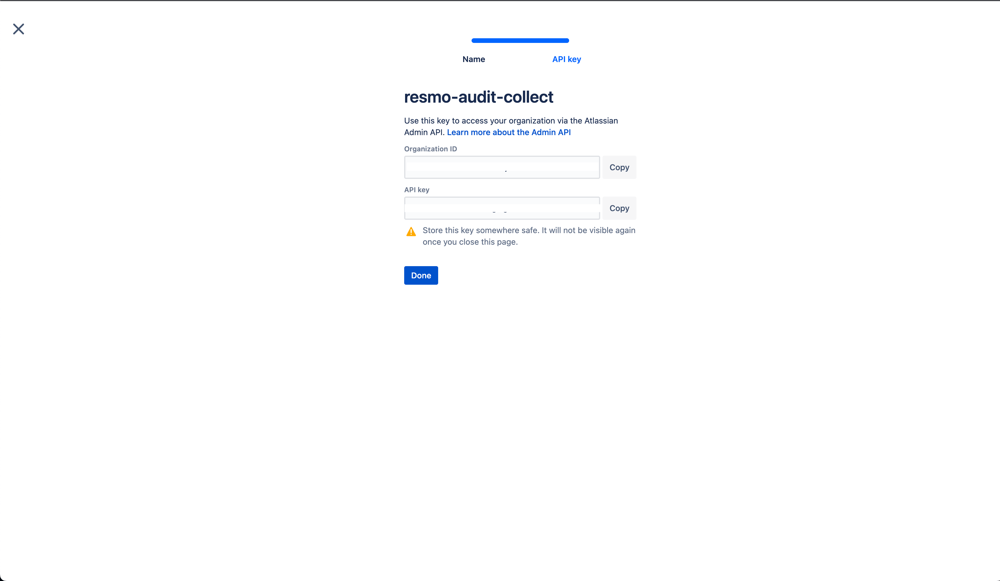
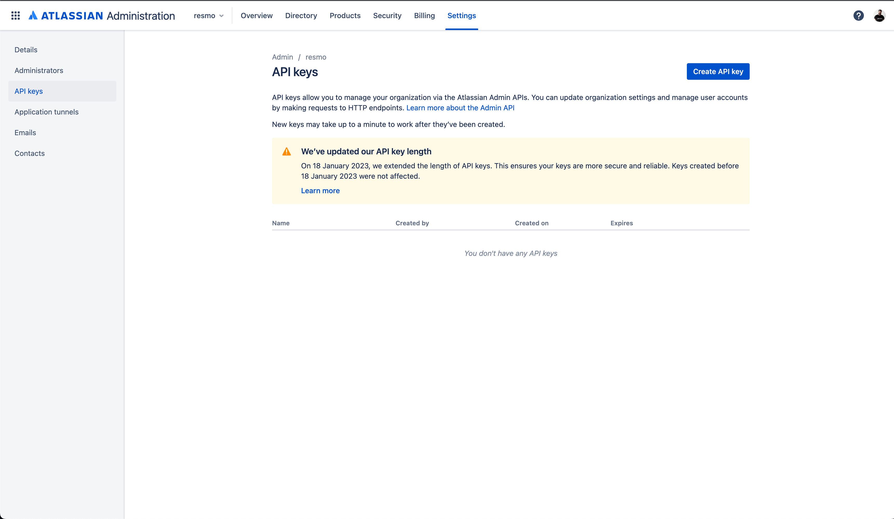
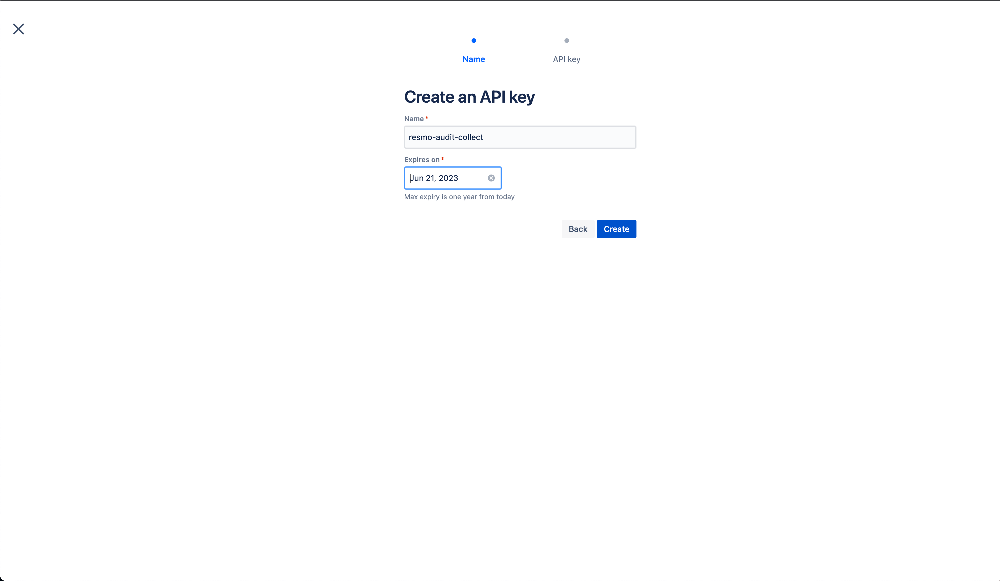
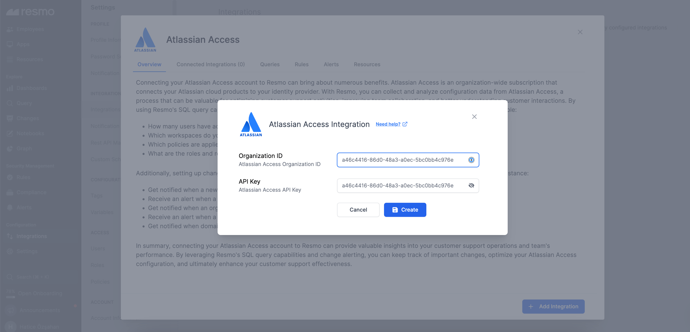

# Atlassian Access Integration

<figure><figcaption></figcaption></figure>

The Resmo Atlassian Access integration empowers organizations to efficiently analyze configuration data from Atlassian cloud products. Through Resmo, users can gain insights into user access, organizational policies, workspaces, and roles, while getting timely alerts on changes.

### What does Resmo offer to Atlassian Access users?

* Get notified when a new user is added to the organization.
* Receive an alert when a user’s access to a product is changed.
* See policies that are applied to your organization.
* List the roles and responsibilities of each user.

### How does the integration work?

Resmo uses API to do the initial polling and collect existing Atlassian Access resources. Following the initial polling, it receives updates and changes in real-time through webhook and regular polling.

**Available resources**



### Integration Walkthrough

#### How to install

1. Log in to your Resmo account and go to your Integrations page.
2. Find and select Atlassian Access.
3. Click the Add Integration button from the bottom right corner of the opening modal.

<figure><figcaption></figcaption></figure>

4. Log in to your [Atlassian admin account](https://admin.atlassian.com/).

<figure><figcaption></figcaption></figure>

5. Select an organization and copy the Organization ID.

<figure><figcaption></figcaption></figure>

6. Navigate to Resmo Integration Screen.

* In the Resmo integration screen, locate the ‘Organization ID’ field under the Atlassian Access section. Paste the Organization ID that you copied earlier into this field.&#x20;

7. Go back to your Atlassian Access account. From Settings > API Keys.

<figure><figcaption></figcaption></figure>

8. Click the Create API Key button and copy it to your clipboard.

<figure><figcaption></figcaption></figure>

9. Return to the Resmo integration screen and locate the ‘API Key’ field. Paste the API Key that you copied into this field.&#x20;

<figure><figcaption></figcaption></figure>

10. Click the ‘**Create**’ button on the Resmo integration screen.

You should see a confirmation message indicating that the integration is complete and successful. Congratulations! Your Atlassian Access account is now integrated with Resmo, and you can start leveraging the combined capabilities of both platforms.

#### How to uninstall

1. Go to your Integrations page on Resmo and select Atlassian Access.
2. Navigate to the Connected Integrations tab and select the account you want to remove.
3. You can either disable it temporarily or delete it permanently. Depending on your choice, click the Disable/Delete button from the top right.

<figure><figcaption></figcaption></figure>

### Support

For further questions or support requests, please contact us via live chat or email us at contact@resmo.com.
