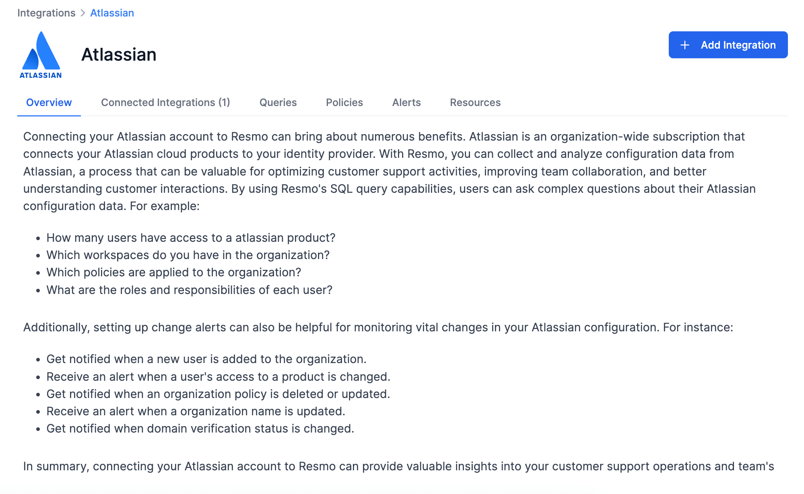
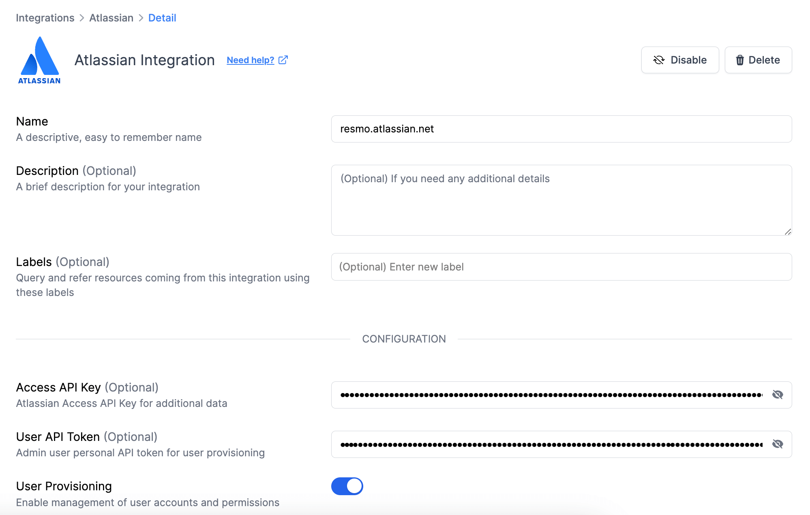

# Atlassian Integration

<figure><figcaption></figcaption></figure>

The Resmo Atlassian integration empowers organizations to efficiently analyze configuration data from Atlassian cloud products. Through Resmo, users can gain insights into user access, organizational policies, workspaces, and roles, while getting timely alerts on changes.

### What does Resmo offer to Atlassian Access users?

* Get notified when a new user is added to the organization.
* Receive an alert when a user’s access to a product is changed.
* See policies that are applied to your organization.
* List the roles and responsibilities of each user.

### How does the integration work?

Resmo uses API to do the initial polling and collect existing Atlassian Access resources. Following the initial polling, it receives updates and changes in real-time through webhook and regular polling.

**Available resources**




**Tip:** Use [Audit Logs](../audit-logs/audit-logs.md) for comprehensive monitoring of all Atlassian Access activities and system events.


### Integration Walkthrough

#### How to install

1. Log in to your Resmo account and go to your Integrations page.
2. Find and select Atlassian.
3. Click the Add Integration button.

<figure><figcaption></figcaption></figure>

4. Optionally, add your **Access API Key**, and **User API Token** for additional data.&#x20;


Note that you can enable **user provisioning** if you add the User API Token and enable user account and permissions management.


<figure><figcaption></figcaption></figure>

5. Log in to your [Atlassian admin account](https://admin.atlassian.com/).
6. Go to Settings > API Keys.

<figure><figcaption></figcaption></figure>

7. Click the Create API Key button and copy it to your clipboard.

<figure><figcaption></figcaption></figure>

8. Return to the Resmo integration screen and locate the ‘API Key’ field. Paste the API Key that you copied into this field.&#x20;
9. For the User API Token, follow these steps:

* Sign in at https://id.atlassian.com/manage-profile/security/api-tokens.
* Select the option to Create API token.
* In the appearing dialog box, provide a brief and memorable Label for your token, then select Create.
* Choose Copy to clipboard and proceed to paste it in the Resmo integration screen, User API Token field.

10. Enable User Provisioning for granular access management.
11. Click the ‘**Create**’ button on the Resmo integration screen and it's ready.

You should see a confirmation message indicating that the integration is complete and successful. Congratulations! Your Atlassian account is now integrated with Resmo, and you can start leveraging the combined capabilities of both platforms.

#### How to uninstall

1. Go to your Integrations page on Resmo and select Atlassian.
2. Navigate to the Connected Integrations tab and select the account you want to remove.
3. You can either disable it temporarily or delete it permanently. Depending on your choice, click the Disable/Delete button from the top right.

<figure><figcaption></figcaption></figure>
