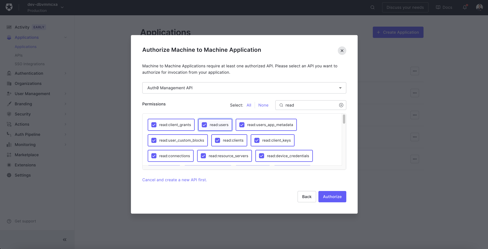

# Auth0 Integration

## Resmo + Auth0 Integration Fundamentals

<figure><figcaption></figcaption></figure>

Resmo integrates with Auth0 (by Okta) to help you gain visibility, security, and compliance over your Auth0 resources.

### What does Resmo offer to Auth0 users?

* Collect your Auth0 resources like users, roles, clients, organizations, and tenant settings in a single asset directory.
* Query across your assets using SQL or free text search.
* Visualize asset relations in graph view.
* Automate security checks with rules and get notified of anomalies in near real-time.

### How does the integration work?

Once you sign up and log in to Resmo, you can connect your Auth0 account to Resmo by creating a “Machine to Machine Application” and then via the application’s config values. Resmo uses API to start the initial polling and collect existing resources. Then, it receives resource changes and updates in real time through regular polling.

#### Available resources

Resources you can collect with your Auth0 integration include:

* Client
* Custom Domain
* Grant
* Organization
* Resource Server
* Role
* Tenant Settings
* User


_“Custom Domains” are only available on upgraded subscriptions; therefore, in order to collect them on Resmo, you must be an upgraded Auth0 subscriber._


## Integration walkthrough

### How to install

1. Select Auth0 on the Integrations page of your Resmo account.
2. Click the Add Integration button at the bottom right corner of the opening modal.
3. Go to your Auth0 account on a new tab.
4. Go to your applications page on Auth0.

<figure><figcaption></figcaption></figure>

5\. Click create application.

6\. Choose "Machine to Machine Applications" and then click create.

<figure><figcaption></figcaption></figure>

7\. Choose "Auth0 Management API".

8\. Choose all the read scopes for your application and click Authorize.

<figure><figcaption></figcaption></figure>

9\. Go to your application page again and click on your application.

10\. Copy your Client ID value and paste it to the Client Id field on the setup page.

<figure><figcaption></figcaption></figure>

11\. Copy your Client Secret value and paste it to the Client Secret field on the setup page.

<figure><figcaption></figcaption></figure>

12\. Go to your APIs page under the Applications.

<figure><figcaption></figcaption></figure>

13\. Copy the "API Audience" value of Auth0 Management API.

14\. Paste it to the Audience field on the setup page.

15\. Click create.

16\. You are ready! Now you can start querying your Auth0 resources!\

### How to uninstall

1. Go to your applications page.
2. Click on the “Machine to Machine” application you’ve created for Resmo.
3. Under the settings click on “Delete this application”
4. Write your application’s name to “Name” field and then click “Delete”
5. Select Auth0 on your Integrations page on Resmo.
6. Navigate to the Connected Integrations tab on the opening modal and select the account you want to remove.
7. Click the Delete button to remove the integration permanently or Disable to enable back later.

### Support

Contact us via live chat or email us at contact@resmo.com for troubleshooting or support requests about your Auth0 integration.
