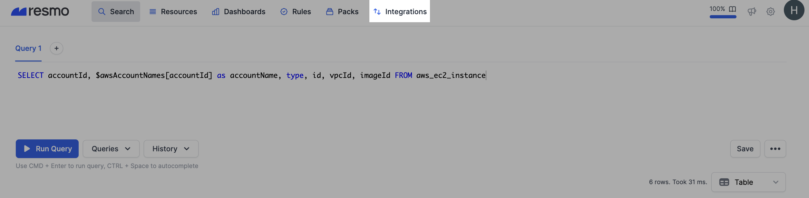
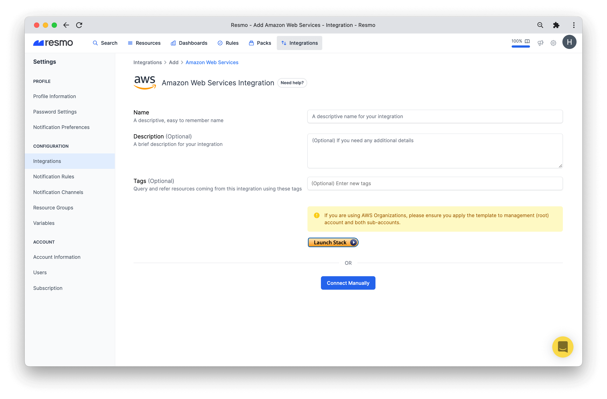
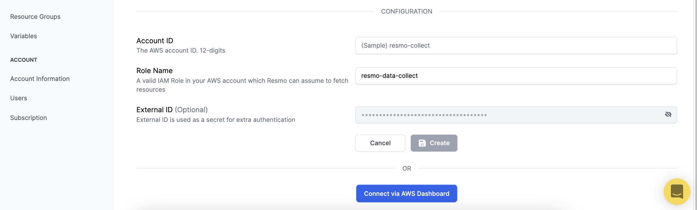
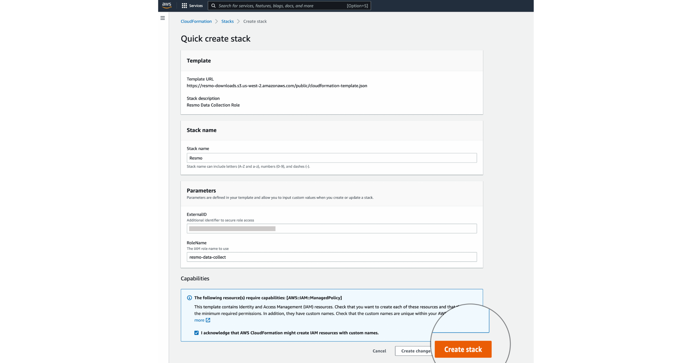
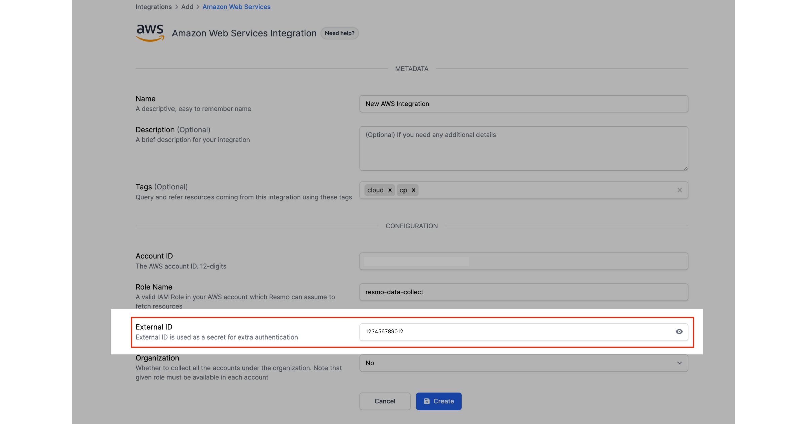

# AWS Integration

## Resmo + AWS Integration Fundamentals  <a href="#what-does-opsgenie-offer-slack-users" id="what-does-opsgenie-offer-slack-users"></a>


Resmo integrates with [Amazon Web Services](https://aws.amazon.com/) to ensure that your cloud environment is secure and compliant.

### What does Resmo offer Amazon Web Services users? <a href="#what-does-opsgenie-offer-slack-users" id="what-does-opsgenie-offer-slack-users"></a>

* Collect all your AWS assets in place (really!)
* Ability to query your AWS IAM roles, VPC security groups, Lambda functions, and 100+ other resources.
* Track changes across your entire AWS organization.
* Set up rule notifications based on AWS resource configurations and their changes.
* Use GitHub Best Practices packs to check your GitHub security and compliance posture.

### How does the integration work?

Resmo has an AWS integration that you can install securely once you sign up for a Resmo account.&#x20;

Our application uses API to make the initial polling and receive existing resources.&#x20;

* API polling
* Webhook (Coming soon via CloudTrail!)

### Available resources

Resmo AWS integration collects Autoscaling groups, IAM roles, DynamoDB tables, KMS keys, EC2 instances, and much more.

See the full list:



### Common queries and rules

* List SQS queues
* Detect EC2 instances with public IPs
* Identify Lambda functions with timeout/memory values
* Find S3 buckets with public read access
* See permissions of a specific IAM user
* Find DynamoDB Tables with KMS encryption disabled
* TBA

## Integration Walkthrough

You have to create a customer-managed IAM Policy and IAM Role to let Resmo access your AWS resources. There are several options for creating policy and role; you can choose the best fitting option from the above list;

1. CloudFormation
2. Manually using AWS CLI
3. Manually using AWS Console
4. Terraform

### How to install

The installation steps in this section present a general route you'll follow. To see the individual methods you can use to create the required IAM Policy and IAM Role for your Resmo AWS integration, navigate to each related heading below.

* [Installation using CloudFormation](aws-integration.md#install-using-cloudformation)&#x20;


[Watch a 2-min video](https://www.youtube.com/watch?v=KlFPNxEeGyI) to learn how to install the AWS integration using CloudFormation.


* [Manual installation using AWS CLI](aws-integration.md#manually-install-using-aws-cli)
* [Manual installation with AWS Console](aws-integration.md#manually-using-aws-console)
* [Manual installation with Terraform](aws-integration.md#manually-using-terraform-script)

#### Integration steps on Resmo

1. Login to Resmo and navigate to Integrations.



2\. Click the Add Integration button on the top right.

 (1).png>)

3\. Add the Amazon Web Services integration.

4\. Give the integration a name and description.



5\. Optionally, you can add tags to query and refer resources coming from this integration using these tags.

6\. To [install the integration using CloudFormation](aws-integration.md#install-using-cloudformation), hit the Launch Stack button. Or you can install it manually by clicking the Connect Manually button.&#x20;

.png>)

**The following steps are for manual installation.**

7\. Enter your 12-digit AWS account ID into the Account ID field.

8\. Then, enter a Role Name (a valid IAM Role in your AWS account, which Resmo can assume to fetch resources).



9\. Next, paste your External ID into the related field. (This step is required for extra authentication.)

10\. Select either Yes or No depending on whether you will collect all the accounts under the organization. Note that the given role must be available in each account.

11\. Hit the Create button, and your AWS integration is ready to roll.

### Install Using CloudFormation

1. On your Resmo Integrations page, click Add Integration>AWS. You'll see the Create page for a new AWS integration. Then, click on the 'Need Help?' button next to the "Amazon Web Services Integration" title.&#x20;
2. Hit the `LaunchStack` button to open the CloudFormation _**Quick create stack**_ page.

.png>)


If you are using AWS Organizations, please ensure;

to apply the CloudFormation template to the management (root) account and both sub-accounts or create required policies and roles at the management (root) account and both sub-accounts.


3\. Create the stack by clicking `Create Stack` button.



4\. After Stack completion, return to Resmo Integration Create Page, enter your AWS Account ID, and update Role Name and External ID if you update CloudFormation Stack parameters.

5\. Create the integration.

### Manually Install Using AWS CLI

1. Create a policy with the name `ResmoDataCollection`

`aws iam create-policy --policy-name ResmoDataCollection --policy-document file://policy.json`

```
{
  "Version": "2012-10-17",
  "Statement": [
    {
      "Effect": "Allow",
      "Resource": "*",
      "Action": [
        "backup:Describe*",
        "backup:Get*",
        "backup:List*",
        "sns:GetSubscriptionAttributes",
        "tag:GetComplianceSummary"
      ]
    }
  ]
}
```

2\. Create a role with the name `resmo-data-collect`\
``<mark style="color:red;">Note</mark>: Update \<EXTERNAL\_ID> with a proper secret of your choice, or you can use what Resmo has generated for you in Create Integration Page\


`aws iam create-role --role-name resmo-data-collect --assume-role-policy-document file://assume-role-policy.json`

```
{
    "Version": "2012-10-17",
    "Statement": [
        {
            "Effect": "Allow",
            "Principal": {
                "AWS": "arn:aws:iam::512995177166:root"
            },
            "Action": "sts:AssumeRole",
            "Condition": {
                "StringEquals": {
                    "sts:ExternalId": "<EXTERNAL_ID>"
                }
            }
        }
    ]
}
```

​You can use the Resmo-generated External ID or the secret of your choice.\




3\. Attach policies to the role `resmo-data-collect`\
\
`aws iam attach-role-policy --policy-arn arn:aws:iam::aws:policy/SecurityAudit --role-name resmo-data-collect`

`aws iam attach-role-policy --policy-arn arn:aws:iam::aws:policy/AWSSSOReadOnly --role-name resmo-data-collect`

`aws iam attach-role-policy --policy-arn arn:aws:iam::aws:policy/AmazonOpenSearchServiceReadOnlyAccess --role-name resmo-data-collect`

`aws iam attach-role-policy --policy-arn arn:aws:iam::<YOUR_AWS_ACCOUNT_ID>:policy/ResmoDataCollection --role-name resmo-data-collect`

4\. After completing all steps, return to Resmo Integration Create Page, set your AWS Account ID, and update Role Name if you create the role with a different name. Set External ID the same as what you have set on _assume-role-policy.json_.

### Manually Using AWS Console

1.  Create a policy with the name `ResmoDataCollection` and following document.

    ```
    {
      "Version": "2012-10-17",
      "Statement": [
        {
          "Effect": "Allow",
          "Resource": "*",
          "Action": [
            "backup:Describe*",
            "backup:Get*",
            "backup:List*",
            "sns:GetSubscriptionAttributes",
            "tag:GetComplianceSummary"
          ]
        }
      ]
    }
    ```


2. Create a role with the name `resmo-data-collect` and attach the following policies to the role.
   1. `SecurityAudit`
   2. `AWSSSOReadOnly`
   3. `AmazonOpenSearchServiceReadOnlyAccess`
   4. `ResmoDataCollection`(Newly created customer-managed Policy)
3.  Set _Trust Policy_ of `resmo-data-collect` role with the following policy. Update **\<EXTERNAL\_ID>** with a proper secret of your choice or use Resmo Generated External ID.

    ```
    {
        "Version": "2012-10-17",
        "Statement": [
            {
                "Effect": "Allow",
                "Principal": {
                    "AWS": "arn:aws:iam::512995177166:root"
                },
                "Action": "sts:AssumeRole",
                "Condition": {
                    "StringEquals": {
                        "sts:ExternalId": "<EXTERNAL_ID>"
                    }
                }
            }
        ]
    }
    ```


4. After the steps are completed, return to Resmo Integration Create Page, set your AWS Account ID, and update Role Name if you create the role with a different name. Set External ID the same as what you have set on _Trust Policy_ of `resmo-data-collect`.

### Manually Using Terraform Script <a href="#manually-using-terraform-script" id="manually-using-terraform-script"></a>

1.  Copy the following Terraform script. Update **\<EXTERNAL\_ID>** with a proper secret of your choice or use Resmo Generated External ID.\


    ```hcl
    terraform {
      required_providers {
        aws = {
          source = "hashicorp/aws"
          version = "4.29.0"
        }
      }
    }

    resource "aws_iam_policy" "resmo_data_collection_policy" {
      description = "Resmo Data Collection policy for additional rights"
      name        = "ResmoDataCollection"
      path        = "/"

      policy = <<POLICY
    {
      "Version": "2012-10-17",
      "Statement": [
        {
          "Effect": "Allow",
          "Resource": "*",
          "Action": [
            "backup:Describe*",
            "backup:Get*",
            "backup:List*",
            "sns:GetSubscriptionAttributes",
            "tag:GetComplianceSummary",
            "iam:GenerateCredentialReport",
            "ec2:GetEbsDefaultKmsKeyId",
            "ec2:GetEbsEncryptionByDefault",
            "account:Get*",
            "account:List*",
            "glue:GetTables",
            "eks:DescribeIdentityProviderConfig",
            "eks:ListAddons",
            "eks:DescribeAddonVersions",
            "eks:ListIdentityProviderConfigs",
            "eks:DescribeAddon",
            "elasticfilesystem:DescribeAccessPoints",
            "kinesisvideo:ListStreams",
            "ses:ListConfigurationSets",
            "ses:ListEmailIdentities",
            "ses:GetIdentityNotificationAttributes",
            "ses:GetEmailIdentity",
            "ses:GetConfigurationSet",
            "ssm:GetInventory",
            "ssm:GetPatchBaseline",
            "support:DescribeSeverityLevels",
            "support:DescribeCases",
            "cognito-identity:DescribeIdentityPool"
          ]
        }
      ]
    }
    POLICY
    }

    resource "aws_iam_role" "resmo_data_collect_role" {
      assume_role_policy = <<POLICY
    {
      "Statement": [
        {
          "Action": "sts:AssumeRole",
          "Condition": {
            "StringEquals": {
              "sts:ExternalId": "<EXTERNAL_ID>"
            }
          },
          "Effect": "Allow",
          "Principal": {
            "AWS": "arn:aws:iam::512995177166:root"
          }
        }
      ],
      "Version": "2012-10-17"
    }
    POLICY
      max_session_duration = "3600"
      name                 = "resmo-data-collect"
      path                 = "/"
    }

    resource "aws_iam_role_policy_attachment" "role_custom_policy_attach" {
      role       = aws_iam_role.resmo_data_collect_role.name
      policy_arn = aws_iam_policy.resmo_data_collection_policy.arn
    }
    resource "aws_iam_role_policy_attachment" "role_sso_policy_attach" {
      role       = aws_iam_role.resmo_data_collect_role.name
      policy_arn = "arn:aws:iam::aws:policy/AWSSSOReadOnly"
    }
    resource "aws_iam_role_policy_attachment" "role_opensearch_policy_attach" {
      role       = aws_iam_role.resmo_data_collect_role.name
      policy_arn = "arn:aws:iam::aws:policy/AmazonOpenSearchServiceReadOnlyAccess"
    }
    resource "aws_iam_role_policy_attachment" "role_security_audit_policy_attach" {
      role       = aws_iam_role.resmo_data_collect_role.name
      policy_arn = "arn:aws:iam::aws:policy/SecurityAudit"
    }
    ```
2.  Run the following commands

    ```shell
    terraform plan --out="resmo-data-colletion-role"
    terraform apply "resmo-data-colletion-role"
    ```

### How to uninstall

.png>)

* Login to your Resmo account.&#x20;
* Navigate to the Integrations page and click your AWS integration.
* Click the Delete button to uninstall or Disable to stop polling AWS resources temporarily.

#### _See the following methods to complete the uninstallation process._

#### 1. Uninstall Resmo through CloudFormation

Delete CloudFormation Stack, this will delete resources that the stack has created.

#### 2. Manually delete the role and policy using AWS CLI

1. Delete the role `resmo-data-collect`&#x20;

`aws iam delete-role --role-name resmo-data-collect`

2\. Delete the policy `ResmoDataCollection`&#x20;

`aws iam delete-policy --policy-arn arn:aws:iam::<YOUR_AWS_ACCOUNT_ID>:policy/ResmoDataCollection`

#### 3. Manually remove the role and policy using AWS Console

1. Delete the role `resmo-data-collect`&#x20;
2. Delete the policy `ResmoDataCollection`&#x20;

## FAQ

<details>

<summary>What should I check if an integration fails to install?</summary>

1. Ensure you have run Cloudformation Stack before the integration creation.
2. Ensure you have entered the correct Account ID in the Resmo Integration create page.
3. Ensure Role Name and External IDs are matching with what Cloudformation Stack has created. You can check **External ID** from the **Trust Relationships** tab of the created IAM Role

</details>

<details>

<summary>What would happen if I delete required role used by integration?</summary>

**I deleted the role before creating integration...**

The integration will not pass into the ready state, you will see an error message on top of the integration page as `Not authorized to assume your role`.

**I deleted the role after creating integration...**

The integration will be in the ready state for a while. \~5 minutes later, your integration will pass into the not ready state and you will see an error message, `Not authorized to assume your role` , on top of the integration page.

</details>

<details>

<summary>Can I update my existing integration so that the integration will look at another AWS account?</summary>

No. The Account ID of an existing AWS integration could not be changed after the creation of the integration. You need to delete the integration and create a new AWS integration with the correct Account ID.

</details>

<details>

<summary>I have entered the wrong Account ID, Role Name, or External ID, what should I do?</summary>

**Role Name** and **External ID** can be updated after the creation of the integration, however, **Account ID** can only be set once, during the creation. You need to delete the integration and create a new AWS integration with the correct Account ID.

</details>

<details>

<summary>I have created my integration without selecting Organization true for my organization root account. Can I update that as the organization after the integration creation? </summary>

No. You need to create a new integration by marking the account as Organization.

</details>

<details>

<summary>How do you identify the account name field?</summary>

Our goal is to give user's a field they can recognize at a glance. AccountId isn't useful, but most users can't recognize which account it is at a glance and need to run another query to spot the account name.&#x20;

If you're using AWS Organizations, we can get the AWS account name for each account from the API. So, it's set based on AWS organization's account names.

If an individual AWS account is integrated, we set the account name field as the Resmo integration name.&#x20;

</details>

Related Documents and Links\

