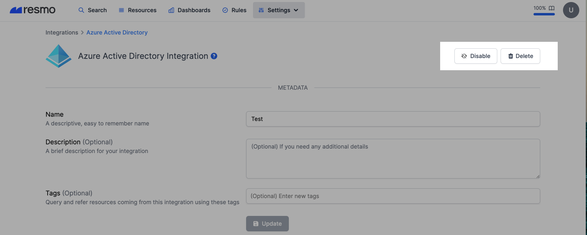

# Azure Active Directory Integration

## Resmo + Azure Active Directory Integration Fundamentals

Resmo easily integrates with AzureAD to secure and query your entire resource asset.

### What does Resmo offer to AzureAD users?

* Collect and monitor all AzureAD resources in near real-time from one place
* Query your assets with the simplified SQL language
* Run automated rule checks with managed or custom rules
* Get notified of rule changes in real-time
* Discover historical data for your resource changes, queries, and rule violations

### How does the integration work?

Resmo connects with AzureAD through an OAuth flow. Then, it initiates polling and aggregating your existing resources. After the initial polling, Resmo performs polling at regular intervals to collect resource changes in real-time.




**Tip:** Use [Audit Logs](../audit-logs/audit-logs.md) for comprehensive monitoring of all Azure Active Directory activities and system events.


### Common queries and rules

* View AzureAD organization-verified domains.
* List guest users.
* See Service Principal OAuth2 permissions.
* Find user groups that are not assignable to any role.
* List user accounts that are not enabled.

### Integration walkthrough

#### How to Install

1. Sign up or sign in to Resmo.
2. Navigate to Integrations and select Azure Active Directory.
3. Click the Add Integration button.
4. Click Create.
5. You'll be redirected to Azure. Accept permissions.

The required **read-only access level permission scopes for the integration** are as the following:


* **Maintain access to data you have given it access to**

Allows the app to see and update the data you gave it access to, even when you are not currently using the app. This does not give the app any additional permissions.

* **Read all users' full profiles**

Allows the app to read the full set of profile properties, reports, and managers of other users in your organization, on your behalf.

* **Read audit log data**

Allows the app to read and query your audit log activities, on your behalf.

* **Read access reviews that you can access**

Allows the app to read information on access reviews, reviewers, decisions and settings that you have access to.

* **Read all app catalogs**

Allows the app to read apps in the app catalogs.

* **Read the names and descriptions of channels**

Read channel names and channel descriptions, on your behalf.

* **Read the members of teams and channels**

Read the members of channels, on your behalf.

* **Read the names, descriptions, and settings of channels**

Read all channel names, channel descriptions, and channel settings, on your behalf.

* **Read Cloud PCs**

Allows the app to read the properties of Cloud PCs, on your behalf.

* **Read consent requests**

Allows the app to read consent requests and approvals, on your behalf.

* **Read your contacts**

Allows the app to read contacts in your contact folders.

* **Read directory data**

Allows the app to read data in your organization's directory.

* **Read domains**

Allows the app to read all domain properties on your behalf.

* **Read identity providers**

Allows the app to read your organization’s identity (authentication) providers’ properties on your behalf.

* **Read Microsoft Intune apps**

Allows the app to read the properties, group assignments and status of apps, app configurations and app protection policies managed by Microsoft Intune.

* **Read Microsoft Intune Device Configuration and Policies**

Allows the app to read properties of Microsoft Intune-managed device configuration and device compliance policies and their assignment to groups.

* **Read devices Microsoft Intune devices**

Allows the app to read the properties of devices managed by Microsoft Intune.

* **Read Microsoft Intune RBAC settings**

Allows the app to read the properties relating to the Microsoft Intune Role-Based Access Control (RBAC) settings.

* **Read Microsoft Intune configuration**

Allows the app to read Microsoft Intune service properties including device enrollment and third party service connection configuration.

* **Read all managed tenant information**

Allows the app to read all managed tenant information on your behalf.

* **Read organization information**

Allows the app to read the organization and related resources, on your behalf. Related resources include things like subscribed skus and tenant branding information.

* **Read all users’ relevant people lists**

Allows the app to read a list of people in the order that is most relevant to you. Allows the app to read a list of people in the order that is most relevant to another user in your organization. These can include local contacts, contacts from social networking, people listed in your organization’s directory, and people from recent communications.

* **Read your organization's policies**

Allows the app to read your organization's policies on your behalf.

* **Read role management data for all RBAC providers**

Allows the app to read the role-based access control (RBAC) settings for all RBAC providers, on your behalf. This includes reading role definitions and role assignments.

* **Read your organization’s security events**

Allows the app to read your organization’s security events on your behalf.

* **Read your organization's security actions**

Allows the app to read security actions, on your behalf.

* **Read service health**

Allows the app to read your tenant's service health information on your behalf.Health information may include service issues or service health overviews.

* **Read service messages**

Allows the app to read your tenant's service announcement messages on your behalf. Messages may include information about new or changed features.

* **Read items in all site collections**

Allow the application to read documents and list items in all site collections on your behalf.

* **Read data subject requests**

Allows the app to read subject rights requests on your behalf.

* **Read teams' settings**

Read all teams' settings, on your behalf.

* **Read the members of teams**

Read the members of teams, on your behalf.

_To enable the User Provisioning feature on Resmo, additional required permissions are:_

* **Read and write all users' full profiles**

Allows the app to read and write the full set of profile properties, reports, and managers of other users in your organization, on your behalf.

* **Read and write group memberships**

Allows the app to list groups, read basic properties, read and update the membership of your groups. Group properties and owners cannot be updated and groups cannot be deleted.


6. Your integration is ready! Now you can start querying your Azure Active Directory resources!

#### How to Uninstall

1. Log in to your Resmo account.
2. Go to your Integrations page and select Azure AD.
3. Go to the Connected Integrations tab from the opening modal and select the one you want to remove or disable.

4\. To temporarily pause the integration, click the Disable button from the top right. Or, you can permanently remove it by clicking the Delete button.

5\. Optionally, you can remove your oAuth token after uninstalling the integration permanently. Follow the instructions [here](https://docs.microsoft.com/en-us/azure/active-directory/enterprise-users/users-revoke-access#azure-active-directory-environment).
