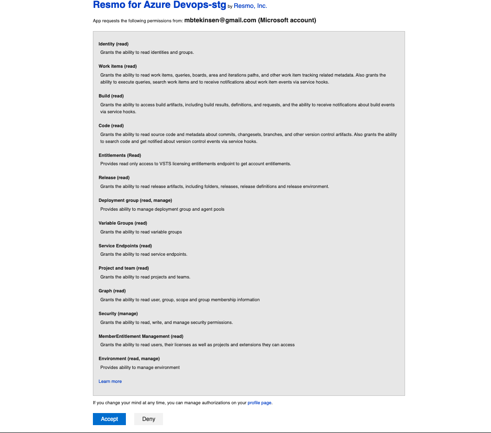

# Azure DevOps Integration

## Resmo + Azure DevOps Integration Fundamentals

<figure><figcaption></figcaption></figure>

### What does Resmo offer to Azure DevOps users?

* Aggregate your Azure DevOps assets on a single platform.
* Query your Azure DevOps users, teams, projects, and much more using Resmo's powerful SQL engine.
* Set up premade or custom rules to automatically and continuously assess your resources and configurations for security and compliance.
* Get notifications based on Azure DevOps resource configurations, changes, and security violations.

### How does the integration work?

Resmo has an Azure DevOps application that you can install once you sign up for a Resmo account. Our application uses API to make the initial polling and receive existing resources. Then, we receive resource changes and updates in real-time by regular polling.

#### Available resources



## Integration Walkthrough

### How to install

1. Go to your Integrations page and select Azure DevOps.
2. Click the Add Integration button at the bottom right corner of the opening modal.
3. Click the Create button.
4. You'll be redirected to Azure DevOps. Accept permissions.

<figure><figcaption></figcaption></figure>

5. You are ready! Now you can start querying your Azure DevOps resources!

#### About Access

* Resmo collects data for organizations that you are an owner of.
* The Organization Settings -> Application connection policies -> Third-party application access via OAuth must be enabled for accessing organization resources via OAuth.

#### Revoking Tokens

If you want to revoke your OAuth tokens after deleting the integration. Navigate [profile page](https://app.vssps.visualstudio.com/profile/view) -> Manage authorizations -> Revoke.

### How to uninstall

1. Go to Integrations -> Azure DevOps.
2. From the Connected Integrations tab of the opening modal, click the Azure DevOps integration you wish to uninstall.
3. You'll see two options on the top right; Disable and Delete. Disabling your integration makes Resmo pause all related polling until you enable it back again. Deleting, on the other hand, permanently removes it and cannot be undone.

### Support
