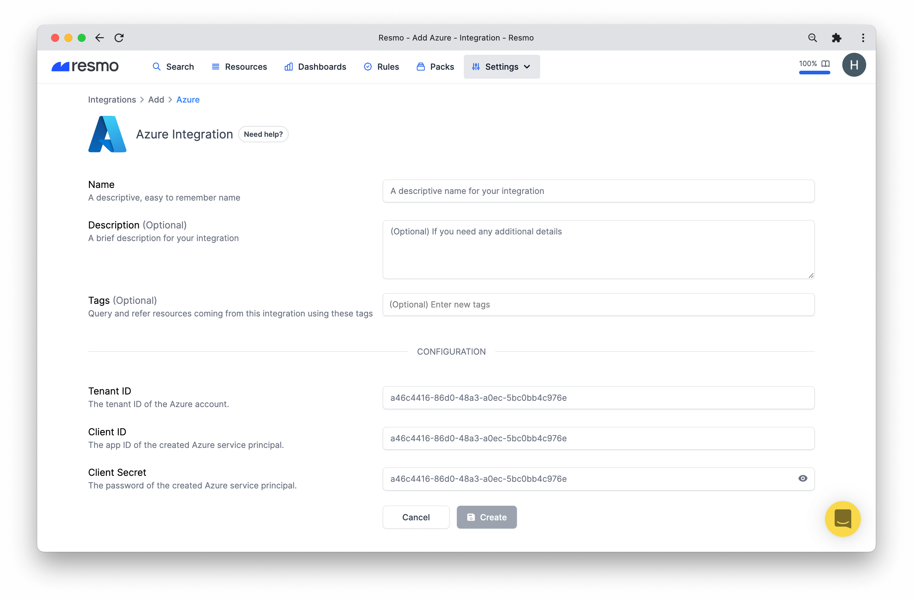

# Azure Integration

## Resmo + Azure Integration Fundamentals

<figure><figcaption></figcaption></figure>

Resmo seamlessly integrates with [Azure](https://portal.azure.com/) to ensure the security and compliance of your Azure environment.

### What does Resmo offer to Microsoft Azure users? 

* Collect all your Azure assets in place.
* Query your networks, storage, virtual machines, and 50+ other resources.
* Set up rule notifications based on Azure resource configurations and their changes.
* Set up custom or predefined rules for continuous security and compliance auditing.
* Check your Azure security and compliance posture using the Azure Best Practices and compliance packs.&#x20;

### How does the integration work?

Resmo has an Azure integration that you can install securely once you sign up for a Resmo account. Our application uses API calls to make the initial polling and receive existing resources.

### Available resources

Resmo Azure integration collects Network, Compute, Storage, and much more.



### Common queries and rules

* Find Security Center subscriptions per tier
* Detect virtual networks without DDoS protection
* Identify virtual network VM protection
* List DNS zones with public access
* See network security groups without subnets
* List subscriptions managed by other tenants

### Integration Walkthrough

You can follow the instructions to create a[ Service Principal](https://docs.microsoft.com/en-us/azure/active-directory/develop/app-objects-and-service-principals#service-principal-object) in an Azure shell/terminal.

#### **Setup Your Azure Account**

#### Create a Service Principal with [Reader](https://docs.microsoft.com/en-us/azure/role-based-access-control/rbac-and-directory-admin-roles#azure-roles) role:

\
\>`az ad sp create-for-rbac --role Reader`

``\
``_Example Output:_\
__`{` \
&#x20;`"appId": "###appId###",  // Client Id`\
&#x20;`"displayName": "azure-cli-2022-04-13-14-04-21",`\
&#x20;`"password": "#####",   // Client Secret`\
&#x20;`"tenant": "###tenantId###" // Tenant Id`\
`}`

#### **For giving access for key vault entities (OPTIONAL)**&#x20;

1. Find objectId of the principal\
   `az ad sp show --id ###appId### --query objectId`
2. Give your key vault read permission access to the created service principal with objectId\
   `az keyvault set-policy --name ###vaultName### \`\
   `--object-id ###objectId### --secret-permissions get list \`\
   `--key-permissions get list --certificate-permissions get list`

#### **For giving access for other subscriptions of the Tenant (OPTIONAL)**&#x20;

`az role assignment create --assignee ###appId### --role Reader --scope /subscriptions/###subscriptionId###`

**How to install**&#x20;

1. Sign up or log in to your Resmo account.&#x20;
2. Go to the Integrations page, click on Add Integration, and select Azure.
3. Name the integration and write a description (optional.)
4. Fill configuration fields with the created Service Principal in [#setup-your-azure-account](azure-integration.md#setup-your-azure-account "mention")

5\. Hit the create button, and you are ready to run queries.&#x20;

#### How to uninstall&#x20;

1. Login to your Resmo account.&#x20;
2. Navigate to the Integrations page and click your Azure integration.
3. Click the Delete button to uninstall or Disable to stop polling Azure resources temporarily.
4. (Optional) Delete the created Service Principal from App Registrations on your Azure Portal.

### FAQ

What should I check if integration fails to install?

* Check your Service Principal's rights on your Azure Portal
* Be ensure your account have privileges to create Service Principal

If it is still not ready, delete the integration and create from scratch with following steps via creating new Service Principal.

What happens if I delete required resource used by integration to poll my resources?

You will see `Not Ready` state for your integration after a while. To fix the problem you need to visit the setup steps and recreate the necessary resources for your account. After updating your integration you will see your integration became ready to poll resources.

Can I update the Tenant ID for my integration?

Changing `Tenant ID` is not allowed for Azure integration. If you want Resmo to poll resources from another project you need to create a new integration or delete the current one.

I could not see resources even if exists on my Azure account, how can I fix it?

It may cause from two different scenario:

* The created service principal app does not have right for fetching the related resource. Have a look at permissions of your Service Principal. Creating new integration and service principle may fix  the problem immediately.
* The resource may not be in your default subscription, you can try adding other subscriptions to the created Service Principle with this command:[#for-giving-access-for-other-subscriptions-of-the-tenant-optional](azure-integration.md#for-giving-access-for-other-subscriptions-of-the-tenant-optional "mention")``

