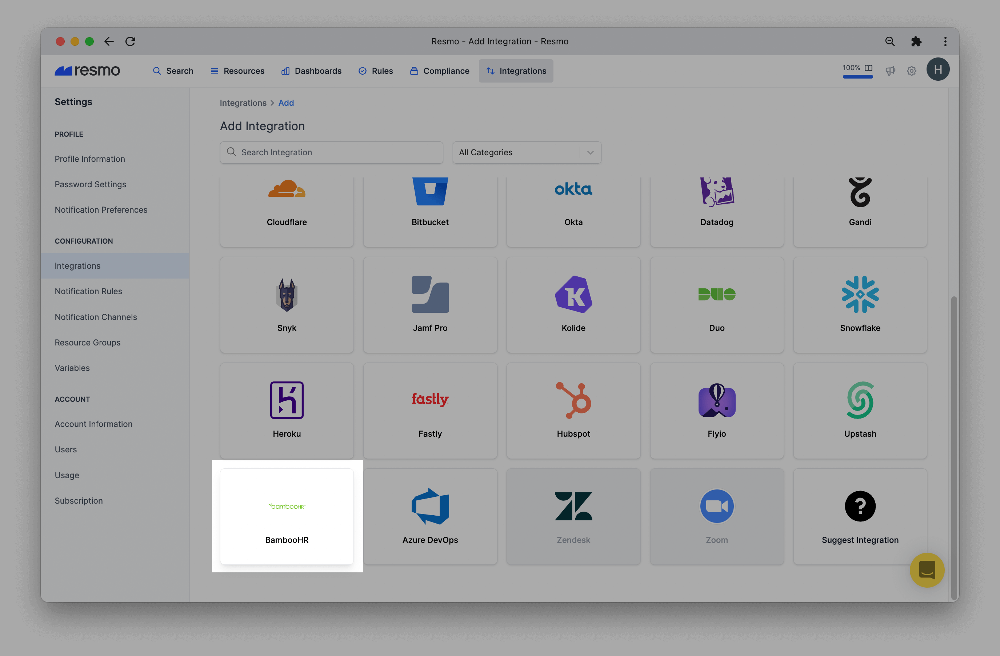
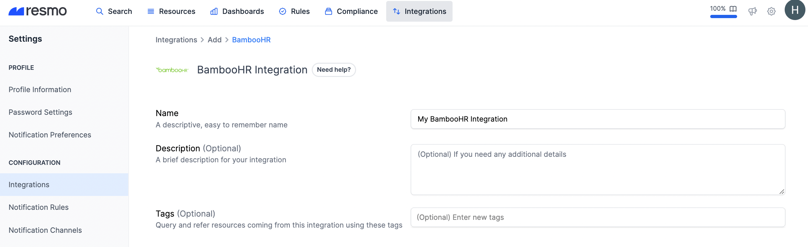
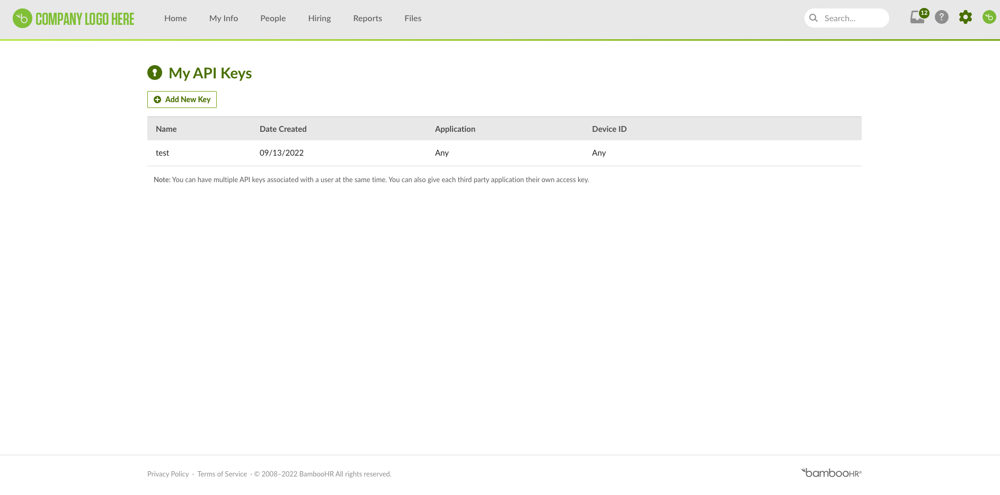

# BambooHR Integration

## Resmo + BambooHR Integration Fundamentals

<figure><figcaption></figcaption></figure>

### What does Resmo offer to BambooHR users?

* Collect your directory assets like users, employees, and company files from your BambooHR account (not the content of files) to create a complete asset inventory.
* Query your BambooHR users, employees, and files with Resmo's flexible SQL engine.
* Set up rules to automate your resources' security and compliance evaluation.
* Get timely notifications based on BambooHR resource configurations.

### How does the integration work?

Once you sign up to Resmo, you can easily integrate your account with BambooHR using the subdomain of your account and API Key.

* The **subdomain** can be obtained as follows: "mycompany" is the subdomain of https://mycompany.bamboohr.com.
* The **API Key** can be created from\
  [https://documentation.bamboohr.com/docs#authentication](https://documentation.bamboohr.com/docs#authentication)
  * As described in the BambooHR documentation, the API key will be created with the permissions of the associated user. This means the user must have sufficient permissions to create an API key, list users metadata, and list company files. (File content will not be collected.)
  * You can select company file categories to collect. Resmo will collect only selected categories.
  * Creating an API Key with the separate user that was created for the integration with its access requirements is recommended.

#### Available resources



## Integration Walkthrough

### How to install

1. Sign in or sign up to Resmo.
2. Go to your Integrations page and click the Add Integrations button from the top right.

<figure><figcaption></figcaption></figure>

3\. Find BambooHR from the list and click on it.

<figure><figcaption></figcaption></figure>

4\. Name the integration and write a description (optional.)

<figure><figcaption></figcaption></figure>

5\. Go to your BambooHR account and create an API Key by following the instructions from [https://documentation.bamboohr.com/docs#authentication](https://documentation.bamboohr.com/docs#authentication)

<figure><figcaption></figcaption></figure>

6\. Enter the API Key on the integration screen’s API Koken field.

7\. Enter the subdomain of your BambooHR account on the integration screen’s Subdomain field.

8\. Hit the create button, and you are ready to run queries.

### How to uninstall

1. Log in to your Resmo account and navigate to the Integrations page.
2. From there, click the BambooHR integration you want to uninstall.
3. To temporarily pause the integration, click the Disable button from the top right. To permanently remove it, click the Delete button.

### Support

Still have questions or issues? Get in touch with us via live chat or email us at contact@resmo.com.

