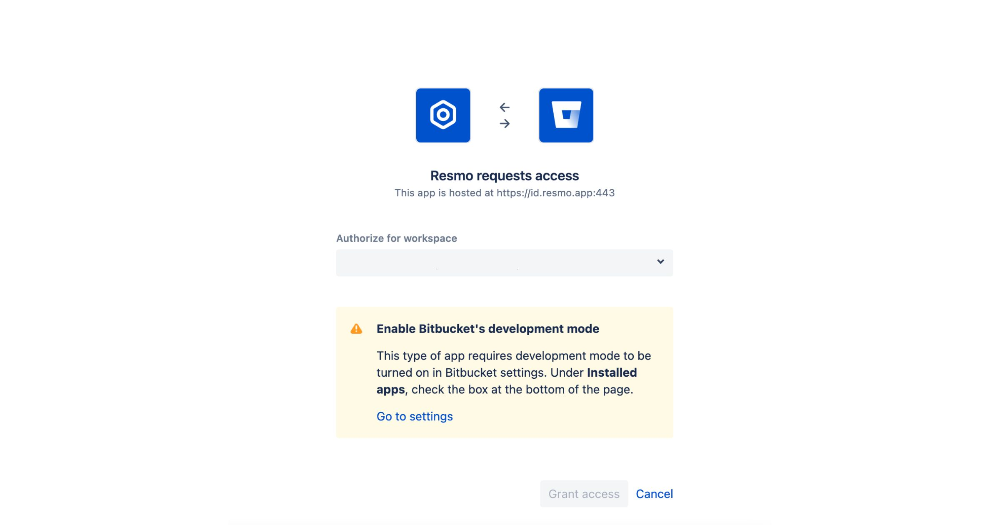

# Bitbucket Integration

## Resmo + Bitbucket Integration Fundamentals

Resmo seamlessly integrates with Bitbucket to secure your resources and mitigate asset vulnerabilities.&#x20;

### What does Resmo offer to Bitbucket users?

* Consolidate all Bitbucket assets in one place and track resource changes
* Automate security and compliance checks with rules
* Get alerted when there is a rule violation
* Query your entire Bitbucket asset inventory using SQL
* Visualize your cyber assets with dashboards and accelerate security controls

### How does the integration work?

Resmo has a Bitbucket application that you can install once you sign up for a Resmo account. Our application uses API to make the initial polling and receive existing resources. Then, we receive resource changes and updates in real-time by regular polling.

[Available Resources](https://docs.resmo.com/resources/bitbucket)

### Common queries and rules

* Identify publicly accessible projects
* Detect active repository webhooks
* List repositories that deny forking
* See public Bitbucket workspaces
* Identify pull requests that don't close the source branch
* List repositories that override the branching model

### Integration Walkthrough

#### How to Install

1. Login to your Resmo account and go to the Integrations page.
2. Find and select Bitbucket. Then, hit the Add Integration button at the bottom right corner of the opening modal.
3. Click Create, and you'll be redirected to Bitbucket; accept permissions.

4. Your Bitbucket integration is ready! Now you can start querying your resources!

#### How to Uninstall

1. Go to Integrations>Bitbucket.
2. Click the Connected Integrations tab on the opening modal and select the Bitbucket account you want to remove.&#x20;
3. You have two options. To temporarily pause the integration, click the Disable button. Or you can permanently remove the integration using the Delete button.

### Troubleshooting

If you have any questions or troubles with the integration, feel free to contact us via live chat on our website or email us at contact@resmo.com.
