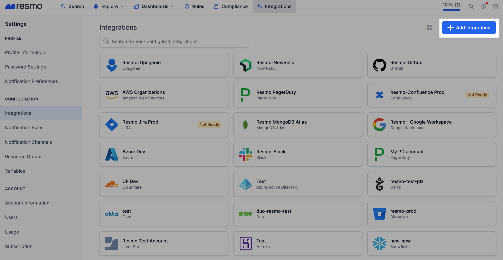
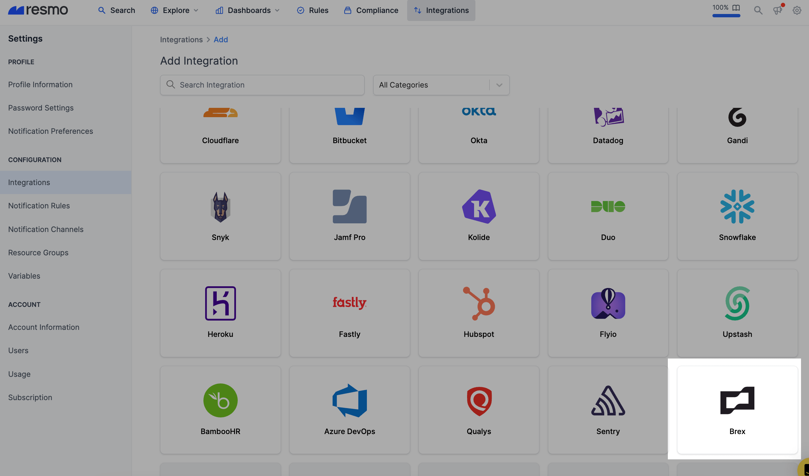
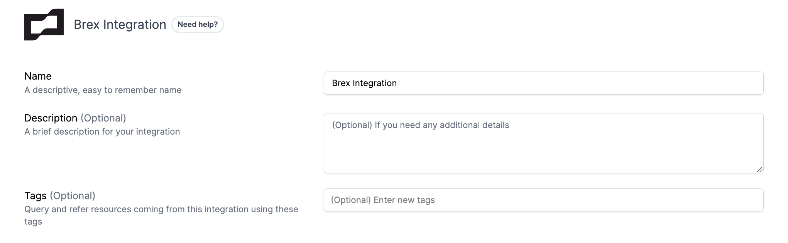
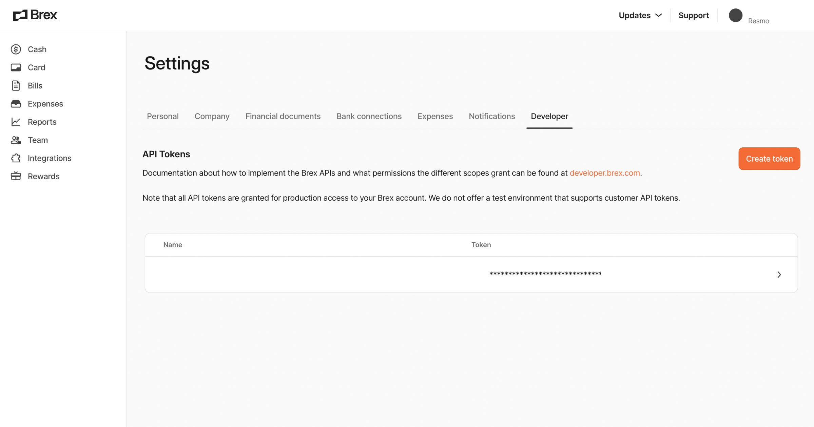
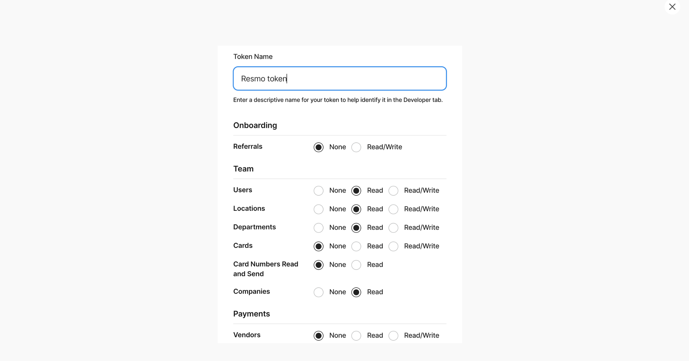
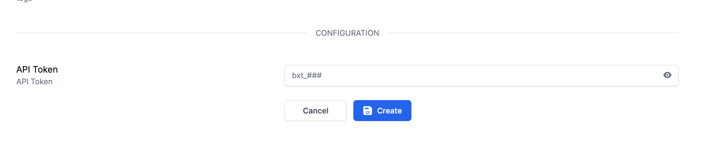
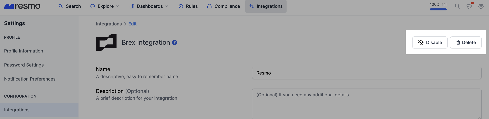

# Brex Integration

## Resmo + Brex Integration Fundamentals

<figure><figcaption></figcaption></figure>

Resmo Brex integration helps you gain visibility over your Brex resources, like companies, departments, and users, while keeping your environment secure and compliant.

### What does Resmo offer to Brex users?

* Collect your Brex assets like users, locations, departments, and companies in a single asset directory.
* Query your resources using SQL or free text search.
* Automate your security and compliance checks with managed or custom rules.
* Receive notifications when there is a rule change.
* Keep track of resource and configuration changes.

### How does the integration work?

Resmo uses API to do the initial polling and collect existing resources. Following the initial polling, it receives updates and changes in real-time through webhook and regular polling.

#### Available resources



## Integration walkthrough

### How to install

1. Sign up or sign in to your Resmo account.
2. Go to your Integrations page and click the Add Integration button.

<figure><figcaption></figcaption></figure>

3\. Add Brex.

<figure><figcaption></figcaption></figure>

4\. Name your Brex integrations and optionally write a description.

<figure><figcaption></figcaption></figure>

5\. Go to **Create Token** under the **Developer -> Settings** page.

<figure><figcaption></figcaption></figure>

6\. Create and copy the Read-only Auth Token from your Brex account. Required scopes:


* Users Read
* Locations Read
* Departments Read
* Companies Read


<figure><figcaption></figcaption></figure>

7\. Paste it to the API Token field on the setup page.

<figure><figcaption></figcaption></figure>

8\. Hit the Create button.

9\. That's it! Now you can start querying your Brex resources.

### How to uninstall

1. Log in to your Resmo account and navigate to the Integrations page.
2. Click the Brex integration you wish to remove.
3. To temporarily pause your Brex integration, click the Disable button. You can also permanently uninstall it by clicking the Delete button.&#x20;

<figure><figcaption></figcaption></figure>

### Support

Still have questions? Feel free to contact us via live chat or email us at contact@resmo.com.

