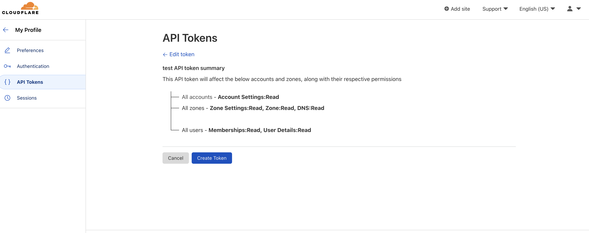
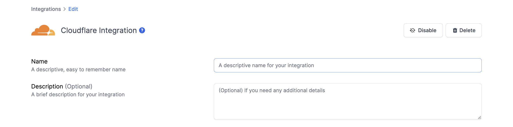

# Cloudflare Integration

## Resmo + Cloudflare Integration Fundamentals

Resmo integrates with Cloudflare to ensure the security and compliance of your Cloudflare assets.

### What does Resmo offer to Cloudflare users?

* Consolidate and monitor all your Cloudflare assets on a single platform.
* Query your Cloudflare users, zones, DNS records, user memberships, accounts, and more.
* Set up rules to continuously assess your Cloudflare resources.
* Receive notifications when there is a rule violation.

### How does the integration work?

Once you sign up to Resmo, you can easily integrate your account with Cloudflare using an API token. Resmo uses API to do the initial polling and collect existing resources. Then, we receive resource changes and updates in real-time by regular polling.

[Available Resources](https://docs.resmo.com/resources/cloudflare)

### Common queries and rules

* See DNS record per zone
* Detect accounts without 2FA enforcement
* List account members with pending state count per account
* Identify DNSSEC activated zone count per account
* List account members with pending state
* Find active zones
* Identify phishing detected zones
* List account members with accepted state

### Integration walkthrough

#### How to Install

1. Login to your Resmo account and navigate to the Integrations page.

.jpg>)

2\. Click the Add Integration button and select Cloudflare.

3\. Name your integration and write a description (optional.)

.png>)

4\. Go to your Cloudflare account and create _read_ access granted API token from your user profile for the following sources:

* Account > Account Settings
* Zone > DNS
* Zone > Zone
* Zone > Zone Settings
* User > User Details
* User > Memberships


Cloudflare API tokens are generated from the User Profile>API Tokens page. The token requires permission to read all resources. You may also use the 'Read all resources' token template as demonstrated below.


.png>)

5\. Enter the user API token on the integration screen’s API token field.

.png>)

6\. Hit the create button, and you are ready to run queries.

#### How to Uninstall

1. Login to your Resmo account and navigate to the Integrations page.
2. Select the Cloudflare integration you wish to remove.
3. To temporarily pause the integration click the Disable button from the top right. Or, you may permanently uninstall it by clicking the Delete button.

### Troubleshooting

Please check your API token permissions if you cannot see your resources even if the integration is successfully configured.
