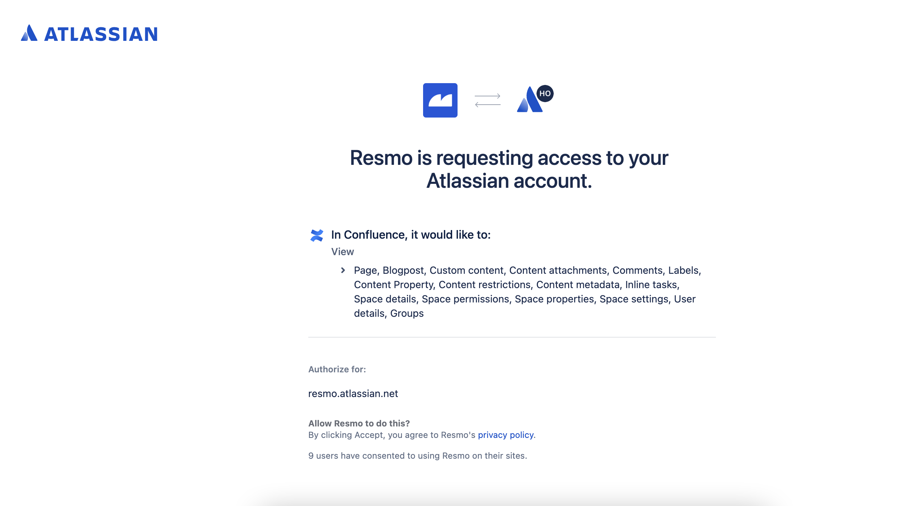

# Confluence Integration

## Resmo + Confluence Integration Fundamentals

Resmo integrates with Jira to help you protect your issues and project from potential risks and stay secure and compliant.

### What does Resmo offer to Confluence users?

* Gather all your Confluence resources in one place
* Query your assets using a streamlined SQL query engine
* Track change histories of your assets
* Set up rules to audit your resource compliance automatically
* Receive alerts on rule violations to accelerate response times

### How does the integration work?

Resmo integrates with Confluence through the OAuth 2.0 app. Once you hit the Create button on the Resmo Confluence integration page, you will be redirected to the OAuth page. After you accept the permissions, you can start querying Confluence assets on your Resmo account.

Resmo operates the resource receiving and regular data-update collection processes through API polling.&#x20;



### Common queries and rules

* List global Confluence spaces
* View the number of Confluence spaces opened by users

(To be added)

### Integration walkthrough

#### How to Install

1. Login to your Resmo account and go to your Integrations page.
2. Find and select Confluence. Hit the Add Integration button from the bottom right corner of the opening modal.
3. Click Create.
4. You’ll be redirected to your Atlassian account; accept permissions.

5\. All done! Now, you can start querying your Confluence resources.

#### How to Uninstall

1. Navigate to your Integrations page on Resmo
2. Select Confluence. On the Connected Integrations tab of the opening modal, click the Confluence integration you wish to uninstall.
3. The Disable button on the top right temporarily disables the integration. To permanently uninstall it, click the Delete button.
4. Optionally, you can remove your OAuth token after uninstalling the integration permanently. Follow instructions [here](https://developer.atlassian.com/cloud/confluence/oauth-2-3lo-apps/#site-scoped-grants-limitations).
