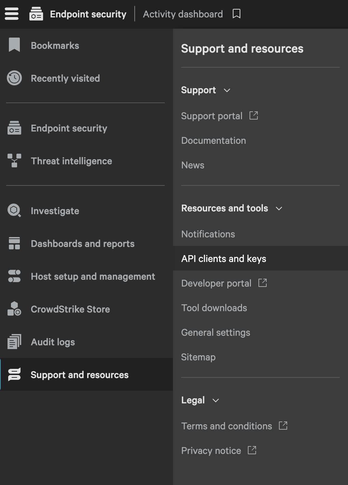

# CrowdStrike Integration

<figure><figcaption></figcaption></figure>

Resmo streamlines real-time cybersecurity monitoring by leveraging APIs and webhooks, enabling immediate data retrieval, updates, and alert notifications about your CrowdStrike resources.

### What does Resmo offer to CrowdStrike users?

* Use Resmo's SQL capabilities to ask complex questions about your CrowdStrike data, including user roles, permissions, host configurations, policy details, detection metrics, and sensor configurations.&#x20;
* Stay alert to changes in user roles and permissions within the CrowdStrike platform, getting notifications when new users are added or when existing roles and permissions are updated.&#x20;
* Receive alerts when changes occur in host statuses, policies, or group memberships.
* Ensure real-time monitoring of detection statuses and updates, with alerts for any new detections or status changes, enhancing your ability to respond to potential threats promptly.

### How does the integration work?

Resmo utilizes APIs to process initial data retrieval, collecting pre-existing resources from CrowdStrike. Following this initial accumulation of data, it maintains an up-to-date record by instantaneously capturing updates and changes through the use of webhooks and regular polling.

#### Available resources



### Integration Walkthrough

#### How to install

1. Find and select CrowdStrike from your Integrations page on Resmo.

<figure><figcaption></figcaption></figure>

2. Hit the Add Integration button from the bottom right corner.

<figure><figcaption></figcaption></figure>

3. Log in to your CrowdStrike account on a new tab.
4. Open **Support and Resources** from the left side menu, then select **API clients and keys** under **Resources and Tools**.

<figure><figcaption></figcaption></figure>

5. Enter the client name and description for the client. Then, select the following API scopes:

* Detections -> Read
* Device control policies -> Read
* Hosts -> Read
* Firewall management -> Read
* Host groups -> Read
* Prevention policies -> Read
* Response policies -> Read
* Sensor download -> Read
* Sensor update policies -> Read
* User management -> Read

<figure><figcaption></figcaption></figure>

6. Select the cloud environment for your CrowdStrike (e.g., US-2), which can be seen in the base URL.
7. Copy the **Client ID** and paste it into the related field on your Resmo-CrowdStrike integration screen.

<figure><figcaption></figcaption></figure>

8. Next, copy and paste the **Client Secret** for your Oauth app in the related field.
9. Click Create, and your CrowdStrike integration will be ready in a few minutes.

#### How to uninstall

1. Select CrowdStrike on your Integrations page.
2. Navigate to the Connected Integrations tab on the opening modal.
3. Select the integrated account you want to remove.
4. Integrations can either be temporarily disabled or permanently deleted.
5. Click the Disable or Delete button based on your choice.

<figure><figcaption></figcaption></figure>
