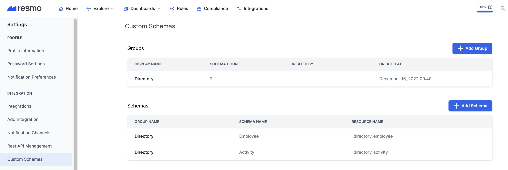
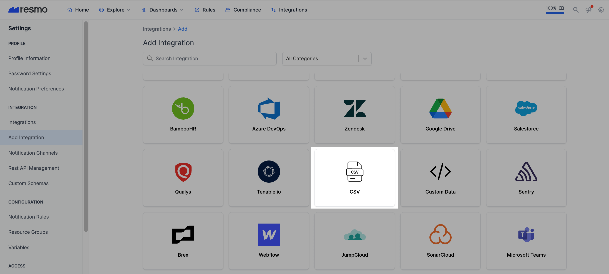
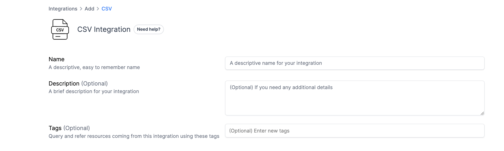
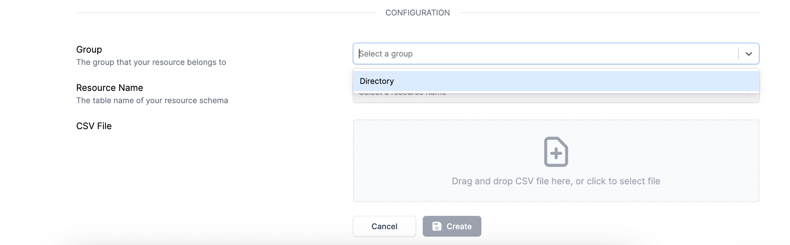
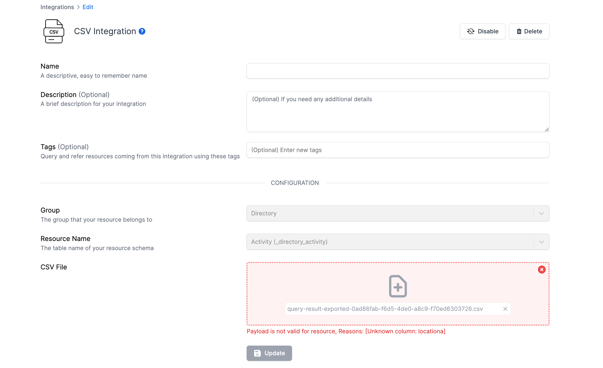
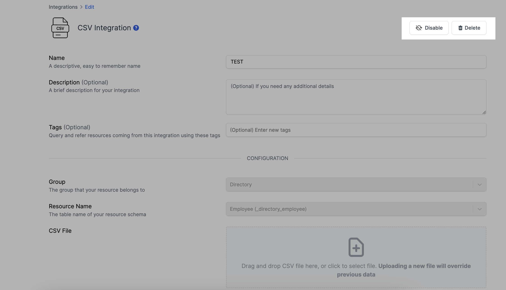

# CSV Integration

## Resmo + CSV Integration Fundamentals

<figure><figcaption></figcaption></figure>

Data from external sources can be uploaded into Resmo in the form of a CSV file for easy creation and tracking of custom resources.


CSV integration can be used with custom resource names and groups. To create custom schemas and groups, click [here](https://demo.resmo.app/settings/schemas).


### What does the CSV integration offer to Resmo users?

* Create custom resources by importing custom data in a CSV file.
* Export data from third-party sources (i.e., services that aren't yet integrated with Resmo) and import them on Resmo as custom resources.
* Monitor custom resources and track changes.
* Query them using SQL or free text search.
* Create custom rules for your custom resources.

### How does the integration work?

Resmo will validate the uploaded data once you specify a custom schema and group that matches the data format in your CSV file. Then, you can start monitoring and querying your custom resources on Resmo.&#x20;


Existing CSV integrations can be edited.&#x20;

* You cannot update the Group and Resource Name of an existing CSV integration.
* Uploading a new CSV file will override the previous data. Therefore, the previous data will be deleted and replaced with the new one.




## Integration walkthrough

### How to install

1. Log in to your Resmo account and navigate to Settings.
2. Go to Custom Schemas from the left side panel.


To add the CSV integration, you must create custom schemas and groups. If you don't have any yet, you will see a warning message on the CSV integration screen.


3\. [Create custom schemas](https://docs.resmo.com/product/integrations/custom-data-integration#1.1-creating-a-custom-schema-group) and groups to define your CSV data so that Resmo can validate them. [See how to create custom schemas and groups](custom-data-integration.md).

<figure><figcaption></figcaption></figure>

4\. Once you define custom schemas and groups for your custom data, go to your Integrations page.

5\. Click the Add Integrations button from the upper right corner.

6\. Add CSV.

<figure><figcaption></figcaption></figure>

7\. Name your CSV integration and optionally write a description.

<figure><figcaption></figcaption></figure>

8\. On the Configuration section, select the group and resource name you created for this integration earlier.&#x20;

<figure><figcaption></figcaption></figure>

9\. Next, upload your CSV file and hit the Create button.


Make sure to select the correct group and resource name. Otherwise, the data format in your file won't match the defined custom schema and group. In that case, you will see the following error: "Payload is not valid for resource"


<figure><figcaption></figcaption></figure>

10\. If your file is successfully uploaded and matches the defined schema and group, you will be able to see your custom resources under Custom Data integration on the Resources page and query each custom resource on the Search page.&#x20;

### How to uninstall

1. Go to your Integrations page and click the CSV integration you want to remove.
2. You can either disable it and enable it later on whenever you want or delete it permanently. Depending on your choice, click the related button (Disable/Delete) from the upper right corner.&#x20;
3. As another option, you may choose to update the CSV file you uploaded. Note that the new file will override the existing one. The existing resources in the CSV file will therefore be replaced with the new ones.

<figure><figcaption></figcaption></figure>
