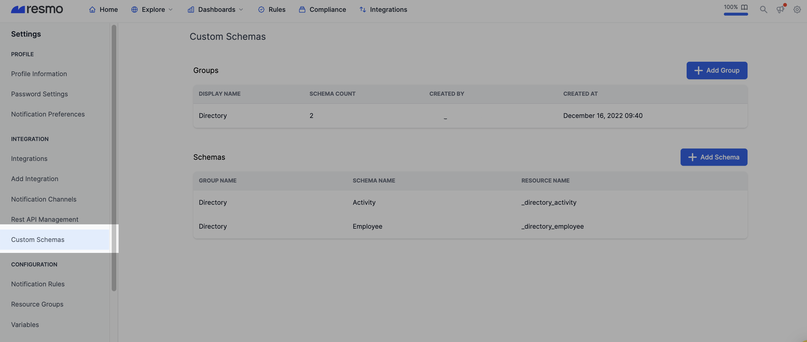
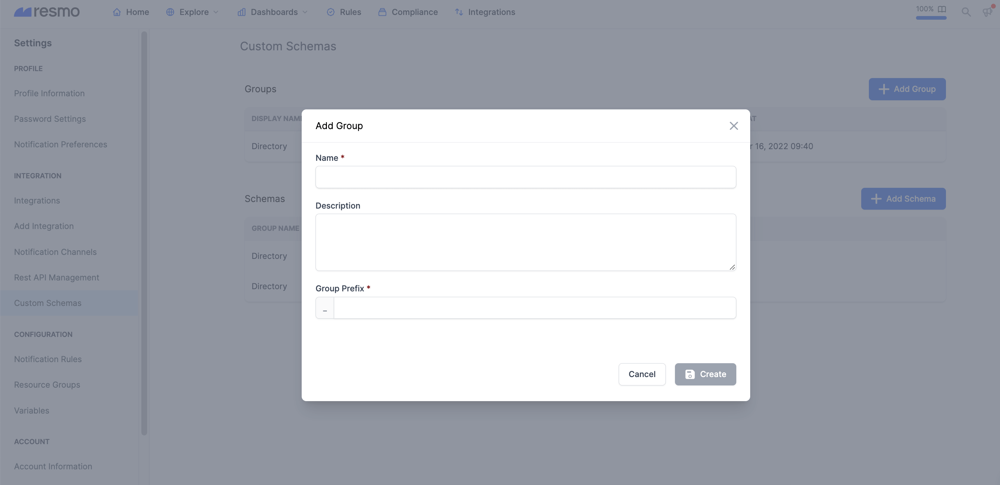

# Custom Data Integration

Custom data integration allows you to create custom resource schemas and collect custom data in addition to existing resources.

To add your custom data integration, first, you need to **create a custom schema group**, **custom schema**, and then **create the integration** (consequently, in this order.) Follow the instructions below for details.

## PART 1. Preparing integration and schema <a href="#part-1.-preparing-integration-and-schema" id="part-1.-preparing-integration-and-schema"></a>

### 1.1 Creating a custom schema group <a href="#1.1-creating-a-custom-schema-group" id="1.1-creating-a-custom-schema-group"></a>

Schema groups have unique names and prefixes. The prefix will be used as a prefix on your custom resources.

Before adding a custom schema and a custom data integration, a valid custom schema group should be created. To do that, go to **Settings** → **Custom Schemas** (under the _Integrations_ section).

<figure><figcaption></figcaption></figure>

Then click the _**Add Group**_, and fill in the related sections.

<figure><figcaption></figcaption></figure>


_**Name**_ field is a unique identifier for group names.

_**Description**_ field is an optional field to set more details about the schema group.

_**Group Prefix**_ field is a unique field and will be used in custom resources as a prefix.


### 1.2 Creating a custom schema (custom resource) <a href="#1.2-creating-a-custom-schema-custom-resource" id="1.2-creating-a-custom-schema-custom-resource"></a>

After creating a group, then we can create a custom schema. To do that, go to **Settings** → **Custom Schemas** (under the _Integrations_ section).

Then click the **Add Schema**, and fill in the related sections.

<figure><figcaption></figcaption></figure>


_**Group**_ is the schema group to which the schema belongs. Group prefix will be used as the table name (resource name) prefix.

_**Name**_ field is a unique identifier name across all of your group names. It will be the resource name in the Resources page section under group3.

_**Table Name**_ field is a unique identifier resource name. You cannot create a new resource with the same name after being removed.

_**Test Data**_ is a field you can put your payload to test your schema before creating it.

_**Schema->**_ see below


#### _Schema limitations and requirements_ <a href="#schema-limitations-and-requirements" id="schema-limitations-and-requirements"></a>

* Resmo uses JSON Schema (for more information:  [JSON Schema](https://json-schema.org/)) for creating a custom resource schema.


**JSON Schema** is a declarative language that allows you to **annotate** and **validate** JSON documents.

JSON Schema enables the confident and reliable use of the JSON data format.


* Support for only the 2020-12 version ([JSON Schema 2020-12 Release Notes](https://json-schema.org/draft/2020-12/release-notes.html))
* It cannot be empty or any type other than an object because Resmo only supports object(a valid map) structure for resources.
* There must be a `resmo` property inside of the schema’s root. It can contain `id`, `name` (optional), `importantFields` (optional). Those paths support json-path ([JSONPath - XPath for JSON](https://goessner.net/articles/JsonPath/) ):
  * `id`: the path of the id field, which cannot be empty, must be a string. This information will be used unique identifier of the resource.
  * `name`: the path of the name field, optional, must be a string. This information will be used to display the purpose of the resource on Resmo.
  * `importantFields`: paths of the important fields, optional, list of paths. This information will be used for display purposes as well on Resmo.

Example:

`1"resmo": { 2 "id": "employeeId", 3 "name": "$.employee.username", 4 "importantFields": [ 5 "employeeId", 6 "$.employee.email", 7 "active" 8 ] 9}`

* If the schema is valid, Resmo services put `unevaluatedProperties` property to the root path of the schema to avoid sending unevaluated properties. (extra/unknown properties)

### 1.3 Creating a custom data integration <a href="#1.3-creating-a-custom-data-integration" id="1.3-creating-a-custom-data-integration"></a>

After the group and the schema is created, you can now create an integration to attach them. To do that, go to **Settings** → **Integrations** (under the _Integrations_ section) and _Add Integration_.&#x20;

<figure><figcaption></figcaption></figure>

**Select **_**Custom Data**_ integration from the available integrations list.

<figure><figcaption></figcaption></figure>


_**Name**_ field is a unique identifier name across all of your group names.

_**Description**_ field is an optional field to set more details about the schema group.

_**Tags**_ field is an optional field to set tags for your integration.

_**Ingest Key**_ is an authentication key for sending resource requests to Resmo.

_**Group**_ is a field to select a custom schema group to attach it. Reminder: you cannot select a group without custom schemas, and integration can be attached to one group only.


## PART 2. Sending resource changes to Resmo <a href="#part-2.-sending-resource-changes-to-resmo" id="part-2.-sending-resource-changes-to-resmo"></a>

After the integration is created with valid groups and schemas, you can send your resource changes with HTTP requests.

In this part, you can check out example schema, and resource payloads in:&#x20;



### 2.1 Sending a resource to Resmo <a href="#2.1-sending-a-resource-to-resmo" id="2.1-sending-a-resource-to-resmo"></a>

```
$ curl --request POST \
  --url https://YOUR_DOMAIN.resmo.app/integration/custom-data/event/YOUR_TABLE_NAME_HERE?groupKey=YOUR_GROUP_KEY_HERE&event=YOUR_EVENT_NAME_HERE&actor=YOUR_ACTOR_HERE \
  --header 'Content-Type: application/json' \
  --header 'X-Ingest-Key: YOUR_INTEGRATION_INGEST_KEY_HERE' \
  --data 'PAYLOAD_HERE'
```

`https://YOUR_DOMAIN.resmo.app/integration/custom-data/event/YOUR_TABLE_NAME_HERE` **→** Set your domain name and requested table name. (which is named as _Table Name_ on the schema)

`?groupKey=YOUR_GROUP_KEY_HERE` **→** **(OPTIONAL**) For grouping resources, for example, you have multiple resources with the same identifier, but those belong to another department/company etc., you can set groupKey. To see more detail about groupKey you can check `_meta` of the resource.

`&event=YOUR_EVENT_NAME_HERE` → **(OPTIONAL)** Event name of the HTTP request; you can see it on the changes history.

`&actor=YOUR_ACTOR_HERE` **→ (OPTIONAL)** Actor name of the HTTP request; you can see it on the changes history as well. it should be a JSON.

`‘X-Ingest-Key: YOUR_INTEGRATION_INGEST_KEY_HERE'` **→** Ingest Key of the integration.

`--data 'PAYLOAD_HERE'` **→** Resource payload

#### How Resmo processes the request <a href="#how-resmo-process-the-request" id="how-resmo-process-the-request"></a>

* If there is no resource with id (+ groupKey) information before then, there will be a new resource!

<figure><figcaption></figcaption></figure>

* If there is an existing resource, this request will be considered an update request. For the update request, if the current resource is the same, then the request will be ignored.

<figure><figcaption></figcaption></figure>

* To remove a resource, please have a look at deleting a resource section.

#### Payload limitations and requirements <a href="#payload-limitations-and-requirements" id="payload-limitations-and-requirements"></a>

* Be sure that the requested payload is valid with the JSON schema
* Payload with unknown fields will not be processed
* Size could not be bigger than 1MB for each resource
* The Actor field can be up to 1000 characters, and the event and groupKey fields can be up to 100 characters.
* Payloads without id field information will be rejected.

### 2.2 Sending bulk resources to Resmo <a href="#2.2-sending-bulk-resources-to-resmo" id="2.2-sending-bulk-resources-to-resmo"></a>

```
$ curl --request POST \
  --url https://YOUR_DOMAIN.resmo.app/integration/custom-data/bulk-event/YOUR_TABLE_NAME_HERE?groupKey=YOUR_GROUP_KEY_HERE&event=YOUR_EVENT_NAME_HERE&actor=YOUR_ACTOR_HERE \
  --header 'Content-Type: application/json' \
  --header 'X-Ingest-Key: YOUR_INTEGRATION_INGEST_KEY_HERE' \
  --data 'LIST-OF-PAYLOAD-HERE'
```

`https://YOUR_DOMAIN.resmo.app/integration/custom-data/bulk-event/YOUR_TABLE_NAME_HERE` **→** Set your domain name and requested table name. (which is named as _Table Name_ on the schema)

`?groupKey=YOUR_GROUP_KEY_HERE` **→ (OPTIONAL)** For grouping resources, for example, you have multiple resources with the same identifier, but those belong to another department/company, etc., you can set groupKey. To see more detail about groupKey you can check `_meta` of the resource.

`&event=YOUR_EVENT_NAME_HERE` **→ (OPTIONAL)** Event name of the HTTP request; you can see it on the changes history.

`&actor=YOUR_ACTOR_HERE` **→ (OPTIONAL)** Actor name of the HTTP request; you can see it on changes history as well. it should be a JSON.

`‘X-Ingest-Key: YOUR_INTEGRATION_INGEST_KEY_HERE'` **→** Ingest Key of the integration.

`--data 'LIST-OF-PAYLOAD-HERE'` **→** List of resources

#### How Resmo processes the request <a href="#how-resmo-process-the-request.1" id="how-resmo-process-the-request.1"></a>

* This endpoint is for sending a bunch of resources at once.
* If there is no resource with id (+ groupKey) information before then, there will be a new resource!
* If there is an existing resource, it will be updated. Ignored if the resource payload is the same.
* Bulk does not support patches; it needs every resource in the request. It means if there is a missing resource in the payload, then it will be removed.
  * For example, in the screenshot, three resources were added for `_directory_employee` with IDs a, b, c with one bulk request.
  * After then, there will be another bulk request with a, b, d resources, and c is missing and a, b updated.
  * As a result, c is removed, a and b are updated, and d is added as a resource.

#### Payload limitations and requirements <a href="#payload-limitations-and-requirements.1" id="payload-limitations-and-requirements.1"></a>

* Same validations with **Sending a resource to Resmo**
* The size cannot exceed 4MB for all resources in one request.

### 2.3 Deleting a resource from Resmo <a href="#2.3-deleting-a-resource-from-resmo" id="2.3-deleting-a-resource-from-resmo"></a>

```
$ curl --request DELETE \
  --url https://YOUR_DOMAIN.resmo.app/integration/custom-data/YOUR_TABLE_NAME_HERE?resourceIds=IDS&groupKey=YOUR_GROUP_KEY_HERE&event=YOUR_EVENT_NAME_HERE&actor=YOUR_ACTOR_HERE \
  --header 'X-Ingest-Key: YOUR_INTEGRATION_INGEST_KEY_HERE' \
```

`https://YOUR_DOMAIN.resmo.app/integration/custom-data/bulk-event/YOUR_TABLE_NAME_HERE` **→** Set your domain name and requested table name. (which is named as _Table Name_ on the schema)

`?resourceIds=IDS` **→** Requested resource IDs'

`&groupKey=YOUR_GROUP_KEY_HERE` **→ (OPTIONAL)** For grouping resources, for example, if you have multiple resources with the same identifier, but those belong to another department/company, etc., you can set groupKey. To see more detail about groupKey you can check `_meta` of the resource.

`&event=YOUR_EVENT_NAME_HERE` **→ (OPTIONAL)** Event name of the HTTP request; you can see it on the changes history.

`&actor=YOUR_ACTOR_HERE` **→ (OPTIONAL)** Actor name of the HTTP request; you can see it on changes history as well. it should be a JSON.

`‘X-Ingest-Key: YOUR_INTEGRATION_INGEST_KEY_HERE'` **→** Ingest Key of the integration.

#### How Resmo processes the request <a href="#how-resmo-process-the-request.2" id="how-resmo-process-the-request.2"></a>

* If there is no resource with ID (+ groupKey) information, then it will be ignored.

### Troubleshooting

Having trouble creating your custom data integration? Feel free to contact us via live chat or email us at contact@resmo.com.
