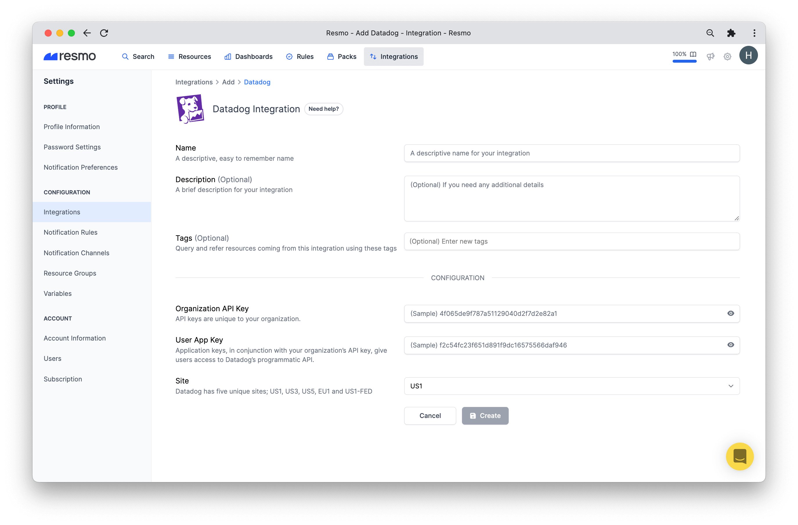
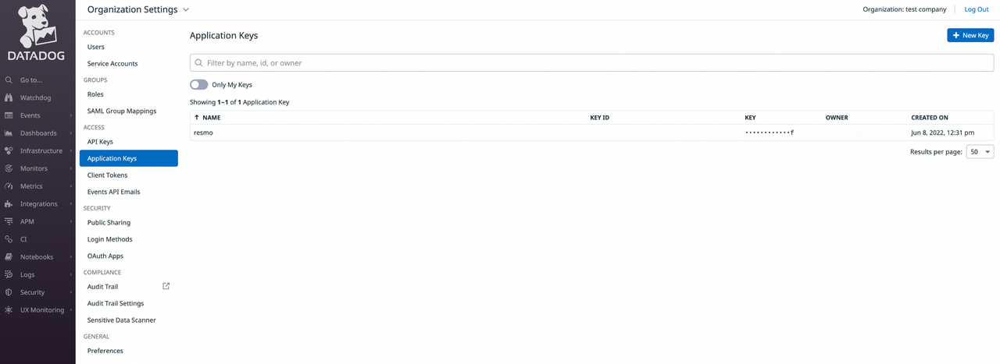
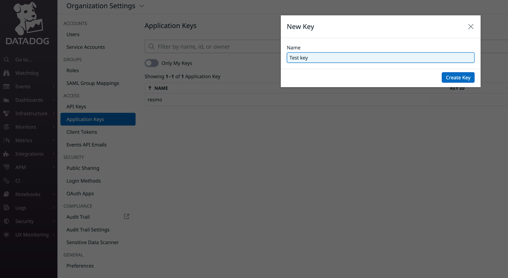
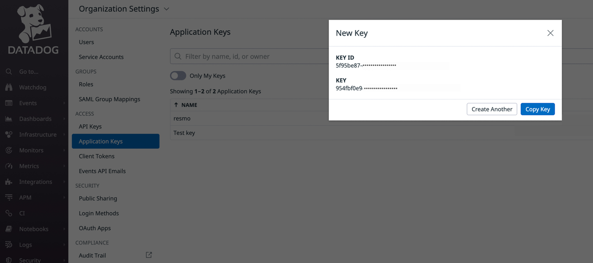
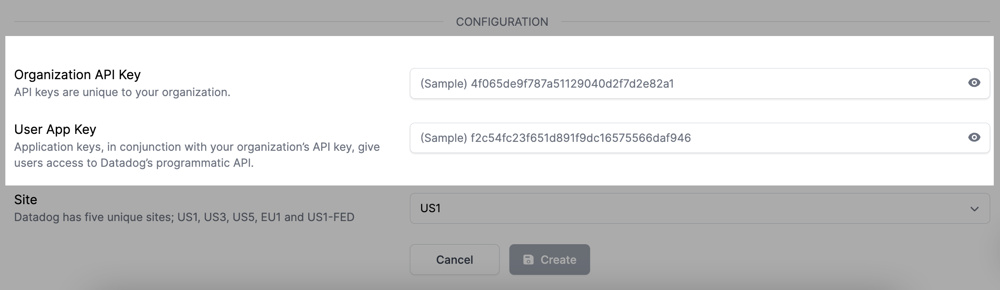
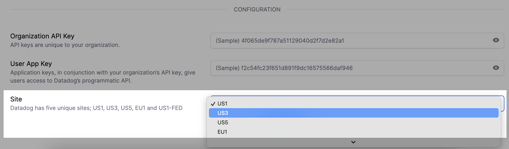

# Datadog Integration

## Resmo + Datadog Integration Fundamentals

Resmo seamlessly integrates with Datadog to help keep your Datadog resources secure, compliant, and visible.

### What does Resmo offer to Datadog users?

* Collect and monitor all your Datadog assets on a single platform.
* Query your Datadog monitors, roles, permissions, API Keys, and more.
* Set up rules to continuously assess your Datadog resources.
* Set up and receive rule notifications based on your Datadog resource configurations.

### How does the integration work?

Once you sign up to Resmo, you can easily integrate your account with Datadog using an API key with an Application key. Resmo uses API to do the initial polling and collect existing resources. Then, we receive resource changes and updates in real-time by regular polling.

[Available Resources](https://docs.resmo.com/resources/datadog)

### Common queries and rules

* See admin users
* List API keys with created user
* Identify restricted permissions
* List not verified users
* Detect permissions for a role
* List service account users
* See active users

## Integration Walkthrough

### **How to Install**

1. Login to your Resmo account and navigate to Integrations.

.png>)

2\. Click Add Integration and select Datadog.

3\. Write a descriptive name and optionally a description.

4\. Then, go to your Datadog account and create a new organization API key and a user Application key.

* **Step 1:** Go to Organization Settings>Application Keys on Datadog.

* **Step 2:** Click the +New Key button to create a key. Name your key and hit Create.

* **Step 3:** Find your key in the Application Keys tab. Then, copy it.

5\. Return to your Resmo account. Enter the copied keys into the related key fields (Organization API Key and User App Key).

6\. Select a site from the dropdown menu on the last field.&#x20;

7\. Hit the create button, and that's it! You're ready to query your Datadog resources.

### **How to Uninstall**

1. Go to Settings>Integrations and select the Datadog integration you wish to uninstall.
2. You have two options;
   1. To temporarily pause the integration, click the Disable button.
   2. To permanently remove the integration, click the Delete button.

### Support

If you have further questions, feel free to contact us via live chat or at contact@resmo.com.
