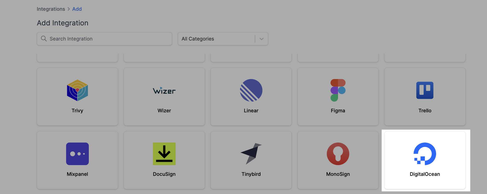
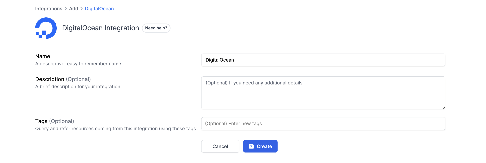
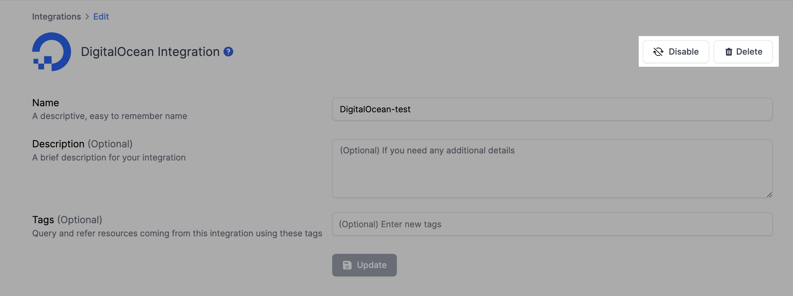

# DigitalOcean Integration

## Resmo + DigitalOcean Integration Fundamentals

<figure><figcaption></figcaption></figure>

Resmo integrates with DigitalOcean to make sure your DigitalOcean environment is safe and compliant.

### What does Resmo offer to DigitalOcean users?

* Collect your directory assets, like CDN endpoints, apps, firewalls, certificates, and more, on a single platform.
* Query your DigitalOcean app, domain, domain records, Kubernetes clusters, and more using SQL and free text search.
* Set up automated security rules to evaluate your DigitalOcean asset security posture.
* Get near real-time notifications of security rule violations to avoid vulnerabilities in time.

### How does the integration work?

Resmo uses API to do the initial polling and collect existing resources. Following the initial polling, it receives updates and changes in real-time through regular polling.

#### Available resources



## Integration walkthrough

### How to install

1. Sign up or sign in to Resmo.&#x20;
2. Navigate to the Integrations page and click the Add Integration button.
3. Add DigitalOcean.

<figure><figcaption></figcaption></figure>

4. Type a descriptive name for the integration and optionally a description.&#x20;

<figure><figcaption></figcaption></figure>

5. You'll be redirected to DigitalOcean. Accept permissions.&#x20;
6. You are ready! Now you can start querying your DigitalOcean resources!

### How to uninstall

1. Go to your Integrations page and click the DigitalOcean integration you want to remove.
2. To temporarily disable the integration, click the **Disable** button from the top right. You can enable it back later on. For permanent deletion, click the Delete button instead. This action cannot be undone.

<figure><figcaption></figcaption></figure>

### Support

Reach out to us for support requests or troubleshooting related to your DigitalOcean integration via live chat or email us at contact@resmo.com.
