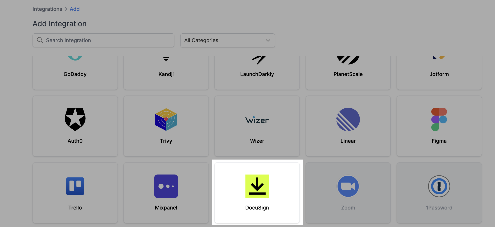

# DocuSign Integration

## Resmo + DocuSign Integration Fundamentals

<figure><figcaption></figcaption></figure>

DocuSign can easily be integrated with Resmo to maintain your assets' security, compliance, and visibility.

### What does Resmo offer to DocuSign users?

* Collect your directory assets like users, groups, and organizations from your DocuSign account.
* Query your DocuSign users, groups, organizations, and more.
* Set up custom security rules and run custom SQL queries to improve your asset visibility.
* Visualize your resource security using graph view or dashboards.
* Receive timely notifications of critical security rule changes.

### How does the integration work?

Resmo uses API to do the initial polling and collect existing resources. Following the initial polling, it receives updates and changes in real-time through webhook and regular polling.

#### Available resources



## Integration walkthrough

### How to install

1. Sign up or sign in to Resmo and navigate to the Integrations page.
2. Click the Add Integration button and add DocuSign.

<figure><figcaption></figcaption></figure>

3. Type a descriptive name for the integration and, optionally, a description.

<figure><figcaption></figcaption></figure>

4. You'll be redirected to DocuSign. Accept permissions.
5. Your DocuSign integration is ready! Now you can start querying your resources!

### How to uninstall

1. Go to your Integrations page on Resmo and click the DocuSign integration you want to remove.
2. For temporary disabling, click the Disable button from the upper right corner. This will pause the integration until the next time you enable it back.&#x20;
3. Or, you can permanently remove it by clicking the Delete button instead. Note that this action cannot be undone.

### Support

Reach out to our team for troubleshooting via live chat or email us at contact@resmo.com.
