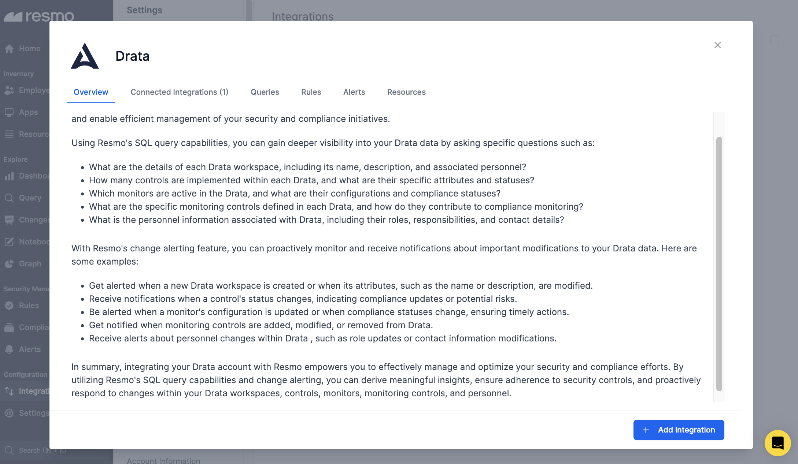
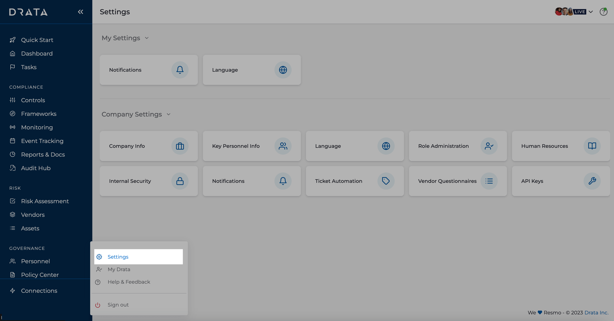
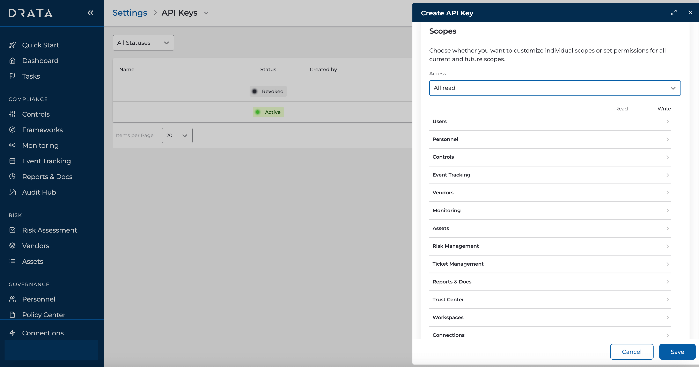
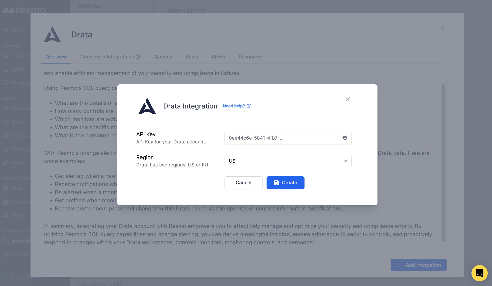
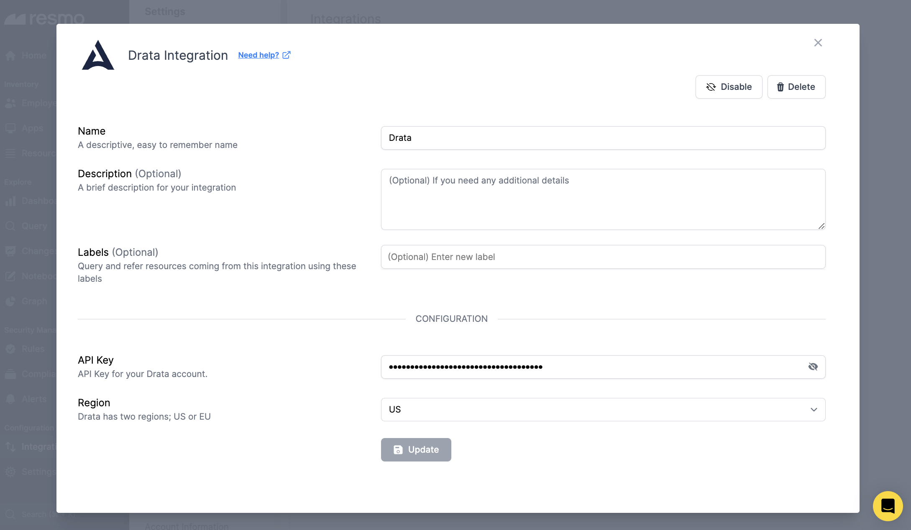

# Drata Integration

<figure><figcaption></figcaption></figure>

Resmo collects and visualizes the configuration data of your Drata workspaces, monitors, monitoring controls, controls, and personnel, as well as any change that occurs, to alert in time and reinforce your security and compliance operations.&#x20;

### What does Resmo offer to Drata users?

* See the details of each Drata workspace, including its name, description, and associated personnel.
* Check the number of implemented controls within each Drata with their specific attributes and statuses.
* List the personnel information associated with Drata, including their roles, responsibilities, and contact details.
* Set up automated checks for changes and vulnerabilities.
* Receive real-time alerts for security rules.

### How does the integration work?

Resmo uses API to do the initial polling and collect existing Drata resources. Following the initial polling, it receives updates and changes in real-time through webhook and regular polling.

**Available resources**



### Integration Walkthrough

#### How to install

1. Log in to Resmo and go to your Integrations page.
2. Find and select Drata.
3. Click the Add Integration button from the bottom right corner of the opening modal.

<figure><figcaption></figcaption></figure>

4. Then, log in to your Drata account. Go to Profile > Settings > API Keys.

<figure><figcaption></figcaption></figure>

5. Create an API Key and copy it to your clipboard.

<figure><figcaption></figcaption></figure>

6. Return to your Resmo integration screen and paste the copied API Key into the related field.

<figure><figcaption></figcaption></figure>

7. Select your Drata region and hit the Create button. Your integration is ready.

#### How to uninstall

1. Go to your Integrations page on Resmo.
2. Find and select Drata. Then, navigate to the Connected Integrations tab on the opening modal.
3. Select the account you want to remove.
4. You can either Disable it temporarily or Delete it permanently. Depending on your choice, click the Disable/Delete button from the top right.

<figure><figcaption></figcaption></figure>

### Support

Contact us via live chat or email us at contact@resmo.com for further questions and troubleshooting.
