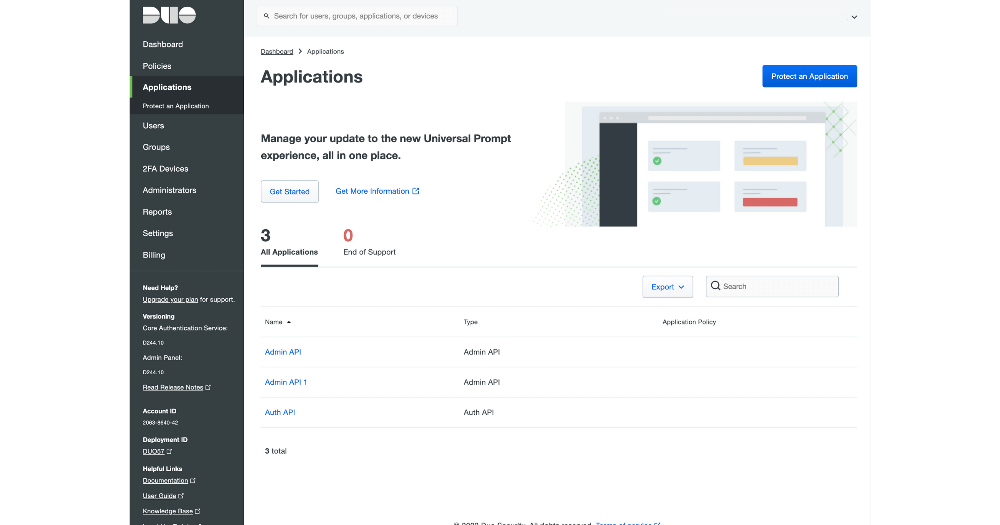
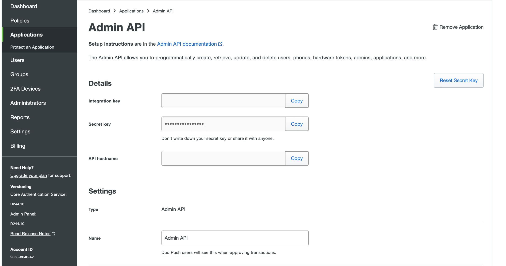
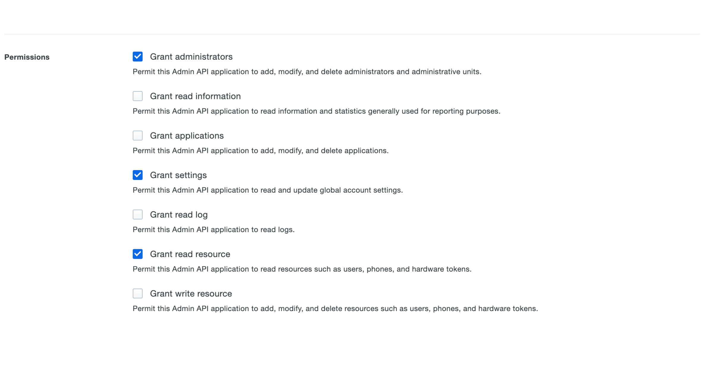
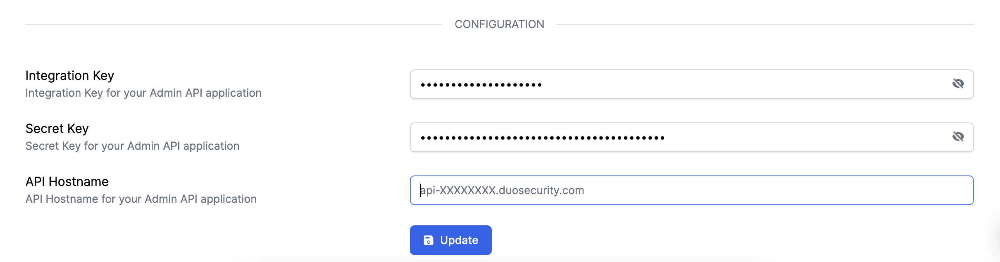

# Duo Integration

## Resmo + Duo Integration Fundamentals

Resmo helps make your Duo resources visible, secure, and compliant.

### What does Resmo offer to Duo users?

* Consolidate and monitor all your Duo assets on a single platform.
* Query your Duo users, groups, devices, integrations, and more.
* Set up rules to continuously assess your Duo resources.
* Get alerted on rule violations to detect vulnerabilities in real-time.
* Use dashboards to visualize your assets and resource configurations.

### How does the integration work?

Once you sign up to Resmo, you can easily integrate your account with Duo using an API Hostname, API integration key, and API secret key. Resmo uses API to do the initial polling and collect existing resources. Then, we receive resource changes and updates in real-time by regular polling.



#### Required permissions for integration:

* Grant administrators
* Grant settings
* Grant read resource

### Common queries and rules

(To be added)

### Integration Walkthrough

#### **How to Install**

1. Login to your Resmo account and go to your Integrations page.
2. Then, select Duo integration and click the Add Integration button from the opening modal.
3. Go to your Duo account -> Duo Admin panel on a new tab.
4. Click Protect an Application and locate the entry for Admin API in the applications list.

6\. Click Protect to configure the application and get your integration key, secret key, and API hostname with the required permissions.

7\. Enter the user integration key on the integration screen’s Integration Key field on the Resmo Duo integration page.

8\. Enter the user secret key on the integration screen’s Secret Key field.

9\. Enter the user API hostname on the integration screen’s API Hostname field.

10\. Hit the create button, and you are ready to run queries.

#### **How to Uninstall**

1. Go to Settings>Inetgrations-> Duo.
2. Navigate to the Connected Integrations tab and select the one you want to remove.
3. There are two options available:

* For a temporary pause in the integration, click Disable. You can enable it later on whenever you want.
* For permanent removal, click Delete. Note that you cannot undo a Delete action.

### Troubleshooting

* Please check the up-to-date instructions in [Duo Support Documentation](https://duo.com/docs/adminapi) if you need to reach Duo Support to request API access.
* Resmo uses the Duo Admin API. **Duo Admin API** is available to Duo Beyond, Duo Access, and Duo MFA plan customers and new customers with an Access or Beyond trial.
* For further queries or information, contact us via live chat or email us at contact@resmo.com.
