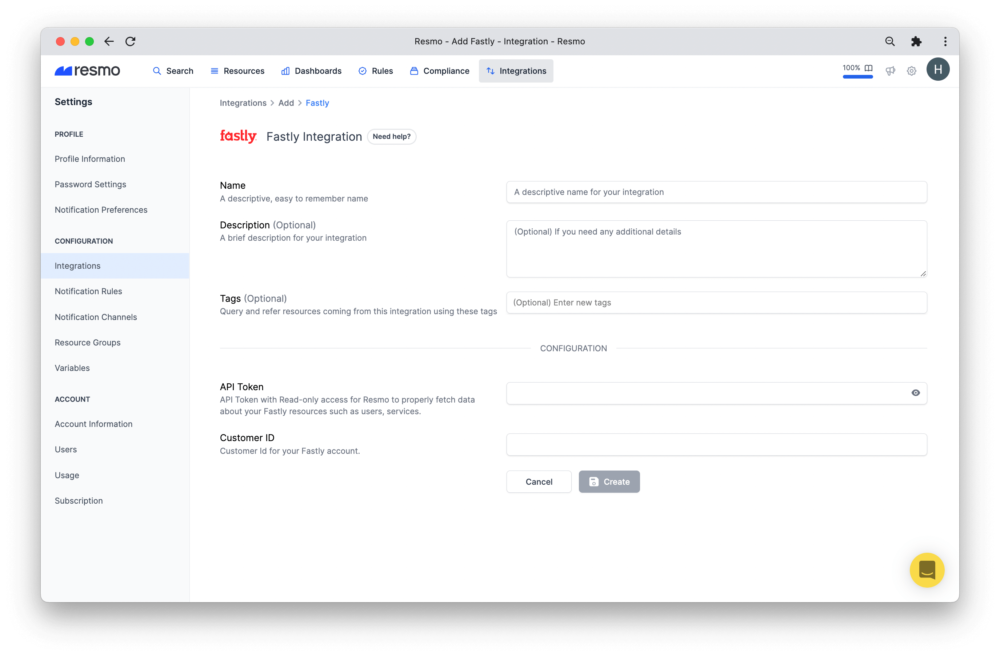
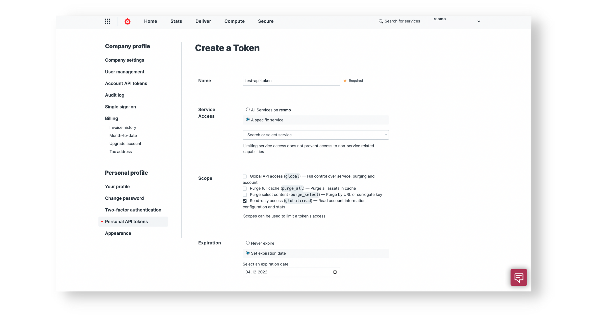
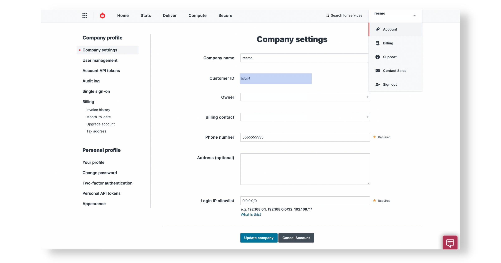
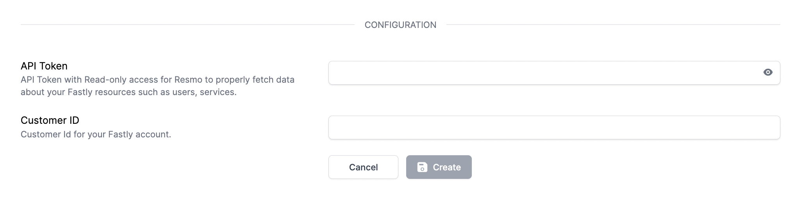

# Fastly Integration

## Resmo + Fastly Integration Fundamentals

<figure><figcaption></figcaption></figure>

Resmo seamlessly integrates with your Fastly account to help you secure your cyber asset environment.

### What does Resmo offer to Fastly users?

* Collect all your Fastly assets, such as API Tokens, users, and services, in one place.
* Query your Fastly users, services, account, and much more.
* Set up rule notifications based on Fastly resource configurations
* Automatically audit resources' conformance with your security rules

### How does the integration work?

Once you sign up to Resmo, you can easily integrate your account with Fastly using an API Token and Customer ID.

* The **Customer ID** can be obtained from\
  [https://manage.fastly.com/account/company](https://manage.fastly.com/account/company)
* The **API Token** can be created from\
  [https://manage.fastly.com/account/personal/tokens](https://manage.fastly.com/account/personal/tokens)
  * API Token must have Read-only access (global:read)
  * Be careful with service selection while creating API Token. If you select a service, Resmo will collect data for only that service.

Resmo uses API to do the initial polling and collect existing resources. Then, we receive resource changes and updates in real-time by regular polling.

#### Available resources

Resmo aggregates Fastly resources in real-time, including accounts, API Tokens, and services, allowing you to query and secure your cyber assets.



## Integration Walkthrough

### How to install

1. Log in to your Resmo account and go to your Integrations page.

<figure><figcaption></figcaption></figure>

2\. Click the Add Integration button from the top right. Then, select Fastly.

<figure><figcaption></figcaption></figure>

3\. Name the integration and write a description (optional.)

4\. Go to your Fastly account and create an API token from [https://manage.fastly.com/account/personal/tokens](https://manage.fastly.com/account/personal/tokens)

<figure><figcaption></figcaption></figure>

5\. Enter the API Token on the integration screen’s API Token field.

6\. Copy your Customer ID from [https://manage.fastly.com/account/company](https://manage.fastly.com/account/company) and go back to your Resmo integration screen. Enter the Customer ID into the Customer ID field.

<figure><figcaption></figcaption></figure>

7\. Hit the create button, and you are ready to run queries.

<figure><figcaption></figcaption></figure>

### How to uninstall

1. Navigate to your integrations page and click the Fastly integration you wish to remove.
2. To temporarily pause the integration, hit the Disable button. Or, you may permanently uninstall it by clicking the Delete button from the top right.

### Support

For further questions about your Resmo Fastly integration or troubleshooting, contact us via live chat or email us at contact@resmo.com.
