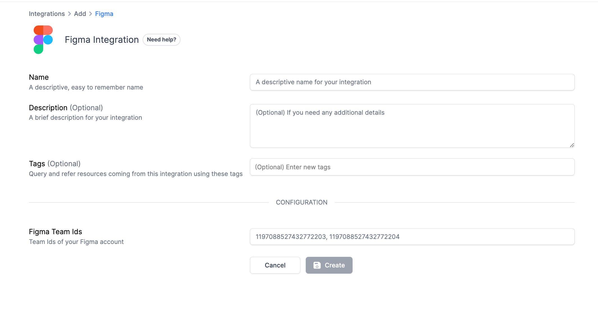
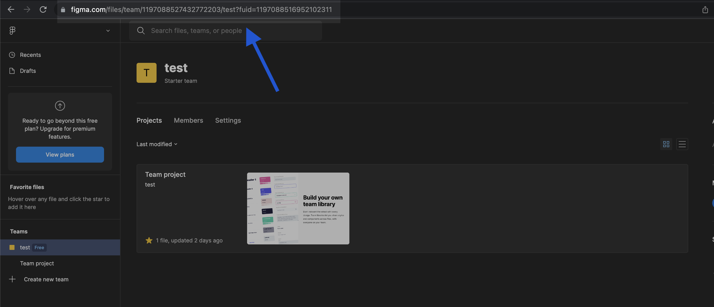
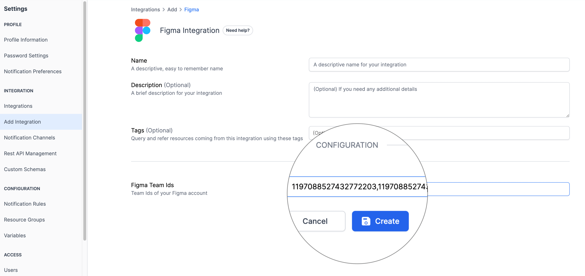
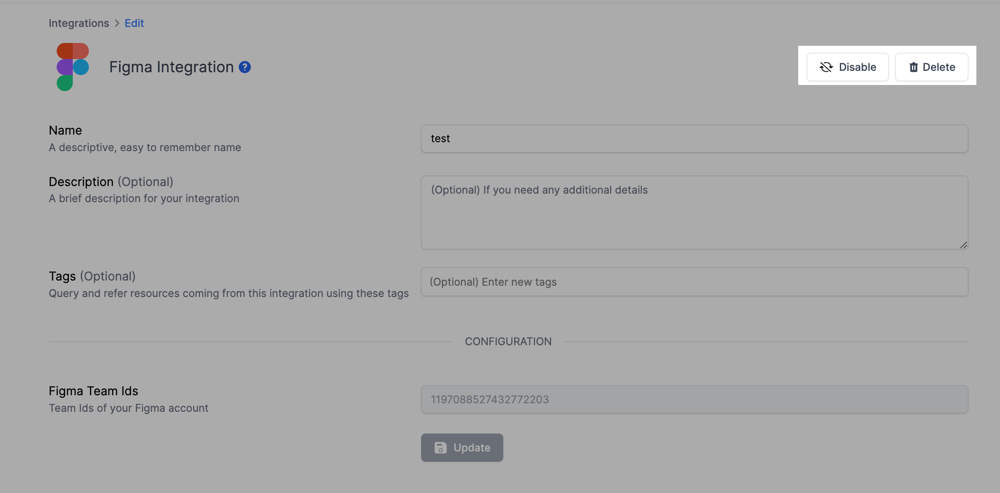

# Figma Integration

## Resmo + Figma Integration Fundamentals

<figure><figcaption></figcaption></figure>

Secure your Figma projects and other assets with the power of continuous visibility, security, and compliance.

### What does Resmo offer to Figma users?

* Collect and monitor your Figma assets on a single platform.
* Query your Figma users, projects, and more using SQL or free text search.
* Set up security rules to continuously assess your Figma resources.
* Receive notifications when there is a critical rule change.

### How does the integration work?

Once you sign up to Resmo, you can easily integrate your account with Figma using an account with the required privileges. Resmo uses API to do the initial polling and collect existing resources. Then, we receive resource changes and updates in real-time through regular polling.

#### Available resources



## Integration walkthrough

### How to install

1. Select Figma on the Integrations page of your Resmo account.
2. Click the Add Integration button at the bottom right corner of the opening modal.

<figure><figcaption></figcaption></figure>

5\. Go to your Figma team page; the team id will be present in the URL after the word team and before your team name.

<figure><figcaption></figcaption></figure>

6\. Fill the Figma Team Ids field with the team Ids you would like to add (Separate team ids with commas.)

<figure><figcaption></figcaption></figure>

7\. Hit the create button, and you'll be redirected to Figma. Accept permissions.

8\. You are ready to run queries.

### How to uninstall

1. Select Figma on your Integrations page.
2. Navigate to the Connected Integrations tab on the opening modal.
3. To **temporarily pause** the integration, click the Disable button from the upper right corner. You can enable it back later on.
4. To **permanently remove** it, click the Delete button. This action cannot be undone.

<figure><figcaption></figcaption></figure>

### Support

Contact us via live chat or email us at contact@resmo.com for troubleshooting or support requests.
