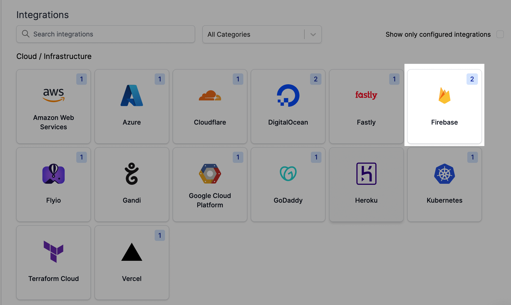
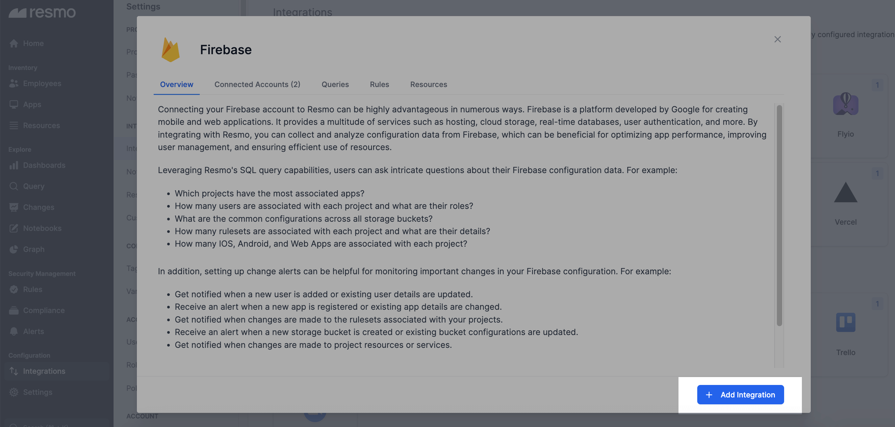
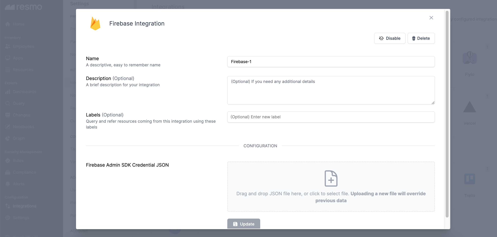

# Firebase Integration

## Resmo + Firebase Integration Fundamentals

<figure><figcaption></figcaption></figure>

Firebase, a Google-developed platform, is designed for building web and mobile applications and offers a variety of services, including hosting, cloud storage, real-time databases, and user authentication, to name a few.&#x20;

When you integrate it with Resmo, you gain the ability to gather, visualize, and set security alerts for configuration data from Firebase. This capability can be extremely useful for enhancing your app's performance, refining user management processes, and guaranteeing the most efficient utilization of resources.

### What does Resmo offer to Firebase users?

* Get detailed visualization and examination of your Firebase configuration data.
* Understand how many users are associated with each project and their respective roles.
* Gain insights into common configurations across all storage buckets, helping streamline operations.
* Learn about the number and details of rulesets associated with each project, enhancing control over project security.
* Set up alerts to monitor important changes, such as new users, app registrations, ruleset alterations, storage bucket updates, or changes to project resources.

### How does the integration work?

Once you integrate Firebase with Resmo using your Firebase Admin SDK Credential JSON, Resmo starts the initial polling and updates existing resources at regular intervals to provide a real-time experience.

#### Available resources



## Integration walkthrough

### How to install

1. Go to your Integrations page on Resmo.
2. Find and click Firebase, which is under the Cloud/Infrastructure category.

<figure><figcaption></figcaption></figure>

3. Click the Add Integration button from the bottom right corner of the opening modal.

<figure><figcaption></figcaption></figure>

4. Optionally, you can name your integration, write a description, and add labels.&#x20;


Labels help you query and refer to resources coming from this integration using the added labels.


<figure><figcaption></figcaption></figure>

5. Drag and drop your Firebase Admin SDK Credential JSON.
6. Hit the Create button.

### How to uninstall

1. Go to your Integrations page and open the Firebase integration.
2. Click the Integrated Accounts tab and the connected account you want to remove.
3. You can either disable the integration until you enable it back or delete it forever. Depending on your choice, click the related button (Disable / Delete) from the top right of the opening modal window.

<figure><figcaption></figcaption></figure>
