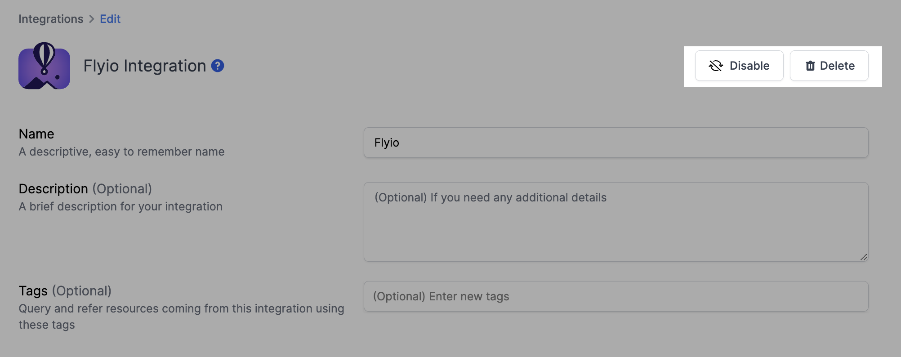

# Flyio Integration

## Resmo + Fly.io Integration Fundamentals

<figure><figcaption></figcaption></figure>

Resmo's seamless integration with Fly.io ensures secure and compliant Fly.io environments.

### What does Resmo offer to Fly.io users?

* Collect your assets like Apps, Certificates, Machines, and much more.
* Query your Flyio assets and keep track of any changes.
* Set up rules to automatically evaluate resources' security and compliance
* Get notified when there's a resource or configuration change

### How does the integration work?

Resmo uses Personal Access Token created from Flyio Web UI. Our application uses API to make the initial polling and receive existing resources. Then, we receive resource changes and updates in real-time by regular polling.

#### Available resources



## Integration Walkthrough

### How to install

1. Select Flyio on your Integrations page on Resmo.
2. Click the Add Integration button at the bottom right corner of the opening modal.
3. Open your Flyio account on a new tab on your browser.
4. Create a personal access token from Flyio [Personal Access Tokens Page](https://fly.io/user/personal\_access\_tokens)
5. Paste the Personal Access Token in the related field on your integration screen on Resmo.
6. Hit the Create button.
7. You are all set! Now you can start querying your Flyio resources!

### How to uninstall

1. Select Flyio on your Integrations page.
2. Navigate to the Connected Integrations tab on the opening modal.
3. Click on the Flyio integration you want to remove.
4. There are two options; to temporarily pause the integration, click the Disable button. To permanently remove it, click the Delete button.

<figure><figcaption></figcaption></figure>
