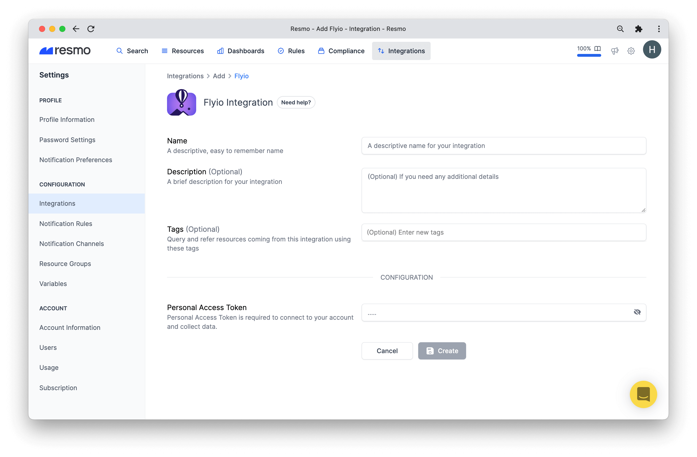

# Flyio Integration

## Resmo + Fly.io Integration Fundamentals

<figure><figcaption></figcaption></figure>

Resmo's seamless integration with Fly.io ensures secure and compliant Fly.io environments.

### What does Resmo offer to Fly.io users?

* Collect your assets like Apps, Certificates, Machines, and much more.
* Query your Flyio assets and keep track of any changes.
* Set up rules to automatically evaluate resources' security and compliance
* Get notified when there's a resource or configuration change

### How does the integration work?

Resmo uses Personal Access Token created from Flyio Web UI. Our application uses API to make the initial polling and receive existing resources. Then, we receive resource changes and updates in real-time by regular polling.

#### Available resources



## Integration Walkthrough

### How to install

1. Sign up or sign in to Resmo. Then, navigate to your Integrations page.
2. From there, click the Add Integration button.
3. Add Flyio from the list.&#x20;
4. Give a descriptive name to your Flyio integration and optionally a description and tags.

<figure><figcaption></figcaption></figure>

4\. Create a personal access token from Flyio [Personal Access Tokens Page](https://fly.io/user/personal\_access\_tokens)

5\. Fill the form with Personal Access Token and click Save.

6\. You are all set! Now you can start querying your Flyio resources!

### How to uninstall

1. Login to your Resmo account and go to your Integrations page.
2. Click the Flyio integration you wish to uninstall.
3. There are two options; to temporarily pause the integration, click the Disable button. To permanently remove it, click the Delete button.

<figure><figcaption></figcaption></figure>

### Support

For further questions or troubleshooting about your Flyio integration, contact us via live chat or email us at contact@resmo.com.
