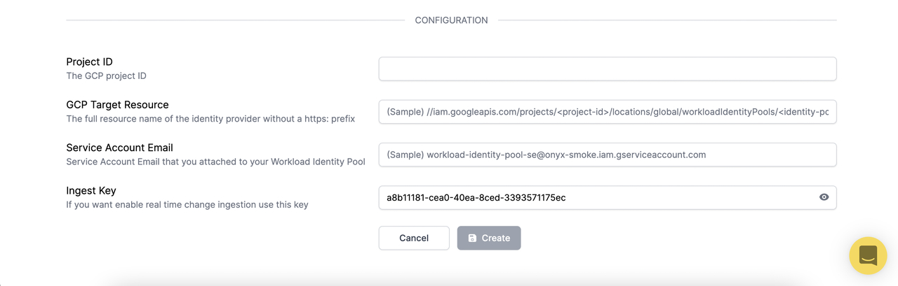

# GCP Integration

## Resmo + GCP Integration Fundamentals


Resmo seamlessly integrates with the [Google Cloud Platform](https://cloud.google.com/) to ensure the security and compliance of your GCP environment.

### What does Resmo offer to Google Cloud Platform users? <a href="#what-does-opsgenie-offer-slack-users" id="what-does-opsgenie-offer-slack-users"></a>

* Collect all your GCP assets in place.
* Ability to query your GCP roles, networks, Cloud functions, and 50+ other resources.
* Set up rule notifications based on GCP resource configurations and their changes.
* Set up custom or predefined rules for continuous security and compliance auditing.
* Check your GCP security and compliance posture using the GCP Best Practices and compliance packs.&#x20;

### How does the integration work?

Resmo has a GCP integration that you can install securely once you sign up for a Resmo account. Our application uses API calls to make the initial polling and receive existing resources.

* API polling uses API calls to sync your GCP assets with Resmo.
* Exposing Audit Logs over PUB/SUB lets track changes with actor information in real-time.

### Available resources

Resmo GCP integration collects AppEngine, API Gateway, Compute, IAM, and much more.



### Integration Walkthrough

You have to create a Workload Identity Pool with the AWS provider to let Resmo access your GCP resources. You can learn more about Workload Identity Pool external providers [here](https://cloud.google.com/iam/docs/configuring-workload-identity-federation).

You can follow the instructions to create a Workload Identity Provider with AWS provider.

#### Setup Your GCP Account

1. Create a Workload Identity Pool\
   \
   `gcloud iam workload-identity-pools create POOL_ID \`\
   `--location="global" \`\
   `--description="DESCRIPTION" \`\
   `--display-name="DISPLAY_NAME"`&#x20;
2. Create an AWS Provider with Resmo trust\
   \
   `gcloud iam workload-identity-pools providers create-aws PROVIDER_ID \`\
   `--location="global" \`\
   `--workload-identity-pool="POOL_ID" \`\
   `--account-id="512995177166" \`\
   `--attribute-mapping="google.subject=assertion.arn" \`\
   `--attribute-condition='assertion.arn=="arn:aws:sts::512995177166:assumed-role/Resmo-GCP-DataCollectionRole/resmo-gcp-data-collection"'`
3.  Create Custom Resmo Data Collect Role\


    ```bash
    gcloud iam roles create ResmoDataCollect \    
        --project PROJECT_ID \    
        --title "Resmo Data Collect" \    
        --stage GA \    
        --permissions storage.buckets.getIamPolicy
    ```
4. Create a Service Account\
   \
   `gcloud iam service-accounts create SERVICE_ACCOUNT_ID \`\
   `--description="DESCRIPTION" \`\
   `--display-name="DISPLAY_NAME"`
5.  Grant viewer and Custom Resmo Data Collect role to the created service account\
    \
    `gcloud projects add-iam-policy-binding PROJECT_ID \`\
    `--member="serviceAccount:SERVICE_ACCOUNT_EMAIL" \`\
    `--role="roles/viewer"`\


    ```bash
    gcloud projects add-iam-policy-binding PROJECT_ID \    
        --member="serviceAccount:SERVICE_ACCOUNT_EMAIL" \    
        --role=CUSTOM_ROLE_NAME
    ```
6. Grant workloadIdentityUser role to the created service account\
   \
   `gcloud iam service-accounts add-iam-policy-binding SERVICE_ACCOUNT_EMAIL \`\
   `--role=roles/iam.workloadIdentityUser \`\
   `--member="MEMBER_EXPRESSION"`\
   \
   You can learn more about MEMBER\_EXPRESSION [here](https://cloud.google.com/iam/docs/workload-identity-federation#impersonation).
7. `Enable Google Cloud Service API`\
   \
   **NOTE** You can only enable 20 services at a time\
   \
   `gcloud services enable \` \
   `accesscontextmanager.googleapis.com \`\
   `apigateway.googleapis.com \`\
   `appengine.googleapis.com \`\
   `bigquery.googleapis.com \`\
   `cloudasset.googleapis.com \`\
   `dns.googleapis.com \`\
   `cloudfunctions.googleapis.com \`\
   `cloudkms.googleapis.com \`\
   `logging.googleapis.com \`\
   `memcache.googleapis.com \`\
   `pubsub.googleapis.com \`\
   `cloudresourcemanager.googleapis.com \`\
   `run.googleapis.com \`\
   `spanner.googleapis.com \`\
   `sqladmin.googleapis.com \`\
   `storage.googleapis.com \`\
   `compute.googleapis.com \`\
   `redis.googleapis.com \`\
   `iam.googleapis.com \`\
   `container.googleapis.com \`\
   `serviceusage.googleapis.com \`\
   `monitoring.googleapis.com \`\
   `iamcredentials.googleapis.com \`\
   `sts.googleapis.com`

#### `Enable Real Time Change Ingestion with PUB/SUB Model`

**`Note:`** **`Real Time Change Ingestion`**` ``is avaliable for enterprise plan only.`

1. Create a PUB/SUB topic\
   \
   `gcloud pubsub topics create TOPIC_NAME`
2. Create a PUB/SUB subscription\
   \
   `gcloud pubsub subscriptions create SUBSCRIPTION_ID \`\
   `--topic=FULL_TOPIC_NAME \`\
   `--push-endpoint=https://id.resmo.app/integration/gcp/event?ingestKey=<your-ingest-key> \`\
   `--expiration-period="never" \`\
   `--ack-deadline=60 \`\
   `--message-retention-duration=10m \`\
   `--min-retry-delay=10s \`\
   `--max-retry-delay=30s`
3. Create a Log Router\
   \
   `gcloud logging sinks create SINK_NAME pubsub.googleapis.com/projects/PROJECT_ID/topics/TOPIC_NAME \`\
   `--log-filter='protoPayload.@type="type.googleapis.com/google.cloud.audit.AuditLog" protoPayload.serviceName=("pubsub.googleapis.com" OR "compute.googleapis.com" OR "storage.googleapis.com" OR "container.googleapis.com")'`

Don't forget to add destination permissions for the created topic. You can learn about it [here](https://cloud.google.com/logging/docs/export/configure\_export\_v2#dest-auth).

### How to install&#x20;

1. Sign up or log in to your Resmo account.&#x20;
2. Go to the Integrations page and select GCP.
3. Click the **Add Integration** button from the bottom right corner of the opening modal.

4\. Enter your **GCP project ID** into the Project ID field.

5\. Enter the full name of the Identity Provider into the **GCP Target Resource** field. (The full resource name of the identity provider without a https: prefix)

* List your identity pools\
  `gcloud iam workload-identity-pools list --location="global"`
* List your identity pool providers

`gcloud iam workload-identity-pools providers list --workload-identity-pool="my-workload-identity-pool" --location="global"`



* Copy your provider name, and paste it to the GCP Target Resource field with the below format.\
  `//iam.googleapis.com/<provider-name>`

7\. Enter your Service Account Email into the Service Account Email field.


Service Account Email that you attached to your Workload Identity Pool.


8\. Hit the **Create** button, and you are ready to run queries.&#x20;

#### How to uninstall&#x20;

1. Login to your Resmo account.&#x20;
2. Navigate to the Integrations page and click your GCP integration.
3. Click the Connected Integrations tab and select the account you want to remove.
4. Click the Delete button to uninstall or Disable to stop polling GCP resources temporarily.
5. Delete your Workload Identity Pool, Service Account (PUB/SUB, Log Router if you enable real-time change ingestion) GCP resources.

### FAQ

<details>

<summary>What should I check if integration fails to install?</summary>

If you see `Not Ready` state for your integration after setup;

1. Check if your APIs are enabled for the related project.
   1. iamcredentials.googleapis.com
   2. sts.googleapis.com
2. Check your `attribute-condition of` identity provider \
   \
   `attribute-condition`must be matched with the following condition `assertion.arn=="arn:aws:sts::512995177166:assumed-role/Resmo-GCP-DataCollectionRole/resmo-gcp-data-collection"`&#x20;
3. Check your service account has `roles/iam.workloadIdentityUser`role for the related identity provider.
4. Check your service account has the correct identity.\
   \
   To impersonate a service account, grant your external identity the Workload Identity User role (`roles/iam.workloadIdentityUser`) on a service account with the roles required by your workload. You can learn more about identities [here](https://cloud.google.com/iam/docs/workload-identity-federation#impersonation).

If you see `Ready` state for your integration but cannot see some resources;

1. Check your `Google Cloud Service API` for the related resource. You have to enable `Google Cloud Service API` for the related resource to let Resmo collect them.

</details>

<details>

<summary>What happens if I delete required resource used by integration to poll my resources?</summary>

You will see `Not Ready` state for your integration after a while. To fix the problem you need to visit the setup steps and recreate the necessary resources for your account. After updating your integration you will see your integration became ready to poll resources.

</details>

<details>

<summary>Can I update the Project ID for my integration?</summary>

Changing `Project ID` is not allowed for GCP integration. If you want Resmo to poll resources from another project you need to create a new integration or delete the current one.

</details>

<details>

<summary>I have entered the wrong Service Account Email, Identity Provider what should I do?</summary>

Changing `Service Account Email` or `Identity Provider` is allowed for the GCP integration. Make sure your new `Service Account Email` and `Identity Provider` have correct permissions.

</details>
