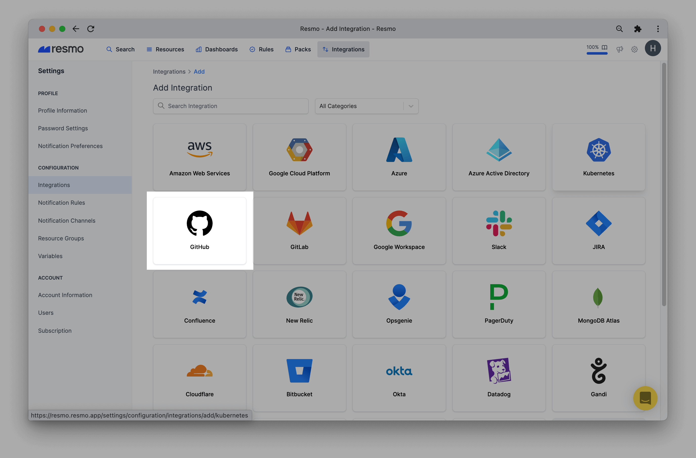
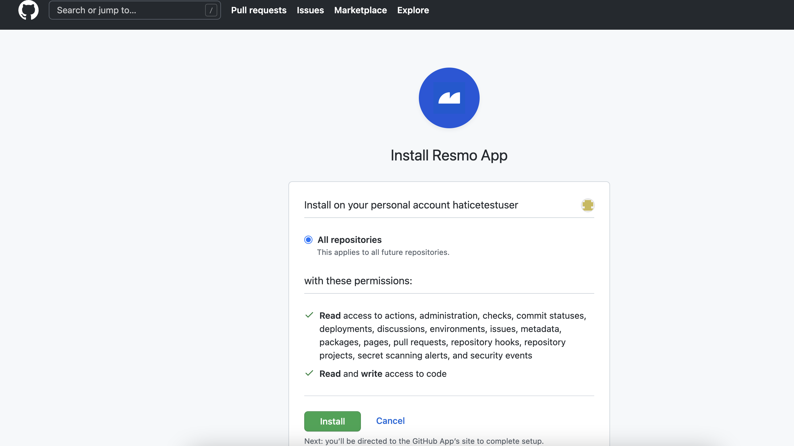

# GitHub Integration

## Resmo + GitHub Integration Fundamentals  

Resmo integrates with [GitHub](https://github.com/) to make sure your GitHub environment is safe and compliant.

### What does Resmo offer GitHub users? 

* Collect all your GitHub assets in place
* Ability to query your GitHub users, repositories, issues, organization members and much more.
* Setup rule notifications based on GitHub resource configurations.
* Use GitHub Best Practices packs to check your GitHub security and compliance posture.
* Ability to cross query GitHub resources like deployment with other tools like AWS EC2 and see their relations.

### How does the integration work?

Resmo has an official GitHub application that you can install once you sign up for a Resmo account.&#x20;

Our application uses API to make the initial polling and receive existing resources. Then, we use GitHub webhooks to collect updates in real-time!

* API polling
* Webhook&#x20;

### Available resources

Resmo GitHub integration collects GitHub repositories, users, organizations, teams, deployments, issues, and much more!

See the full update list:


GitHub Resources


### Common queries and rules

* Ensure organization members enable two-factor authentication
* List pull requests handled by a developer in the last 5 days
* List open pull request that has no assigned reviewer or tag for 2 days
* Ensure all your organization's repositories stay private
* Ensure no one becomes an admin in your org except a given email address
* See Pull requests merged without any comments or review

## Integration Walkthrough

### How to install

1. Create or log in to your Resmo account.
2. Go to the integrations page, select add, and then select GitHub.

3\. Type the integration name and click the Install GitHub button.

.png>)

4\. You'll be redirected to GitHub. Accept permissions.

5\. You are ready! Now you can start querying your GitHub resources!

### How to uninstall

* **If you uninstall GitHub App on GitHub**, we don't delete the integration on our side, so you can continue seeing your resources and query them.&#x20;
  * Coming Soon: We are working on adding a mark to show you that you deleted the integration and it is not receiving updates anymore.
* **If you uninstall GitHub App on Resmo,** you need to go to your GitHub account and delete the Resmo app. The automatic deletion is coming soon.

## FAQ

What happens if I want to add two separate GitHub apps to one Resmo account?

You can install more than one GitHub app for different organizations in the same Resmo account.&#x20;

If you need to add multiple integrations for the same org, you need to create another Resmo account.

Related Documents and Links\

