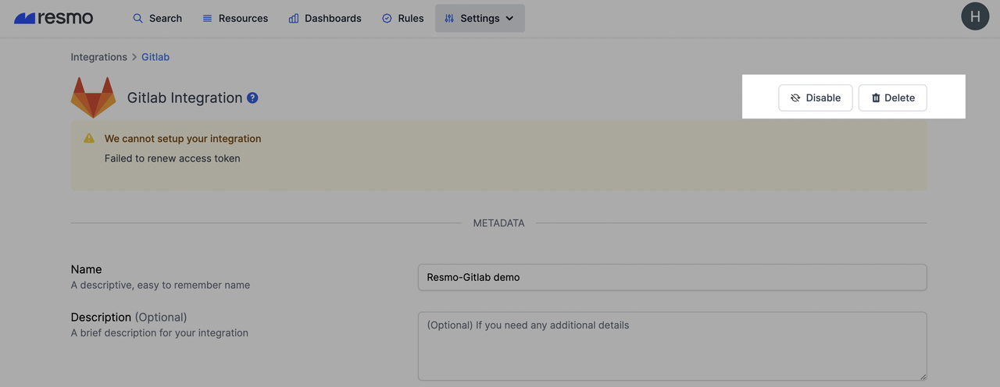

# GitLab Integration

## Resmo + GitLab Integration Fundamentals

<figure><figcaption></figcaption></figure>

Resmo integrates with [GitLab](https://about.gitlab.com/) to ensure your GitLab environment's security and compliance.

### What does Resmo offer to GitLab users?

* Consolidate and monitor all GitLab assets in one place
* Query your GitLab issues, repositories, user, groups, and more
* Assess your GitLab security posture against GitLab Best Practices packs
* Set up rule notifications to get alerted on GitLab resource configurations
* Cross-query your GitLab resources, such as deployment, with other tools like AWS EC2 and understand their relations.

### How does the integration work?

Resmo has an official GitLab application that you can install once you sign up for a Resmo account. The application operates the initial polling and receives the existing resources using an API key. Then, it uses GitLab webhooks to collect updates in real-time.

* API polling
* Webhook

### Available Resources

Resmo GitLab integration collects users, groups, merge requests, projects, and more.

See the full list:



### Common queries and rules

* Find groups where email notifications are disabled&#x20;
* List merge requests opened per projects&#x20;
* See groups that allow sharing a project with other groups
* Detect merge requests with a security label
* Identify merge requests with a bug or security label still open for 2 days
* Find issues enabled for GitLab projects

### Integration walkthrough

#### How to install

1. Sign up for or sign in to your Resmo account.
2. Navigate to the Integrations page and select GitLab.
3. Click the Add Integration button from the bottom right corner of the opening modal.
4. Click the Create button.&#x20;
5. You will be redirected to GitLab. Accept permissions.

.png>)

6\. Your integration is all set! Now you can start exploring and querying your GitLab resources.

#### How to uninstall

1. Log in to your Resmo account.
2. Go to the Integrations page and select GitLab.
3. Then, navigate to the Connected Integrations tab on the opening modal.
4. Click the GitLab integration you want to uninstall.
5. To temporarily pause your GitLab integration, click Disable from the top right. To permanently remove it, click Delete.

### Support

If you have any questions regarding our GitLab integration or Resmo, you can contact us via live chat on our website or email us at contact@resmo.com.
