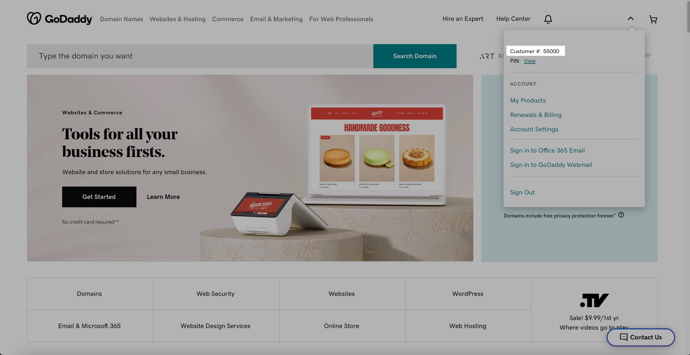
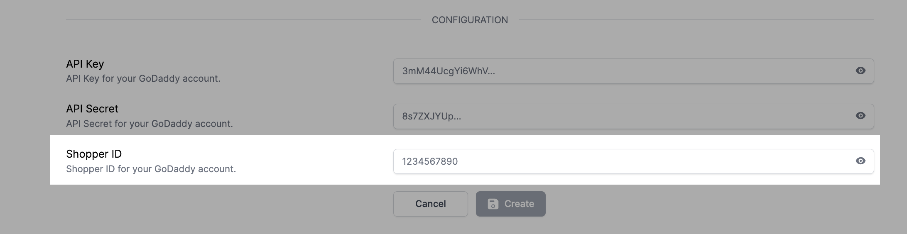
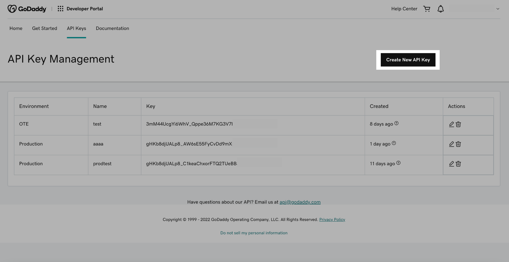
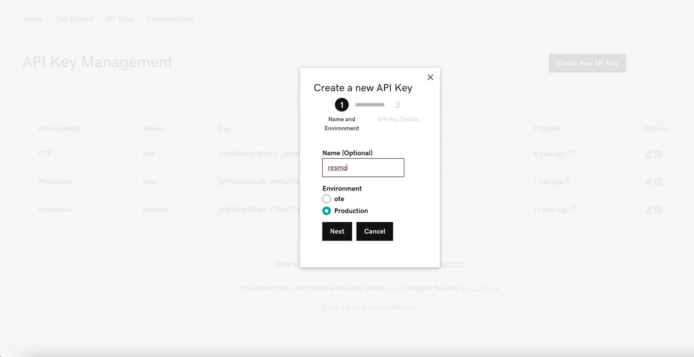
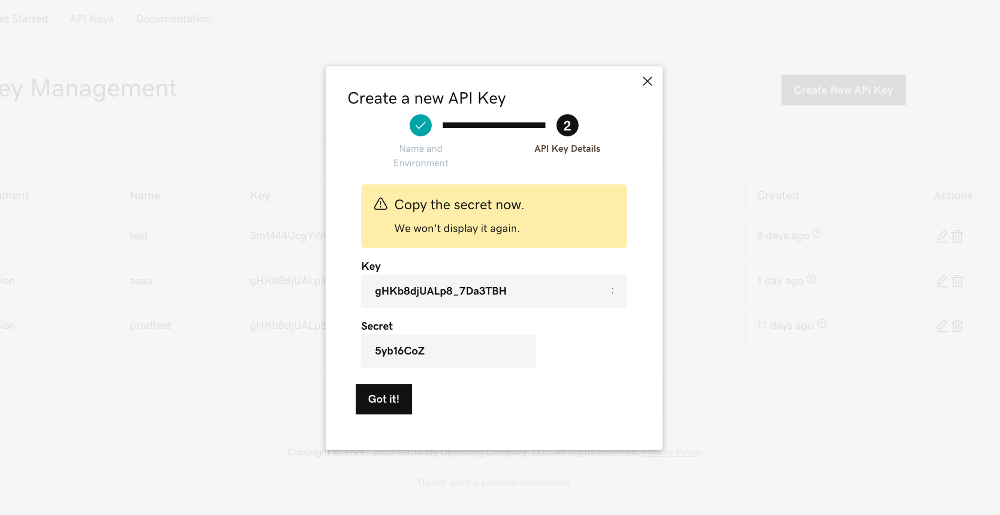
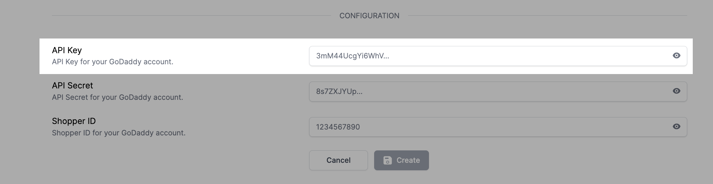
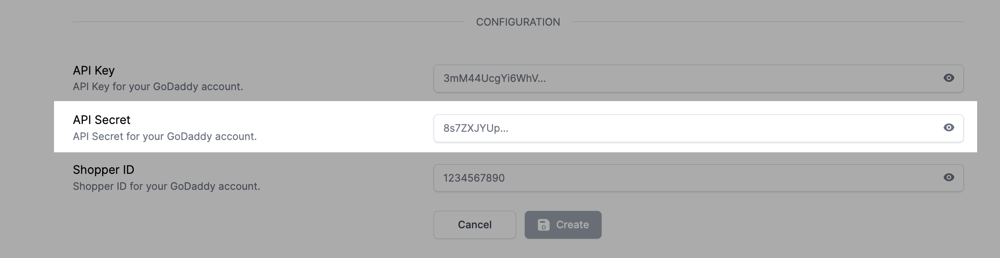
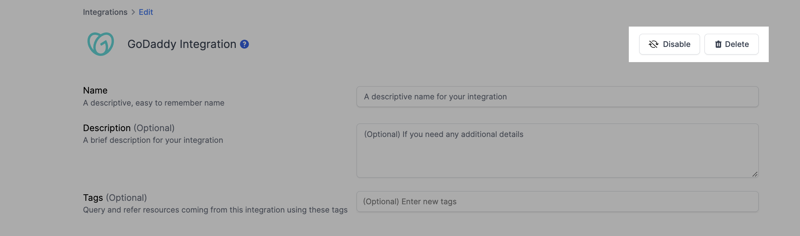

# GoDaddy Integration

## Resmo + GoDaddy Integration Fundamentals

<figure><figcaption></figcaption></figure>

Integrate Resmo with GoDaddy to keep your assets visible, secure, and compliant.

### What does Resmo offer to GoDaddy users?

* Aggregate your directory assets like domains, domain records, and account information from your GoDaddy account and explore the details of each, such as their changes, compliance, and relations.
* Query your GoDaddy domains, domain records, account information, and more to answer complex security and compliance questions.
* Set up security rules and run custom SQL queries to improve asset visibility.
* Get notified about critical changes in near real-time.

### How does the integration work?

Resmo uses API to do the initial polling and collect existing resources. Following the initial polling, it receives updates and changes in real-time through webhook and regular polling.

#### Available resources

GoDaddy resources you can collect with Resmo include accounts, contacts, domains, and more.

**See the complete list:**



## Integration walkthrough

### How to install

1. Select GoDaddy on the Integrations page.
2. Click the Add Integration button at the bottom right corner of the opening modal.
3. Go to your GoDaddy account and click on your account page. Copy your shopper ID under your username.

<figure><figcaption></figcaption></figure>

4. Paste it to the shopper ID field on the setup page.

<figure><figcaption></figcaption></figure>

5. Go to [API Keys](https://developer.godaddy.com/keys).
6. Click on "Create a new API Key."

<figure><figcaption></figcaption></figure>

7. Make sure the selected environment is "Production," and then click "Next."

<figure><figcaption></figcaption></figure>

8. Copy the "Key" value from the page.

<figure><figcaption></figcaption></figure>

9. Paste it to the API Key field on the setup page.

<figure><figcaption></figcaption></figure>

10\. Copy the "Secret" value from the page and paste it to the API Secret field on the setup page.

<figure><figcaption></figcaption></figure>

11\. Click create.

12\. All set! Now you can start running queries on your GoDaddy resources.

### How to uninstall

1. Select GoDaddy on your Integrations page.
2. Navigate to the Connected Integrations tab on the opening modal.
3. Click on the GoDaddy integration you want to uninstall.
4. To temporarily pause it, click Disable from the top right and enable it back later. Or you can also permanently remove the integration by clicking on the Delete button.&#x20;

<figure><figcaption></figcaption></figure>

### Support

Reach out to us for troubleshooting or support requests related to your GoDaddy integration via live chat or email us at contact@resmo.com.
