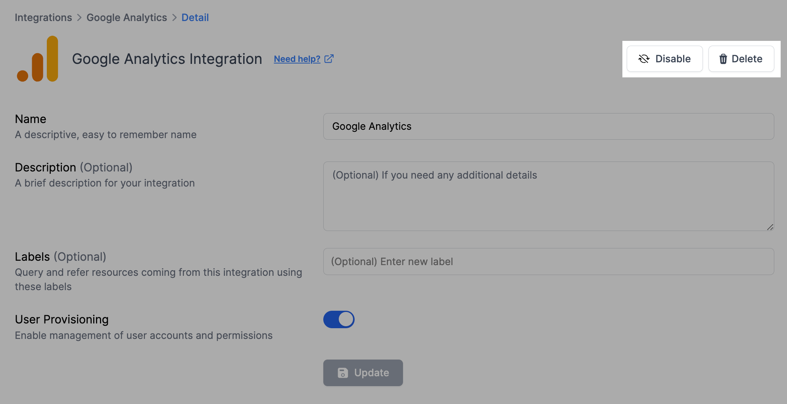

# Google Analytics Integration

<figure><figcaption></figcaption></figure>

By connecting Resmo with Google Analytics in one click, you can more easily handle your website's data. Resmo lets you ask specific questions about your Google Analytics information and alerts you to changes, like new users or updates. This helps you understand your website better and keep your data in good shape.

### What does Resmo offer to Google Analytics users?

* Simplify managing website data by connecting with Google Analytics.
* Ask detailed questions about your Google Analytics assets such as:
  * How many users have access to a specific Google Analytics account, and what roles and permissions do they possess?&#x20;
  * How many Google Analytics account do you have?
* Get alerts on users about important changes, such as new user additions or setting modifications.

### How does the integration work?

Resmo integrates with Google Analytics by initially collecting data via API, then continuously updating changes in real-time through webhooks and regular polling.

**Available resources:**

* Account
* Account User

### Integration walkthrough

#### How to install

1. Go to your Integrations page on Resmo from Settings.
2. Find and click Google Analytics.
3. Hit the Add Integration button and your integration will be ready after giving the required permissions.

<figure><figcaption></figcaption></figure>

4. To be able to revoke user access through Resmo, you can enable the User Provisioning option as well.

#### How to uninstall

1. Head over to your Google Analytics integration page on Resmo (Settings>Integrations>Google Analytics).
2. Click the Connected Integrations tab and select the account you want to remove.
3. To disable the integration temporarily, click the Disable button from the top right. Or, you may choose to uninstall it permanently by clicking the Delete button instead.

<figure><figcaption></figcaption></figure>
