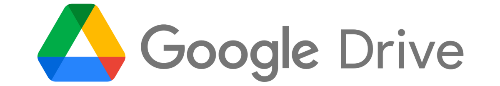
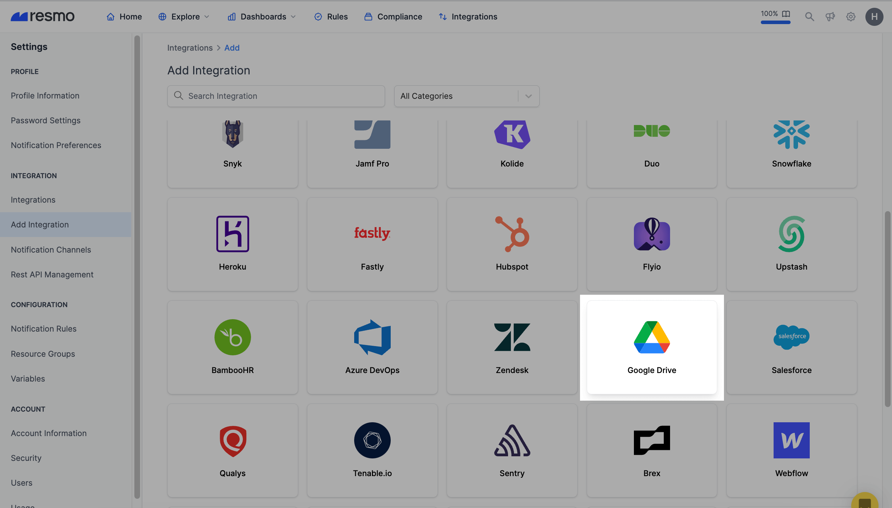
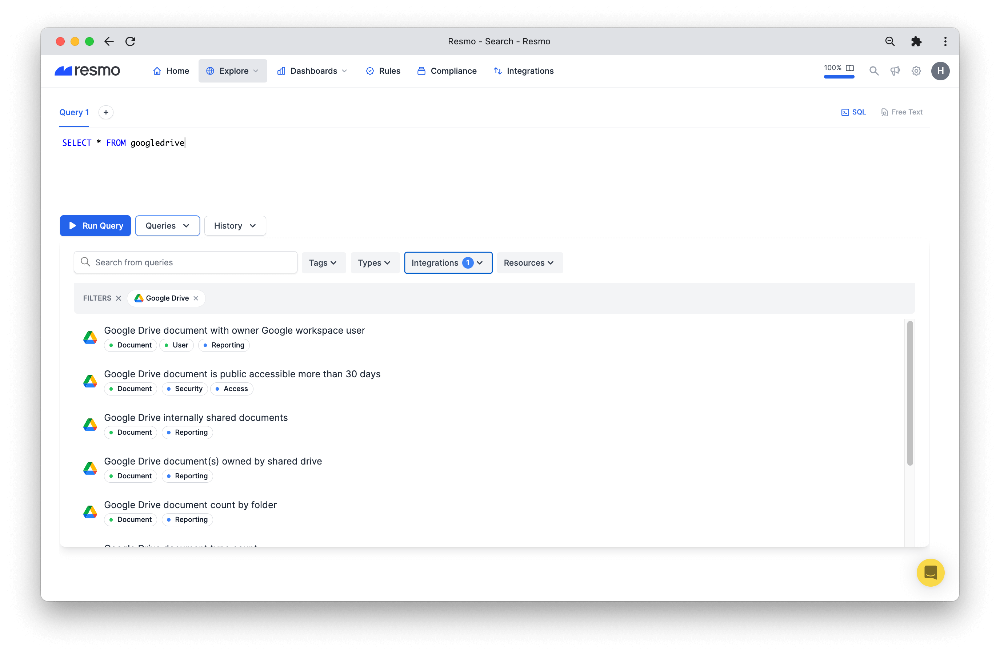
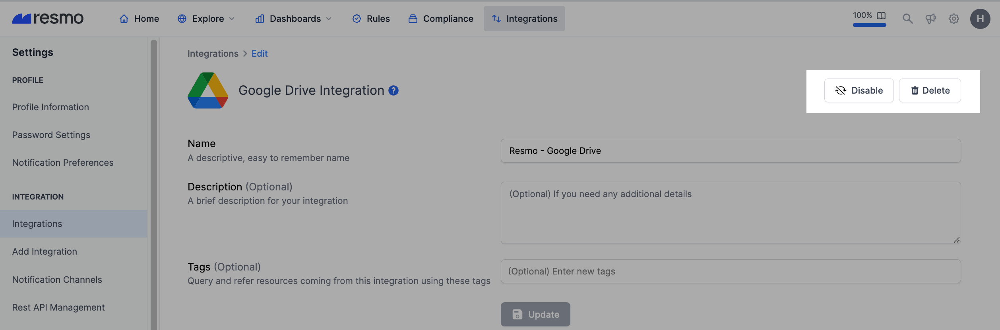

# Google Drive Integration

## Resmo + Google Drive Integration Fundamentals

<figure><figcaption></figcaption></figure>

Resmo integrates with Google Drive in one click to bring visibility and security to your Google Drive environment.

### What does Resmo offer to Google Drive users?

* Collect any kind of documents from your Drive.
* Query your documents to see scopes and visibilities.
* Set up custom security rules and run custom SQL queries to improve asset visibility.
* Use managed queries to evaluate your Google Drive security quickly.
* Understand how your Drive assets relate to each other in graph view.

### How does the integration work?

Resmo uses Google Workspace Reports API to do the initial polling and collect existing resources. Following the initial polling, it receives events in real time through webhook.

#### **Available resources**




**Critical Notes**

* Business Standard pricing plan required at least one Google Workspace account to run this integration successfully.
* We are not accessing your document's content. Google Drive integration only takes permission for audit logs and customer information.
* Initially, this integration polls the last six months' audit logs, creates document resources, and listens for document events.


### How to grant domain-wide delegation access to your organization

Resmo needs domain-wide delegation access to collect users' files in your organization. Yo can grant domain-wide delegation access for Resmo using following below steps. Visit official documentation for more [information](https://support.google.com/a/answer/162106).&#x20;

1. Go to [https://admin.google.com](https://admin.google.com/)
2. Go to **Security** > **Access and data control** > **API Controls**
3. Click **Manage Domain Wide Delegation**.
4. Click **Add new** and enter.&#x20;
   1. **Client ID**: `109597776999965244120`
   2. **OAuth Scopes**: `https://www.googleapis.com/auth/drive`


* For comprehensive management of file permissions via Resmo, the **broader Drive permission scope** is essential. This scope facilitates both the listing and the permission management of files within Google Drive. The OAuth scope to enable this enhanced functionality is `https://www.googleapis.com/auth/drive`.
* Alternatively, to assign Resmo **read-only access** for the Google Drive integration, thereby **excluding remediation functionalities**, you may allocate the read-only scope. This restricts Resmo's capabilities to data retrieval without the possibility of modification. You can only list and monitor your Drive files without the ability to manage them through Resmo. The read-only OAuth scope for this level of permission is `https://www.googleapis.com/auth/drive.metadata`.


5. Click **Authorize.**

## Integration walkthrough

### How to install

1. Log in to your Resmo account and go to the Integrations page.
2. From there, select Google Drive and click the Add Integration button from the bottom right corner of the opening modal.

<figure><figcaption></figcaption></figure>

5\. Hit the Create button, and you'll be redirected to your Google Account. Accept permissions.

6\. Your Google Drive integration is ready! Now you can start querying your resources!

<figure><figcaption></figcaption></figure>

### How to uninstall

1. Go to your Integrations page on Resmo.
2. Select Google Drive and go to the Integrated Accounts tab on the opening modal. Select the account you want to remove.
3. For temporary disabling, click the **Disable** button from the top right. This action can be reversed later by enabling the integration back. Or you can permanently uninstall the integration by clicking the **Delete** button. This action cannot be undone.

<figure><figcaption></figcaption></figure>
