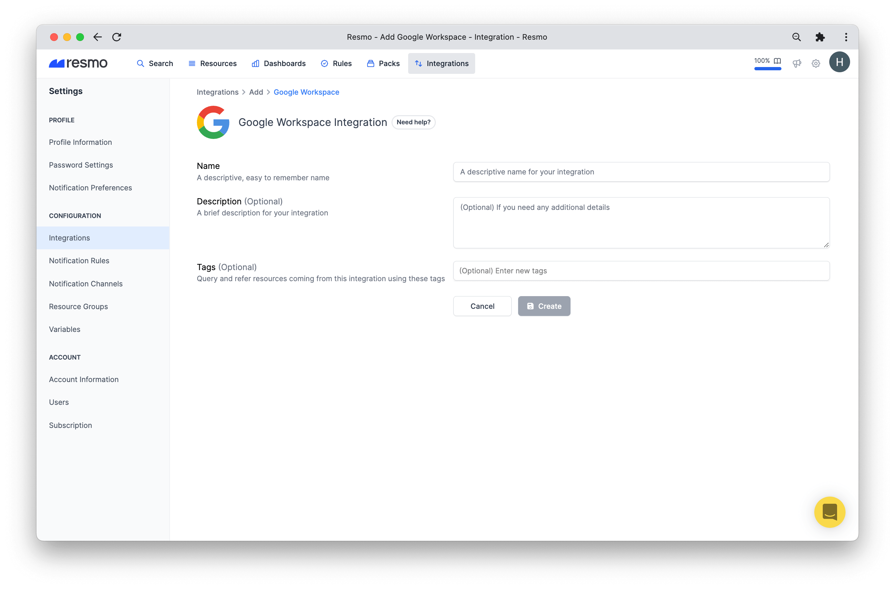
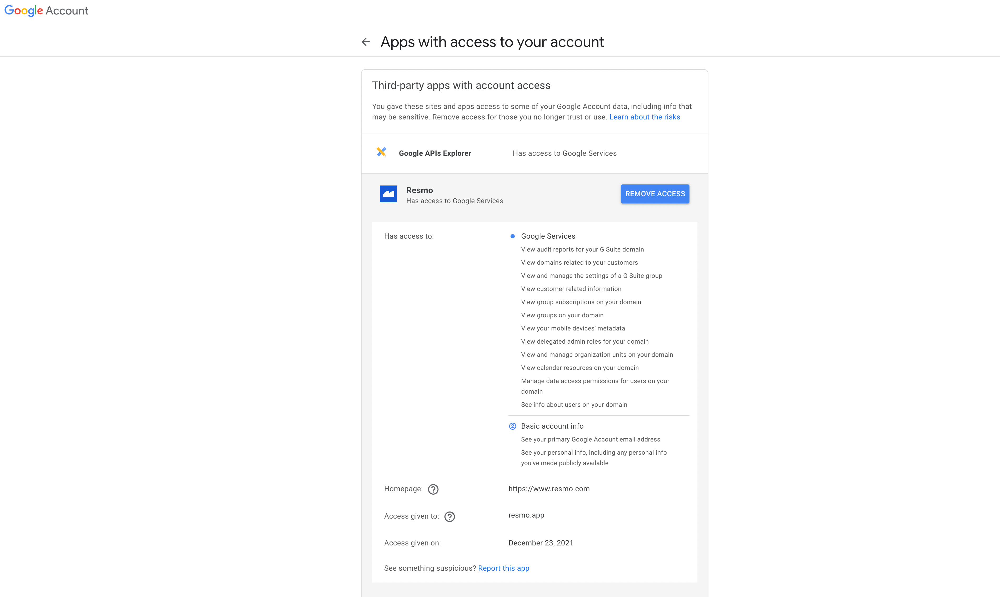

# Google Workspace Integration

## Resmo + Google Workspace Integration Fundamentals 

Resmo integrates with Google Workspace to make sure your asset landscape is safe and compliant.

### What does Resmo offer to Google Workspace users? 

* Collect and visualize Google Workspace resources
* Query assets like customers, domains, groups, users, tokens, and more
* Set up rules for continuous security and compliance evaluation
* Receive near real-time notifications when a rule breach occurs
* Use conformance packs to automate security best practices and compliance checks

### How does the integration work?

Resmo has an **official** OAuth application that you can install securely once you sign up for a Resmo account. Our application uses API calls to make the initial polling and receive existing resources.

* API polling uses API calls to sync your Google Workspace assets with Resmo.
* Exposing Audit reports over a channel let us track changes with actor information in real-time.

### Available resources

Resmo Google Workspace integration collects users, groups, group members, tokens, role assignments, and more for unified monitoring on a single platform.

See the full list:




**Tip:** Use [Audit Logs](../audit-logs/audit-logs.md) for comprehensive monitoring of all Google Workspace activities and system events.


### Common queries and rules

* List users per assigned role
* Identify users without a recovery phone number
* Detect groups with content moderation permission for all users
* Identify users with public SSH keys
* See custom roles and privileges

## Integration Walkthrough

### How to install

1. Create or log in to your Resmo account.
2. Go to your Integrations page. Then, add Google Workspace.
3. Type the integration name and click the Create button.

4\. You'll be redirected to the Google consent screen. You need to select all permissions and click the Continue button.

5\. You are ready! Now you can start querying your Google Workspace resources!

#### Permissions and Resmo Resources

:exclamation:Resmo requires at least `View customer related information` permission to provide its functionality.


If you do not give permission **View audit reports for your G Suite domain** or you do not have that permission at your Google Workspace, Resmo will not be able to track changes with actor information in real-time.


You will be informed about the resources that are not eligible to be accessed by Resmo due to missing permissions on the integration page.

### How to uninstall

* **If you remove access to Resmo on Google Security**, we don't delete the integration on our side, so you can continue seeing your resources and query them.&#x20;
  * Coming Soon: We are working on adding a mark to show you that you deleted the integration and it is not receiving updates anymore.
* **If you delete the integration on Resmo,** you need to remove access of Resmo at **Google Security** too. The automatic deletion is coming soon.


You can remove access to Resmo from [Google Security](https://myaccount.google.com/permissions?continue=https://myaccount.google.com/security\&pli=1).


## FAQ

Can I add my personal Gmail account?

No. You can not add your Gmail account since resources obtained from Google Workspace do not exist for personal Gmail Accounts.

I am not an admin of our Google Workspace, can I integrate it to the Resmo account anyway?

If you have at least `View customer related information` permission at your workspace, integration creation will succeed. You will be informed about the resources that are not eligible to be accessed by Resmo due to missing permissions on the integration page.

### Troubleshooting

If you have further questions about the Resmo Google Workspace integration, contact us via live chat or email us at contact@resmo.com.
