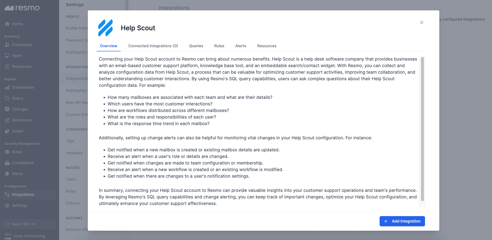

# Help Scout Integration

<figure><figcaption></figcaption></figure>

Integrate Resmo with Help Scout to effortlessly gather assets like users, teams, and workflows, with the power to query, visualize, and secure. Set up custom security rules, execute SQL queries, and enhance visibility, all while safeguarding a compliant Help Scout environment.

### What does Resmo offer to Help Scout users?

* Collect your assets like users, teams, and mailboxes from your Help Scout account.
* Query your Help Scout assets, configurations, and changes using SQL or free-text search.
* Set up automated security rules and get notified of changes and vulnerabilities in real-time.

### How does the integration work?

Resmo uses API to do the initial polling and collect existing resources. Following the initial polling, it receives updates and changes in real-time through webhook and regular polling.

**Available resources**



### Integration Walkthrough

#### How to install

1. Login to your Resmo account and navigate to the Integrations page. Then, find and click Help Scout.
2. Click the **Add Integration** button from the bottom right corner of the opening modal.

<figure><figcaption></figcaption></figure>

3. Copy the Redirection URL from the related field.

<figure><figcaption></figcaption></figure>

4. Go to your Help Scout account and navigate to your Profile. Then, click on My Apps from the left sidebar.&#x20;

<figure><figcaption></figcaption></figure>

5. Click Create Custom App. Paste the Redirection URL you copied from Resmo and hit the Create button.

<figure><figcaption></figcaption></figure>

6. You'll see it in "My Apps." Copy the App ID and App Secret from there and go back to Resmo.

<figure><figcaption></figcaption></figure>

7. Paste each in related fields. Once you're done, click Create.

<figure><figcaption></figcaption></figure>

7. Lastly, accept permissions, and now you can start querying your Help Scout resources.

#### How to uninstall

Open the Help Scout integration from Integrations>Help Scout to delete the integration. Go to the Connected Integrations tab from the opening modal and select the one you want to remove or disable.&#x20;

Disabled integrations can be enabled later, while deletion cannot be undone.

### Support

Contact us via live chat or email us at contact@resmo.com for queries and troubleshooting.
