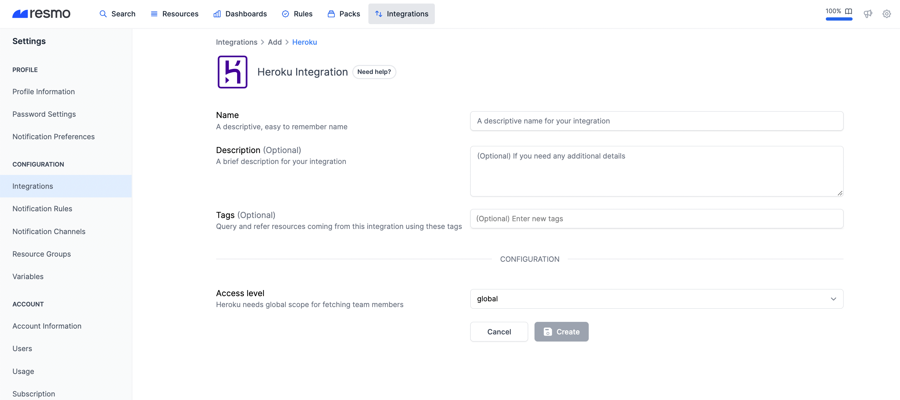
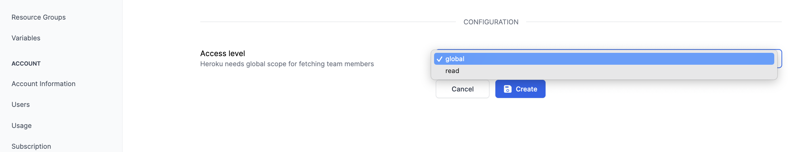

# Heroku Integration

## Resmo + Heroku Integration Fundamentals

.png>)

Resmo integrates with Heroku to keep your cyber asset environments secure and compliant.

### What does Resmo offer to Heroku users?

* Collect and monitor all your Heroku assets like add-ons, applications, and teams in one place
* Query your entire asset inventory using Resmo's powerful SQL query engine
* Set up rule notifications based on Heroku resource configurations to stay continuously secure
* Receive timely alerts on policy violations to mitigate risks

### How does the integration work?

Resmo has a Heroku application that you can install once you sign up for a Resmo account. Our application uses API to make the initial polling and receive existing resources. Then, we receive resource changes and updates in real-time by regular polling.

#### Available resources

Resmo aggregates Heroku resources like teams, applications, and add-ons to help you keep them visible and secure.



### Common queries and rules

(To be added)

## Integration Walkthrough

### How to install

1. Login to your Resmo account and navigate to the Integrations page.

.png>)

2\. Select Heroku. Next, give a descriptive name to your Heroku integration.

3\. Optionally, you may add a description and tags. Then, hit the create button.

* When choosing an access level, keep in mind that Heroku requires global scope for fetching team members.&#x20;

4\. You'll be redirected to Heroku. Accept permissions.

5\. You are ready! Now you can start querying your Heroku resources!


#### About Access level

There are two options for Oauth token scopes: global and read. Resmo sets 'global' as default for fetching team members because this resource is not accessible with the 'read' scope.


### How to uninstall

1. Navigate to your Integrations page and select the Heroku integration you wish to delete.
2. To temporarily pause the integration click the Disable button. To remove it permanently, click the Delete button from the top right.


#### Revoking Tokens

If you want to revoke your OAuth tokens after deleting the integration. Navigate the [settings page](https://dashboard.heroku.com/account/applications) and delete the Resmo application.


### Support

If you have questions or issues regarding your Heroku integration, please contact us via live chat or email us at contact@resmo.com. Our team will assist you in the shortest possible time.

&#x20;
