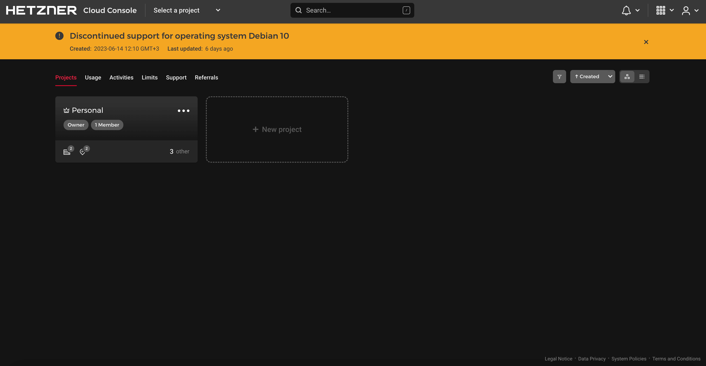
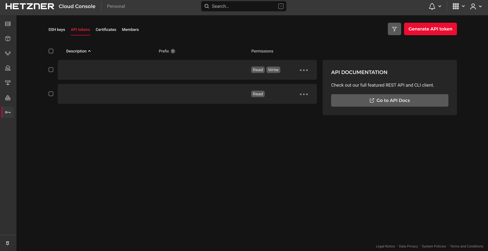
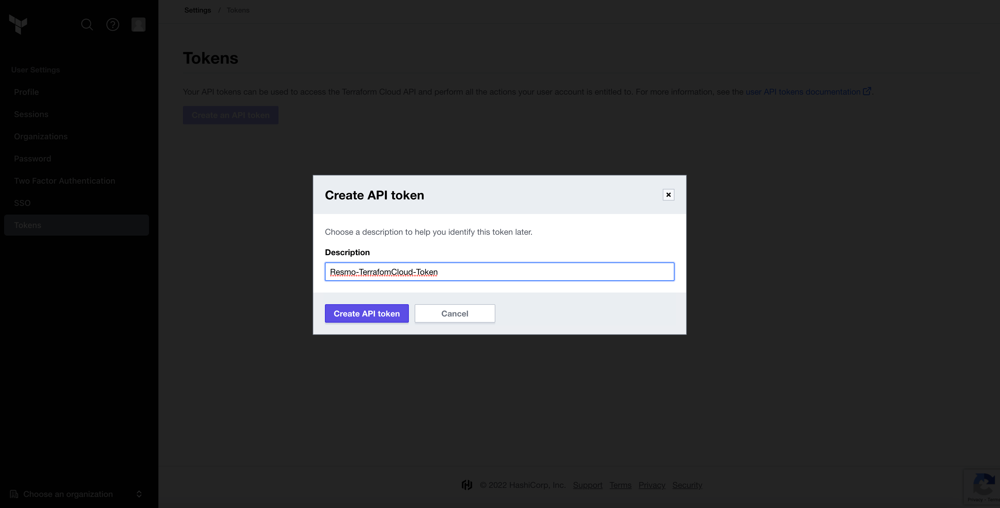
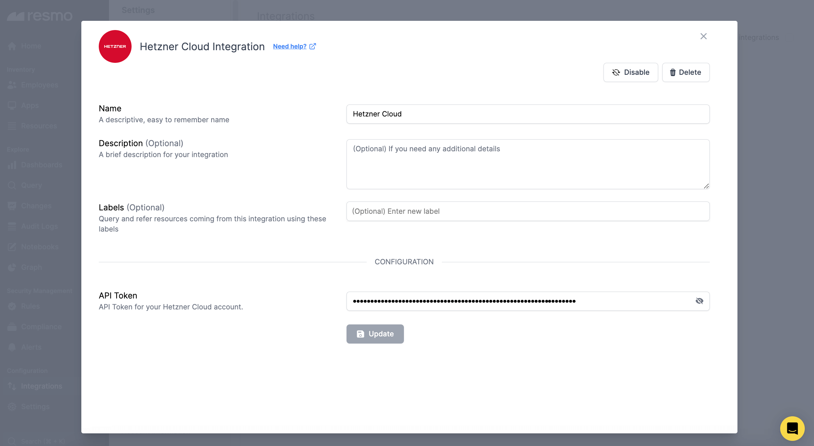
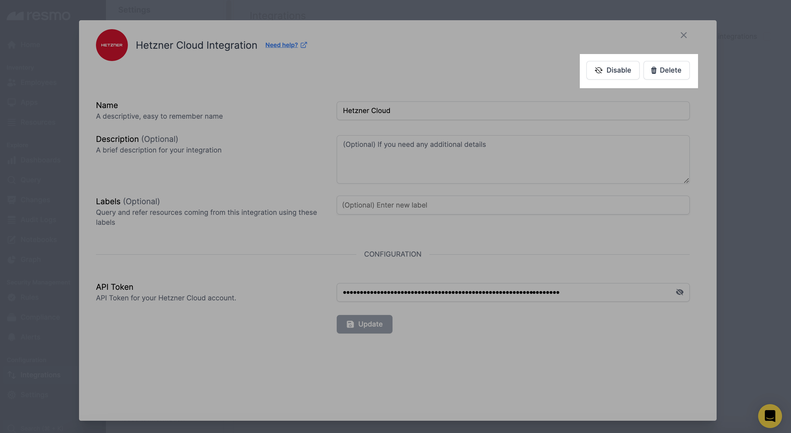

# Hetzner Cloud Integration

<figure><figcaption></figcaption></figure>

Resmo collects Hetzner resource configuration data like firewalls, servers, networks, and data centers to minimize security risks like misconfigurations and unauthorized access.

### What does Resmo offer to Hetzner Cloud users?

* Query your Hetzner Cloud configuration data, such as details about your server specifications, IP addresses, location, and associated teams and projects.
* Set up automated security rules to continuously assess your resources and configurations to catch and avoid vulnerabilities in time.
* Get alerts on critical changes, such as when load balancers are created, modified, or deleted.

### How does the integration work?

Resmo uses API to do the initial polling and collect existing Hetzner Cloud resources. Following the initial polling, it receives updates and changes in real-time through webhook and regular polling.

**Available resources**



### Integration Walkthrough

#### How to install

1. Log in to your Resmo account and navigate to Integrations.
2. Find and select Hetzner Cloud.
3. Click the Add Integration button from the bottom right corner of the opening modal.

<figure><figcaption></figcaption></figure>

4. Next, log in to your Hetzner account and select a Project from Projects.

<figure><figcaption></figcaption></figure>

5. Click on Security from the left side menu and then API Tokens.

<figure><figcaption></figcaption></figure>

6. Create an API token.

<figure><figcaption></figcaption></figure>

7. Copy the API token and paste into the related field on Resmo integration screen.

<figure><figcaption></figcaption></figure>

8. Hit the Create button and your Hetzner integration will be ready.

#### How to uninstall

1. Go to your Integrations page and select Hetzner.
2. Click on the Connected Integrations tab from the opening modal.
3. Select the integration you want to remove. You can either disable temporarily (disabled integrations can be enabled back later on) or delete permanently which cannot be undone.

<figure><figcaption></figcaption></figure>

### Support

Still have questions about your Hetzner integration? Contact us via live chat or email us at contact@resmo.com.
