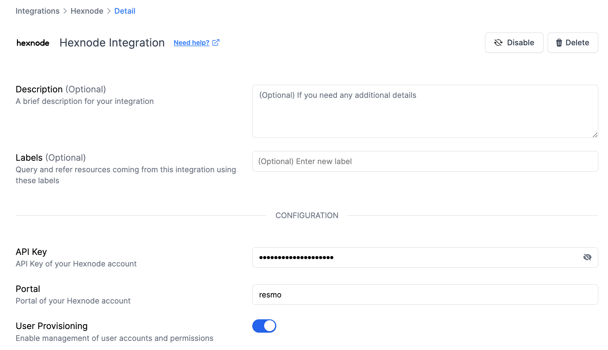

# Hexnode Integration

<figure><figcaption></figcaption></figure>

Streamline your IT asset management and enhance security protocols with automated monitoring and tailored alerts in your Hexnode environment.

### What does Resmo offer to Hexnode users?

* Gather detailed information about users in your Hexnode environment for better management.
* Keep tabs on device assignments, configurations, and policy adherence to maintain security and compliance.
* Analyze data on device and application usage for more informed planning and resource distribution.
* Gain a deeper understanding of user activities with Hexnode tools to optimize training and resource allocation.

### How does the integration work?

Resmo connects to Hexnode using APIs for the initial data pull. Post-setup, it keeps the data up to date through real-time webhook and regular polling.

**Available resources:**

* App Catalog
* App Group
* Application
* Device
* Device Group
* Policy
* User
* User Group

### Integration Walkthrough

#### How to install

1. Visit your Integrations page on Resmo.
2. Locate and select Hexnode from the list.
3. Click on the 'Add Integration' button.
4. Enter your Hexnode **API key** in the provided field. Need help finding your Hexnode API Key? [Visit this page](https://www.hexnode.com/mobile-device-management/developers/setting-up-an-api/retrieve-api-key/).
5. Input the **Portal** of your Hexnode account.

* See the beginning of the URL when you login to your Hexnode account. I.e., for `acme.hexnodemdm.com` , the Portal is acme.

<figure><figcaption></figcaption></figure>

6. Enable **User Provisioning** to manage user accounts and permissions effectively, leveraging Resmo’s capabilities in user offboarding and access management.
7. Click 'Create' to complete the integration setup.

**How to uninstall**

1. Go to your Integrations page on Resmo and select Hexnode.
2. In the Connected Integrations tab, choose the Hexnode account you want to remove.
3. To temporarily disable the integration, click 'Disable'. To remove it permanently, select 'Delete'.\

<figure><figcaption></figcaption></figure>
