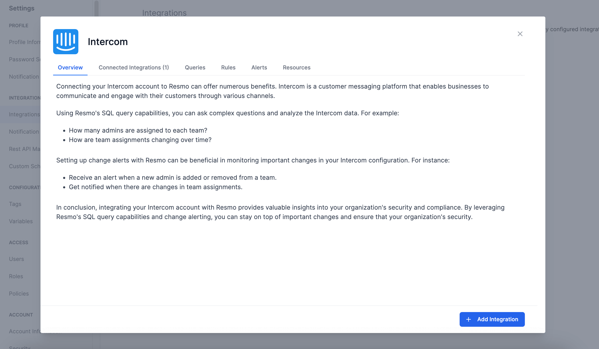
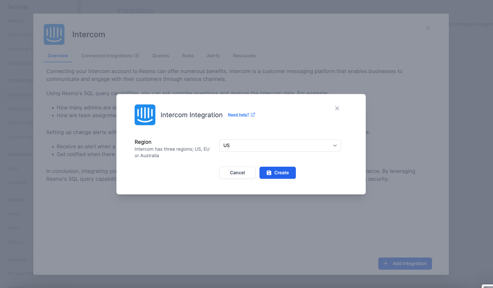
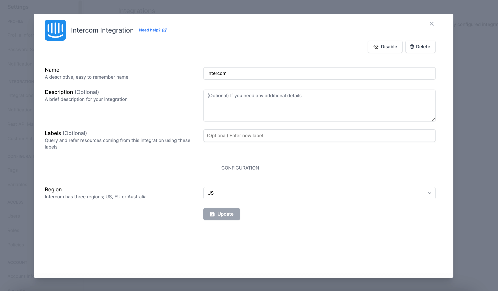

# Intercom Integration

<figure><figcaption></figcaption></figure>

Resmo integrates with your Intercom account in one click, allowing you to collect and secure your Intercom resources and configurations in one place.

### What does Resmo offer to Intercom users?

* Be instantly alerted of any additions or removals of administrators within your team.&#x20;
* Stay informed about any changes in team assignments with real-time notifications.
* Set up custom rules and run custom SQL queries to improve asset visibility.

### How does the integration work?

Resmo uses API to do the initial polling and collect existing Intercom resources. Following the initial polling, it receives updates and changes in real-time through webhook and regular polling.

**Available resources**



### Integration Walkthrough

#### How to install

1. Log in to your Resmo account and navigate to the Integrations page.
2. Find and select Intercom. Then, click the Add Integration button from the bottom right corner of the opening modal window.

<figure><figcaption></figcaption></figure>

3. Depending on your Intercom region, select your region as US, EU, or AU.

<figure><figcaption></figcaption></figure>

4. Hit the Create button, and your integration will be all set.

#### How to uninstall

1. Go to your Integrations page on Resmo.
2. Find and click Intercom. From there, navigate to the Connected Integrations tab on the opening modal.&#x20;
3. Select the Intercom account you want to uninstall.
4. You can temporarily disable it or permanently delete it by clicking the related button from the top right (Disable/Delete).

<figure><figcaption></figcaption></figure>

### Support

Contact us via live chat or email us at contact@resmo.com for troubleshooting or support requests.
