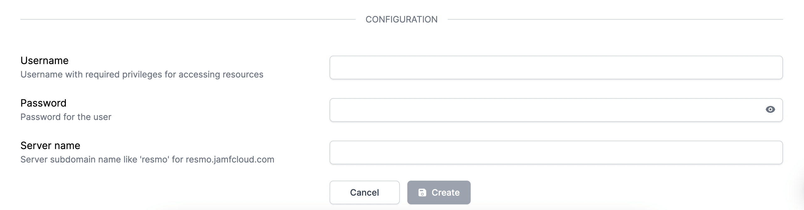

# Jamf Integration

## Resmo + Jamf Integration Fundamentals&#x20;

Resmo integrates with Jamf to ensure the security and compliance of your Jamf environment.

### What does Resmo offer Jamf users?

* Gather and monitor your Jamf assets on a single platform.
* Query your Jamf assets like computers, mobile devices, account groups, and more.
* Set up rules to continuously assess your Jamf resources for security and compliance.
* Receive breach alerts through notification rules in near real-time
* Visualize your resources and rules through user-friendly dashboards

### How does the integration work?

Once you sign up to Resmo, you can easily integrate your account with Jamf using an account with the required privileges. Resmo uses API to do the initial polling and collect existing resources. Then, we receive resource changes and updates in real-time by regular polling.

#### Required privileges of account for integration:

* Read Advanced Computer Searches
* Read Advanced Mobile Device Searches
* Read Advanced User Searches
* Read Computers
* Read Jamf Pro User Accounts & Groups
* Read macOS Configuration Profiles
* Read iOS Configuration Profiles
* Read Mobile Devices
* Read Users

#### Available Resources

Resmo Jamf integration aggregates resources, including account groups, computers, mobile devices, users, and more.

**See the full list:**



### Integration Walkthrough

#### How to Install

1. Go to your Integrations page on Resmo and select Jamf.
2. Click the Add Integration button from the bottom right corner of the opening modal.
3. On a new tab, go to your Jamf Pro User Accounts & Groups under System Settings on your Jamf Account.
4. Create a new user with the required privileges.
5. Go to the Resmo integration page and fill in the username and password fields with the created user credentials.

6. Enter the server name of your Jamf account. For example, if your Jamf server URL is _resmo.jamfcloud.com_, your server name must be _"resmo"_.
7. Hit the create button, and you are ready to run queries.

#### How to Uninstall

1. Go to the Integrations page on your Resmo account.&#x20;
2. Select the Jamf integrations and navigate to the Connected Integrations tab.
3. There are two courses of action you might take:

* To temporarily pause your Jamf integration, click the Disable button on. You can always enable it later to allow the integration to continue collecting resources.
* To permanently remove it, click the Delete button. This action cannot be undone.
