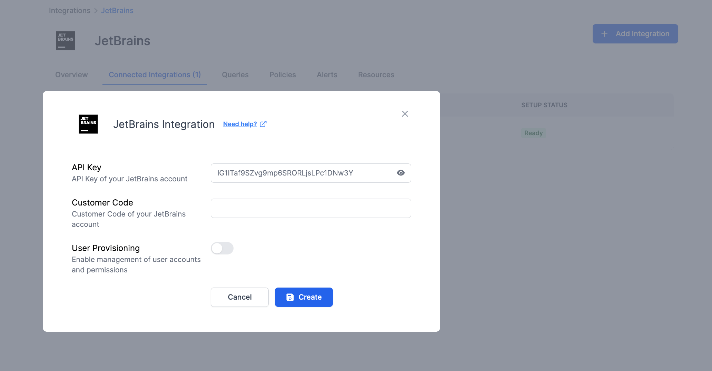
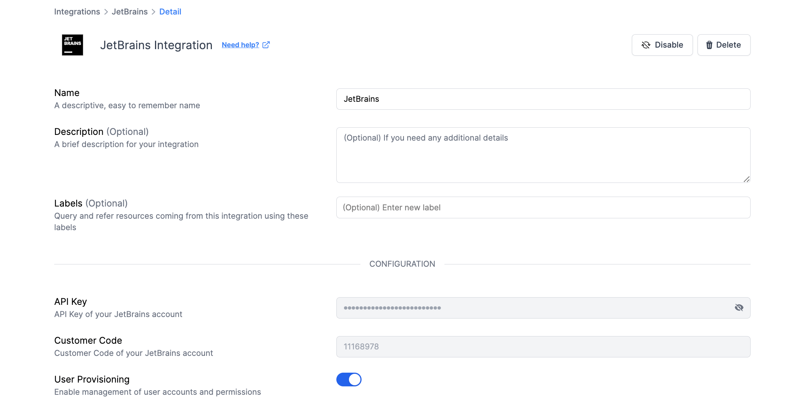

# JetBrains Integration

<figure><figcaption></figcaption></figure>

Monitor changes in your JetBrains environment; set up alerts for potential license issues. Observe user activities through comprehensive dashboards and establish tailored security protocols for automated monitoring and checks.

### What does Resmo offer to OneDrive users?

* Collect detailed information about users in your JetBrains environment.
* Track license utilization to ensure cost-effectiveness and compliance.
* Analyze license distribution for strategic planning.
* Gain insights into user activity with JetBrains tools for effective training and resource allocation.

### How does the integration work?

Resmo uses API for initial data collection from JetBrains. After the initial setup, it continuously updates changes in real-time through webhook and regular polling.

**Available resources:**

* License
* Team
* User

### Integration walkthrough

#### How to install

1. Go to your Integrations page on Resmo.
2. Find and select JetBrains.
3. Click the 'Add Integration' button.
4. Copy and paste the API key of your JetBrains account into the API Key field.

* [See this page](https://sales.jetbrains.com/hc/en-gb/articles/4406854152978-JetBrains-Account-API?rel=nofollow) if you need help finding your JetBrains API Key.

<figure><figcaption></figcaption></figure>

5. Copy and paste the Customer Code of your JetBrains account into the Customer Code field.
6. Turn the User Provisioning toggle on to enable the management user accounts and permissions. This helps you utilize Resmo's offboarding, and user access and permissions management capabilities.
7. Hit the Create button and your integration is all set!

#### How to uninstall

1. From your Integrations page on Resmo, select JetBrains.
2. Go to the Connected Integrations tab and choose the JetBrains account you wish to remove.
3. To disable temporarily, click 'Disable'. For permanent removal, select 'Delete'.

<figure><figcaption></figcaption></figure>
