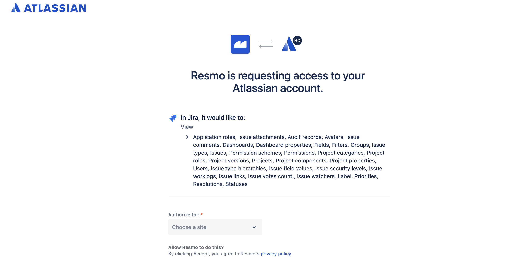

# Jira Integration

## Resmo + Jira Integration Fundamentals&#x20;

Resmo integrates with Jira to help you protect your issues and project from potential risks and stay secure and compliant.&#x20;

### What does Resmo offer to Jira users?&#x20;

* Monitor all Jira assets from a single platform&#x20;
* Query Jira users, filters, groups, and projects&#x20;
* Set up ready-made or custom rules and rule notifications based on Jira resource configurations
* &#x20;Check your Jira security and compliance posture using the Jira Best Practices pack.&#x20;

### How does the integration work?&#x20;

Resmo integrates with Jira using the OAuth 2.0 app that you will automatically be redirected to once you click the create button on your Resmo Jira integration page. After permitting access, you can begin seeing your Jira resources and query them on your Resmo account.

Resmo operates the resource receiving and regular data-update collection processes through API polling.&#x20;

### Available resources&#x20;

Resmo Jira integration collects Jira resources, including projects, users, groups, and filters.

See the complete list:&#x20;


Jira resources


### Common queries and rules&#x20;

* See users with an email from a different domain&#x20;
* List projects with administrator role&#x20;
* List projects with default assignee to project lead&#x20;
* Monitor filters and their owners List classic projects&#x20;
* Check next-gen projects&#x20;

### Integration Walkthrough&#x20;

#### How to install&#x20;

1. Create or sign in to your Resmo account.&#x20;
2. Navigate to the Integrations page and click Add Integration > Jira.&#x20;
3. Give a descriptive name to the integration and click Create.

.png>)

4\. You’ll be redirected to your Atlassian account; accept permissions.

5\. All done! Now, you can start querying your Jira resources.&#x20;

#### How to uninstall&#x20;

1. Log in to your Resmo account.&#x20;
2. Go to Integrations and select Jira.&#x20;
3. Click Delete to uninstall or Disable to pause the integration.
4. Optionally, you can remove your OAuth token after uninstalling the integration permanently. Follow instructions [here](https://developer.atlassian.com/cloud/confluence/oauth-2-3lo-apps/#site-scoped-grants-limitations).

If you uninstall Resmo from your Jira account, we don’t remove the integration by our side, so you will still be able to monitor and query your resources.

#### Revoking Tokens

If you want to revoke your OAuth tokens after deleting the integration. Follow the steps [here](https://developer.atlassian.com/cloud/confluence/oauth-2-3lo-apps/#site-scoped-grants-limitations).

### Support

For further queries and issues, contact us via live chat or email us at contact@resmo.com.
