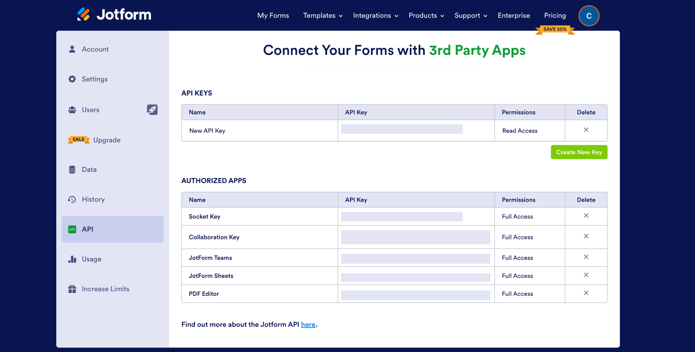

# Jotform Integration

## Resmo + Jotform Integration Fundamentals

<figure><figcaption></figcaption></figure>

Resmo integrates with Jotform to help you gain visibility, security, and compliance over your Jotform resources.

### What does Resmo offer to Jotform users?

* Collect your Jotform resources like forms, users, and reports in a single asset directory.
* Query across your assets using SQL or free text search.
* Visualize asset relations in graph view.
* Automate security checks with rules and get notified of anomalies in near real-time.

### How does the integration work?

Once you sign up and log in to Resmo, you can easily connect your Jotform account to Resmo using an API key. Resmo uses API to start the initial polling and collect existing resources. Then, it receives resource changes and updates in real-time through regular polling.&#x20;

#### Available resources

Resources you can collect with your Jotform integration include:

* Sub-users (account users)
* Form
* Report


"Sub-users" are only available on Jotform Enterprise; therefore, in order to collect them on Resmo, you must be a Jotform Enterprise subscriber.


## Integration walkthrough

### How to install

1. Select Jotform on the Integrations page of your Resmo account.
2. Click the Add Integration button at the bottom right corner of the opening modal.
3. Go to your Jotform account on a new tab.
4. Create an API token from the User Settings-> API -> API Keys section if you haven't created it already.

<figure><figcaption></figcaption></figure>

5\. If you are an Enterprise customer, enter your Jotform subdomain into the integration screen's subdomain field.

6\. Hit the Create button, and your integrations will be ready.

### How to uninstall

1. Select Jotform on your Integrations page.
2. Navigate to the Connected Integrations tab on the opening modal.
3. Click the Jotform integration you want to remove.
4. You can temporarily disable the integration by clicking the Disable button from the top right or permanently uninstall it by clicking the Delete button.

### Support

Contact us via live chat or email us at contact@resmo.com for troubleshooting or support requests about your Jotform integration.
