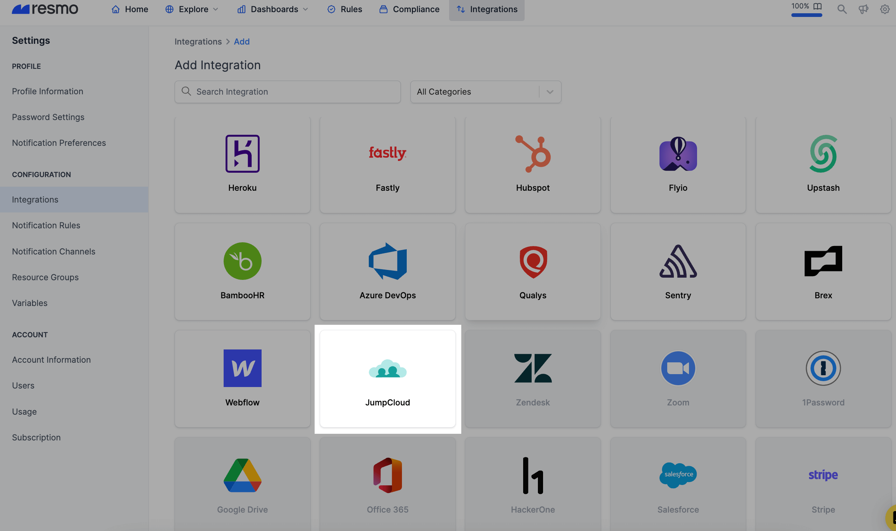
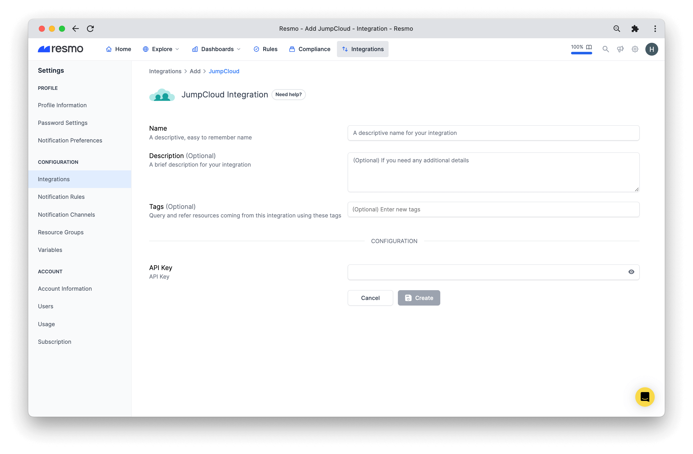
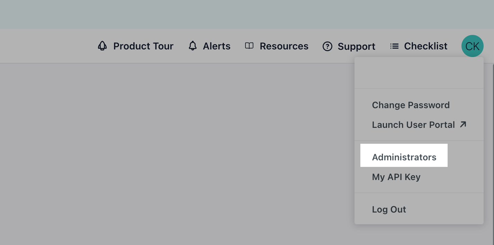
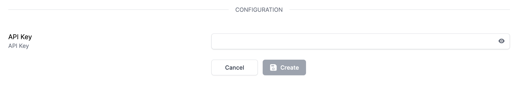

# JumpCloud Integration

## Resmo + JumpCloud Integration Fundamentals

<figure><figcaption></figcaption></figure>

Resmo integrates with JumpCloud to help you keep your JumpCloud assets and configurations like users, devices, policies, and groups secure and compliant.

### What does Resmo offer to JumpCloud users?

* Collect your directory assets like devices, users, groups, and policies from your JumpCloud account.
* Query your JumpCloud devices, users, groups, policies, resource changes, and more.
* Run automated security rules to evaluate your JumpCloud assets and configurations against security best practices
* Receive timely notifications based on JumpCloud resource configurations and changes.

### How does the integration work?

Resmo uses an API key created from your JumpCloud Admin page. Our application uses API to make the initial polling and receive existing resources. Then, we receive resource changes and updates in real-time through regular polling.

**Available resources**

Available resources you can collect with Remso include directories, applications, users, policies, devices, and more.

See the complete list:



## Integration walkthrough

### How to install

1. Sign up or sign in to your Resmo account.
2. Go to your Integrations page and click the Add Integration button.

<figure><figcaption></figcaption></figure>

3\. Then, add JumpCloud.

<figure><figcaption></figcaption></figure>

4\. Give a descriptive name to your integration and, optionally, a description.

<figure><figcaption></figcaption></figure>

5\. Go to your JumpCloud account and create a read-only admin user via **Settings** -> **Administrators** -> **Create a new administrator.**


The Role should be 'Read Only' and select Multi-factor Authentication also for best practices!


<figure><figcaption></figcaption></figure>

6\. Login new created user and copy the user's API Key '**My API Key**' section, which can be accessible by clicking the User Icon from the top right of the page.

<figure><figcaption></figcaption></figure>

7\. Return to your Resmo JumpCloud integration page and paste the API Key in the related field. Then, click Save.

<figure><figcaption></figcaption></figure>

8\. You are now ready! Now you can start querying your JumpCloud resources!

### How to uninstall

1. Login to your Resmo account and navigate to the Integrations page.
2. Open the JumpCloud integration you wish to uninstall.
3. From there, you have two options. You can choose to temporarily disable it by clicking the Disable button or permanently uninstall it by clicking the Delete button.

<figure><figcaption></figcaption></figure>

### Troubleshooting

If you still have questions or issues about the Resmo JumpCloud integration, contact our team via live chat or email us at [contact@resmo.com](mailto:contact@resmo.com).
